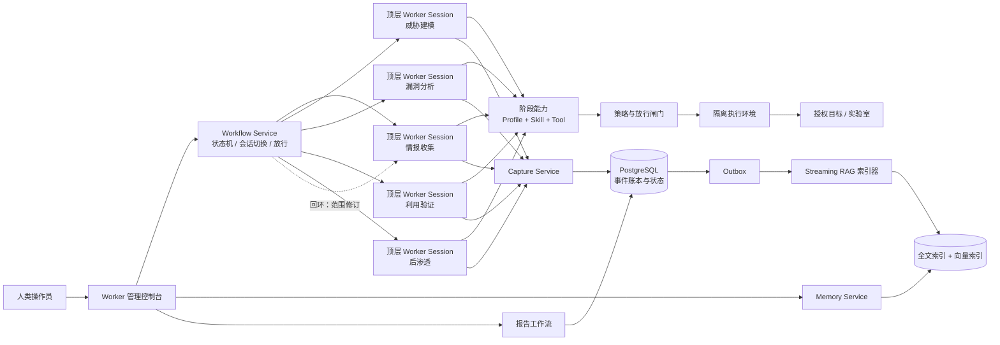
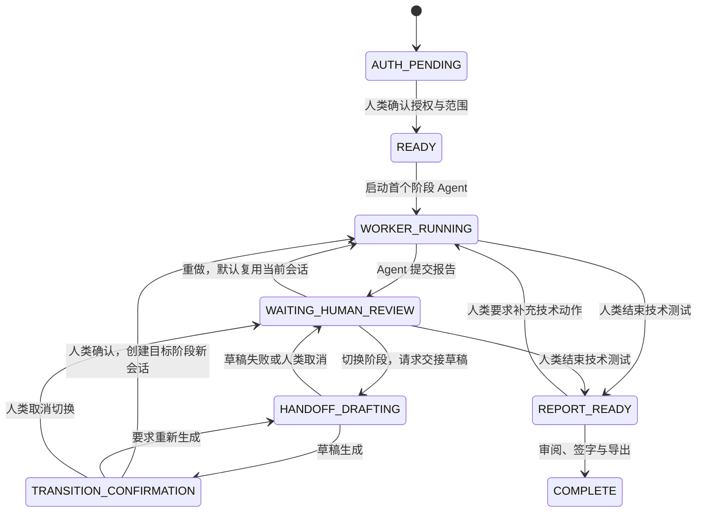
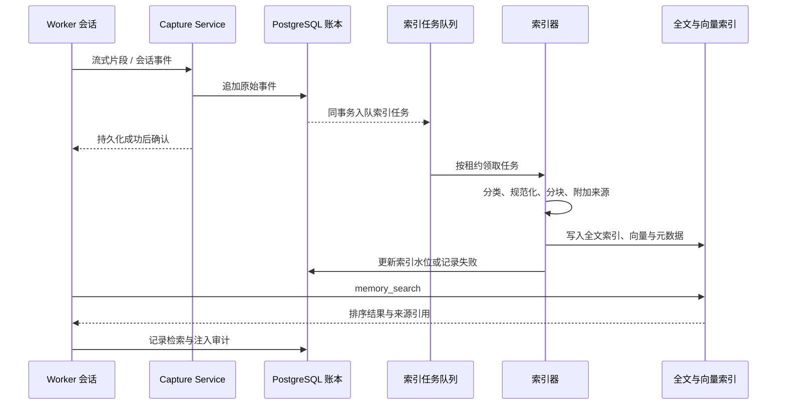

# dsh 渗透测试多 Agent 插件设计方案

- 目标运行时：DeepSeek Harness（dsh）
- 主力模型：DeepSeek API
- 持久化：PostgreSQL + pgvector
- 方法学：PTES 五阶段技术流程，辅以 NIST SP 800-115
- 当前支持范围：单操作者、本机或个人局域网部署、自有靶场与实验室；不面向客户生产系统或多用户 SaaS
- 实现基线：DeepSeek Harness `0.1.5-rc.2`（本工作区已安装，§21 的校准结论均在此版本实测）；升级 dsh 后必须重新执行 §21 的 API 校准与客户端验收
- 已知上游演进：`0.1.6` 把工作流引擎从 `dsh-workflow-worker-thread` 改名为 `dsh-workflow-ptc`；`0.1.7` **整体替换设置注册面**（`installSettingsSection` / `SettingsProvider.installSection` / `SettingsNamespace` / `SettingsScope` → live Config 表单），移除客户端 `ctx.settingsScope` 服务，改用 `ctx.configForms.get(entryId)`，并以 `retainedBy.mainView` 识别当前会话；`0.2.0-rc.*` 已存在。本设计**不注入 `settingsScope`**，因此不受该次破坏性变更影响（§6.2.3）。升级时按 §21.1 的清单逐项复核

## 1. 概述

本插件在 dsh 之上提供一套由人类操作员直接驾驶的长期渗透测试工作台。**控制台 UI 是核心产品面，不是后端服务的附属管理页**：它负责让人类看懂当前作业、轮换阶段 Agent、审查上下文交接、修改授权与规则，并决定每一个会改变作业事实的动作。

五个技术阶段各由一个独立的顶层 Worker Agent 承担。人类在控制台查看当前 Agent 的实时输出、工具调用、证据与记忆检索，在它自报任务成果后决定下一步：重做或切换阶段。切换阶段意味着更换 Agent、创建新会话；当前 Agent 只负责基于已知上下文起草面向下一 Agent 的压缩摘要、任务提示词和交接材料，人类审阅、调整并确认后才创建下一会话。

全部上下文——人类输入、模型思考链、流式输出、工具调用与输出、检索请求与命中、人工决策、状态转移、交接草稿、人工编辑版本与最终交接包——写入 PostgreSQL。任意阶段 Agent 都可以主动检索整个 engagement 的记忆来补充自己的推理上下文，但只有人类确认的交接内容才会跨会话注入。

### 1.1 设计原则

| 编号 | 原则 | 含义 |
|---|---|---|
| P1 | 人类决定推进 | Worker 报告后系统停下等人；不存在自动进入下一阶段的路径 |
| P2 | 阶段即 Agent 即会话 | 五个阶段与五个 Agent 一一对应；切换阶段就换 Agent、换会话 |
| P3 | 全量记忆、按需检索 | 所有原始上下文长期保存；进入提示词的只有人类选中的内容和 Agent 主动检索到的内容 |
| P4 | 交接是可审阅的材料 | 新 Agent 收到的是人类确认过的任务提示词与上下文，而不是旧会话的完整对话 |
| P5 | 证据先于推断 | 观察、事实、假设、候选结论、已验证结论分列，置信度不替代证据 |
| P6 | 高风险动作需放行 | 每个高风险动作在人类批准后执行，批准绑定目标、范围、动作与时效 |
| P7 | 一切可回放 | 任何一次模型请求、工具副作用、状态转移和人工决策都能从事件账本重建 |
| P8 | 深度推进与首次测试同流程 | 内网侦察与横向构成新一轮迭代，走同一套阶段与闸门，不为深入单独开口子 |
| P9 | 能力由人装配 | skill 可增、可选、可为空；工具只能收窄不能放宽 |
| P10 | 人类可随时介入 | 任务运行期间可插话纠偏；闸门之外的动作一律拦截，插话不替代放行 |
| P11 | 不重复实现生态已有能力 | 网络策略、注入防御、脱敏、遥测、成本治理复用现成插件（§4.4）；范围、放行、状态机、交接、记忆自建 |
| P12 | 强制点唯一且在服务内 | 范围、放行与能力的检查位于服务方法内部；工具层只做薄封装，另有 `tools/pre-execute` 全局守卫兜底 |
| P13 | 当前状态先于细节 | 首屏优先呈现当前阶段、当前 Agent、待人类处理事项与下一步；原始记录和诊断信息按需展开 |
| P14 | 渐进披露复杂度 | 常用动作直接可见；范围 JSON、完整工具清单、压缩细节、调试标识与高级预算等复杂选项默认隐藏 |
| P15 | 交接必须可审查 | AI 只生成候选交接；弹窗展示来源、摘要、提示词、引用、限制与差异，人类编辑确认后才进入下一会话 |
| P16 | 状态事实与展示状态分离 | 空数据、尚未加载、读取失败、数据过期和确实为空必须在界面上分别表达，不能用一个空列表代替 |
| P17 | 记录完整，展示克制 | 原始事件、决策、交接和证据完整持久化；界面用摘要、时间线和引用帮助扫描，不把全部原始内容堆在首屏 |
| P18 | 预设不等于授权 | 范围预设与行为预设只降低填写成本；服务端必须展开、校验并冻结最终快照，任何预设都不能绕过范围、放行、租约、预算、审计或沙箱边界 |


### 1.2 五个技术阶段

| 阶段 | Agent | 主要交付物 | 阶段重点 |
|---|---|---|---|
| Intelligence Gathering | 情报收集 Agent | 资产、服务、入口、技术指纹、来源证据 | 被动与受控主动情报收集 |
| Threat Modeling | 威胁建模 Agent | 资产图、信任边界、攻击路径、假设与优先级 | 建立攻击面与业务影响模型 |
| Vulnerability Analysis | 漏洞分析 Agent | 候选漏洞、去重结果、评级、验证计划 | 分析与候选发现 |
| Exploitation | 利用验证 Agent | 最小化验证结果、复现证据、影响边界 | 在人工放行下验证可利用性 |
| Post Exploitation | 后渗透 Agent | 影响核查、内部可见面清单、清理记录、回环建议 | 作为回环网关，交接给下一轮 |

### 1.3 状态机是循环的

后渗透阶段不是终点，而是回环网关。

取得访问权之后，目标空间从外部扩展到内部：内网主机、服务、凭据可达的资源，都是新的未知区域。这些未知区域和最初的外部目标在本质上没有区别——同样需要先收集情报、再建模、再分析、再验证。因此它们构成状态机的又一轮循环：

```text
情报收集 → 威胁建模 → 漏洞分析 → 利用验证 → 后渗透
     ↑                                            │
     └──────────────── 新一轮（范围扩展）──────────┘
```

- 后渗透阶段只做三件事：确认已获得访问权的影响边界、清点因此变得可见的内部资产、完成现场清理。它**不执行**内网侦察与横向移动。
- 内网侦察属于下一轮的情报收集，横向移动属于下一轮的利用验证——在扩展后的范围与新的人工放行下执行。
- 每次回环，图迭代计数加一，范围版本随之递增。时间线按“迭代 × 阶段”展示，人类可以看清这是第几层网络。

这条设计的直接好处是：攻击深度的推进和最初的外部测试走完全相同的流程与闸门，不需要为“横向”另建一套机制，也不会出现绕过人工判断的自动深入。

**回环前的范围修订**：内网发现的主机默认不在授权范围内。回环时必须修订范围快照——列出新发现的资产、标注其来源（从哪个入口发现）、明确哪些进入本轮范围、哪些排除，并记录授权依据。范围修订是一次独立的人工决策，未列入新范围的资产不参与后续任何阶段。
两个阶段职责由控制台承担，不设 Agent：

- **授权与范围界定**：engagement 创建向导，收集目标、授权、范围、排除项、时间窗、数据处理规则与紧急停止方式，生成运行前必须确认的快照。范围在每次回环时修订并产生新版本。
- **报告产出**：技术阶段结束后，控制台依据人工接受的结论、证据与时间线生成报告草稿，由人类编辑、签字与导出。

### 1.4 产品定位与当前使用画像

本项目当前首先服务于**单个人类操作者的个人渗透测试工作**。它运行在操作者自己的 dsh 环境中，连接个人 PostgreSQL、Docker 工具沙箱与自有靶场或实验室目标，主力模型为 DeepSeek。它不是当前意义上的多用户 SaaS、团队协作平台或面向客户生产系统的托管服务。

这一定义不降低安全要求，而是确定安全要求的优先级：当前最重要的边界是“模型可能跑偏，但不能越过人类确认的阶段、范围和执行闸门”，以及“长任务经过多次 Agent 切换后，事实、证据和人类决定不能丢失或混淆”。多租户身份、组织角色和跨实例数据库隔离属于未来扩展边界，不应反过来主导当前个人 UI 的交互复杂度；若将来开放多人使用，必须另行补充请求级操作者身份、角色授权和真实运行时 RLS，而不能把当前固定 operator 语义直接当作通用方案。

本插件要解决的不是“让模型一次完成一份扫描”，而是三个连续的人类工作问题：

1. **按状态机轮换 Agent 角色**：人类根据作业进展在五个技术阶段之间切换。每次阶段切换都让下一阶段获得适合其职责的 Agent Profile、skill、工具边界和任务目标，而不是让一个会话无限承担所有角色。
2. **把 Engagement 当作长期工作空间**：人类可以查看阶段、会话、报告、证据、记忆、审批、范围版本、行为规则、插话、暂停、失败和人工决策，并在同一个作业中持续修订授权范围与工作规则。历史记录保留可读，当前配置通过版本或决策变更，不靠覆盖历史事实。
3. **让上下文交接成为人类确认的桥**：人类选择切换后，AI 自动基于当前报告、状态便签、相关记忆和目标阶段职责生成上下文压缩与下一任务提示词；系统把结果放入交接弹窗，人类审查、删除、补充或改写后确认，确认内容才注入下一 Agent。

当前产品的主要使用画像如下：

| 维度 | 当前约束 |
|---|---|
| 操作者 | 单个人类；控制台中的 operator 是部署配置，不是多人身份系统 |
| 驱动方式 | 人类选择阶段、审查交接、修改范围与规则、处理审批，Agent 不自动推进状态机 |
| 作业形态 | 长时间运行的单个或少量 Engagement；数据库保存跨阶段和跨迭代历史 |
| 目标环境 | 自有靶场、故意存在漏洞的实验室或明确授权的个人测试环境 |
| 模型角色 | DeepSeek 是研究与执行协作者，不是授权者、状态机控制者或最终结论签字者 |
| UI 重点 | 快速看懂当前状态、低摩擦完成常用操作、在关键变化处提供可编辑的审查界面 |

因此，产品设计的优先级是：**连续性与可回看 > 人类控制 > 状态扫描效率 > 常用操作低摩擦 > 高级配置的完整表达**。高级能力不能删除，但应通过折叠区、抽屉、二级面板和详情链接渐进披露。

明确的非目标：模型自行从一个阶段跳到另一个阶段；模型自行扩大范围或确认放行；把所有原始数据一次性塞入下一 Agent；用复杂的多用户权限 UI 换取当前单人场景并不需要的配置项；把控制台做成营销式首页或装饰性仪表板。

### 1.5 术语
| 术语 | 含义 |
|---|---|
| engagement | 一次完整的授权测试活动，是记忆、状态与权限的隔离单元 |
| 阶段（phase） | 五个技术阶段之一，同时是状态机节点与 Agent 身份 |
| Worker Agent | 承担某一阶段的顶层 dsh Agent 会话 |
| 会话（session） | 一个 Worker Agent 的 dsh Session，拥有独立的模型上下文 |
| 任务（task） | 人类交给当前 Worker Agent 的一次具体工作 |
| 报告（report） | Worker 完成任务后提交的结构化成果 |
| 交接（handoff） | AI 生成、经人类审查确认的下一任务提示词与上下文材料 |
| 交接草稿（handoff draft） | 当前 Agent 面向下一阶段生成的候选摘要、提示词、引用和能力建议；不构成状态转移 |
| 交接包（handoff package） | 人类确认后写入的不可变交接版本，是下一 Agent 实际注入内容的来源 |
| 放行（approval） | 人类对某个高风险动作的一次性授权 |
| 记忆（memory） | PostgreSQL 中保存的该 engagement 的全部上下文 |
| 迭代（iteration） | 状态机从情报收集走到后渗透的一轮完整循环；每次回环迭代计数加一 |
| 范围修订（scope amendment） | 回环时对目标范围的增删，产生新的范围版本与授权依据 |
## 2. 阶段与 Agent 模型

### 2.1 一一对应

五个阶段与五个 Worker Agent 严格一一对应：一个阶段由唯一 Agent 承担，一个 Agent 只服务一个阶段。阶段、Agent、会话在数据模型中是同一枚标识的三种视角。

这样设计的直接结果是：**切换阶段必然更换 Agent 并创建新会话**，人类的心智模型始终是单层的——当前在哪个阶段，就是哪个 Agent 在哪个会话里工作。

阶段内的侧重点差异（Web / 网络 / 云 / 源码 / 身份）通过为该 Agent 装载不同的 skill 与工具来表达，不产生新的阶段或新的 Agent。

### 2.2 skill 装载

skill 是高度自定义的，支持三种使用方式：

| 方式 | 说明 |
|---|---|
| 使用已添加的 skill | 从 skill 库中勾选任意条目装载到本次会话 |
| 自行添加 skill | 在控制台新增 skill（名称、描述、正文），加入库后可被任意 Agent 勾选 |
| 不装载 skill | 允许空集合。Agent 仅凭自身 Profile 与任务提示词工作 |

三条规则：

- **可添加**：新增 skill 需要名称、描述与正文。正文是 Agent 会遵循的指令文本，因此新增操作记录操作者、时间与内容哈希，形成审计条目。
- **可选择**：任意阶段的 Agent 都可以装载库中的任意 skill，不按阶段硬性限制。是否合适由装载它的人类判断，而不是由插件预设。
- **可为空**：不装载 skill 是合法状态。不需要为了"配全"而强行勾选——空集意味着 Agent 依赖自身能力与人类写清楚的任务提示词。

**会话隔离**：skill 装载在创建会话时冻结。会话运行期间新增或修改 skill 不影响已创建会话，只对之后创建的会话生效。人类希望改变装载，通过重做或切换阶段完成，从而留下一条明确的决策记录。

**风险提示**：skill 正文是提示词内容，装载一个来源不明的 skill 等于允许其作者向 Agent 注入指令。控制台在勾选界面对非本人添加的 skill 标注来源，并在审计中保留每次装载的完整集合。

### 2.3 各阶段默认能力

下表是各阶段的默认能力参考，供控制台初始化勾选状态使用，不是硬性限制。skill 一列列出该阶段常用的 skill，它们与其他阶段共享同一个库。

| 阶段 | 常用 skill | 典型工具能力 | 明确不做 |
|---|---|---|---|
| 情报收集 | `osint-passive`、`dns-cert`、`web-surface`、`network-surface`、`cloud-surface`、`source-surface`、`internal-discovery` | 公开信息检索、DNS 与证书查询、低风险 HTTP 请求、只读代码分析、内网资产发现 | 漏洞利用、范围外扫描、改变目标状态 |
| 威胁建模 | `asset-graph`、`trust-boundary`、`attack-path`、`business-impact` | 记忆与图谱查询、只读证据访问 | 以推断替代观测、执行攻击动作 |
| 漏洞分析 | `web-vuln`、`network-vuln`、`source-vuln`、`cloud-vuln`、`vuln-research` | 受控扫描、代码与配置分析、漏洞资料检索 | 未经放行执行利用 |
| 利用验证 | `web-validation`、`network-validation`、`auth-validation`、`exploit-safety`、`lateral-movement` | 已放行的验证动作、隔离沙箱、证据采集 | 范围外目标、持久化、破坏性动作、数据外传 |
| 后渗透 | `impact-boundary`、`post-validation`、`cleanup` | 受限只读核查、清理工具、证据审查 | 内网侦察、横向移动、持久化、批量收集、破坏性动作 |

### 2.4 能力冻结

创建会话时，插件把以下内容冻结为快照，写入会话记录并注入 Agent 的提示词：

- 阶段与 Agent Profile 版本
- 本次装载的 skill 集合（可为空）
- 工具允许列表与当前已实现的速率、授权到期和策略边界
- 目标、范围、规则与策略快照；`roe/timeWindow` 作为高级记录和 Agent 上下文保存，但当前不构成执行服务硬边
- 本次任务提示词
- 交接材料引用

冻结意味着两件事：运行中的 Agent 不会因为后台配置变动而获得新权限；人类想改变能力边界，只能重做或切换阶段，从而留下一条可追溯的决策记录。若未来把 `roe/timeWindow` 中的速率、并发或时间窗升级为硬边，必须在冻结快照之外增加执行期读取、校验和版本绑定。

## 3. 系统架构

### 3.1 总览



### 3.2 组件职责

| 组件 | 职责 |
|---|---|
| Host 插件 | 注册 Cordis 服务、阶段 Agent Profile、Worker 工具、事件监听、控制台 RPC |
| Workflow Service | 维护阶段、状态、会话切换、人工放行与转移事务 |
| Worker Session Manager | 创建与关闭顶层 dsh 会话，冻结能力快照，向会话投递任务与交接草稿请求 |
| Memory Service | 写入原始事件、执行检索与读取、记录访问审计 |
| Streaming RAG 索引器 | 增量解析、分块、嵌入、建立全文与向量索引 |
| 策略与放行闸门 | 范围校验、风险分级、动作放行、沙箱准入 |
| 隔离执行环境 | 在受限容器或远程执行器中运行工具，返回原始输出与证据 |
| 证据仓库 | 保存附件、哈希、媒体类型、敏感度与引用关系 |
| 报告工作流 | 从人工接受的结论生成报告版本，支持编辑、脱敏与导出 |
| Worker 管理控制台 | 启停、查看、审核、重做、切换、交接编辑、放行与报告签字 |

### 3.3 关键不变量

| 编号 | 不变量 |
|---|---|
| I-01 | 没有有效的授权与范围快照，任何触及目标的动作都不执行。 |
| I-02 | 提交报告、申请放行与执行动作都必须持有当前会话的有效租约；会话被取代或关闭时租约失效，旧会话的提交被拒绝。 |
| I-03 | 阶段切换、重做、暂停、终止与报告签字都来自已认证的人类操作。 |
| I-04 | Worker 报告只把当前会话置为等待人工判断，不改变阶段。 |
| I-05 | 阶段切换必然创建新会话；重做默认沿用当前会话，仅在人类显式选择时新建。 |
| I-06 | 新会话只接收人类确认的任务提示词与上下文内容，不继承旧会话的对话记录。 |
| I-07 | 当前 Agent 只能生成交接草稿，不能自行确认交接、选择目标阶段或推进状态。 |
| I-08 | 原始事件只追加；摘要、分块、嵌入与派生结论都可以从原始事件重建。 |
| I-09 | 进入模型请求的每一段检索内容都可以通过检索记录与记忆标识复盘。 |
| I-10 | 工具执行带幂等标识，重试不产生重复副作用。 |
| I-11 | 不同 engagement 的数据由数据库策略与服务层双重隔离。 |
| I-12 | 审计写入不可用时，所有触及目标的动作都不执行；不按动作风险分类降级。 |
| I-13 | 模型推理、Agent 陈述与外部文本不因表述自信而成为事实。 |
| I-14 | 回退与重做产生新的转移记录，历史会话、报告与证据保持可读。 |
| I-15 | 权限判断同时校验会话身份与它绑定的任务；绑定到任务 A 的会话不能提交任务 B 的结果。 |
| I-16 | 范围、放行与能力的强制检查位于服务方法内部；工具适配器不承担判断，新增入口必须复用同一服务。 |
| I-17 | 领域事件只进 PostgreSQL 账本；不向会话日志写入宿主未注册的事件类型。 |
| I-18 | 预设选择只产生默认输入；触及目标前必须存在服务端展开、人工确认和完整快照哈希。 |
| I-19 | 当前策略投影与不可变 `policy_versions` 必须一致；历史策略不能靠覆盖 `engagements.policy_snapshot` 恢复。 |
| I-20 | 控制台、Worker、系统任务和回放使用不同审计主体；控制台读操作必须归因到认证操作者，不能使用固定 `console`。 |
| I-21 | 每个目标动作都能关联到范围版本、策略版本、policy epoch、计划哈希、审批结果和最终停止原因。 |

## 4. 插件形态

### 4.1 包结构

```text
dsh-pentest/
├── package.json
├── cordis.patch.yml
├── src/
│   ├── index.ts                      # bundle 入口与服务装配
│   ├── config.ts                     # 配置 schema 与密钥引用
│   ├── phases.ts                     # 五阶段定义、能力目录、合法转移
│   ├── workflow/
│   │   ├── service.ts                # 转移事务与状态版本
│   │   ├── sessions.ts               # 顶层会话创建、冻结、关闭、投递
│   │   ├── approvals.ts              # 动作放行
│   │   ├── scope.ts                  # 范围版本与回环修订
│   │   └── handoff.ts                # 交接草稿、编辑、确认
│   ├── skills/
│   │   ├── library.ts                # skill 库增删改与版本
│   │   └── loader.ts                 # 会话装载与冻结
│   ├── memory/
│   │   ├── service.ts                # PostgreSQL 访问与隔离
│   │   ├── capture.ts                # 会话、模型、工具事件落库
│   │   ├── retrieval.ts              # 混合检索与引用
│   │   ├── chunks.ts                 # 分块与规范化
│   │   └── outbox.ts                 # 索引任务队列
│   ├── workers/
│   │   ├── profiles/                 # 五个阶段 Agent Profile
│   │   └── reports.ts                # 报告 schema 与校验
│   ├── tools/
│   │   ├── worker.ts                 # 记忆、报告、放行申请、执行
│   │   └── console.ts                # 控制台 RPC 与命令
│   ├── policy/
│   │   ├── scope.ts                  # 域名、URL、CIDR、资产范围
│   │   ├── risk.ts                   # 风险分级与放行要求
│   │   └── sandbox.ts                # 容器镜像与工具能力白名单
│   ├── execution/
│   │   ├── service.ts                # 执行管线唯一承载点（§10.2）
│   │   ├── templates.ts              # 服务端受信动作模板注册表（§10.2.1）
│   │   └── approvals.ts              # 放行凭证校验与一次性消费
│   ├── report/
│   │   └── service.ts                # 报告投影、版本、脱敏预览、导出
│   ├── artifacts/
│   │   └── service.ts                # 证据内容寻址存储、哈希、敏感度、引用
│   └── db/migrations/
├── src/client/
│   ├── index.ts                      # 客户端入口：槽位注册、locale、apply 守卫
│   ├── mount-console.tsx             # settings.plugins.tab 无会话入口；main 承载日常主面板
│   ├── mount-session-view.tsx        # conversation.view 注册（会话内工具轨迹，辅助）
│   ├── controller.ts                 # 无框架依赖的视图状态存储（可订阅快照）
│   ├── rpc.ts                        # 经 ctx.connection.rpc 访问 Host（唯一数据通道）
│   ├── locales.ts                    # 中英文案
│   ├── views/
│   │   ├── EngagementList.tsx        # engagement 列表（无会话依赖）
│   │   ├── EngagementWizard.tsx      # 授权与范围向导
│   │   ├── RunHeader.tsx             # 运行总览条
│   │   ├── PhaseTrack.tsx            # 阶段轨道（分层布局 + 两种边）
│   │   ├── SessionTimeline.tsx       # 会话时间轴
│   │   ├── Minimap.tsx               # 迷你地图与跳转
│   │   ├── ReportReview.tsx          # 报告审阅与结论处置
│   │   ├── MemoryExplorer.tsx        # 记忆浏览器
│   │   ├── ApprovalQueue.tsx         # 放行队列
│   │   ├── HandoffEditor.tsx         # 交接编辑（差异与哈希）
│   │   ├── ScopeManager.tsx          # 范围版本与回环修订
│   │   ├── SkillLibrary.tsx          # skill 库
│   │   ├── ReportExport.tsx          # 报告签字与导出
│   │   └── ToolTrace.tsx             # 会话内工具轨迹（消费已注册的宿主会话事件）
│   ├── layout/
│   │   ├── layered.ts                # 阶段轨道分层布局
│   │   └── force.ts                  # 力导向布局（整体概览备选）
│   ├── slots.ts                      # SlotMap 模块增强声明
│   └── styles/                       # 基于官方设计令牌的样式
├── workers/
│   ├── intelligence-gathering/profile.yml
│   ├── threat-modeling/profile.yml
│   ├── vulnerability-analysis/profile.yml
│   ├── exploitation/profile.yml
│   └── post-exploitation/profile.yml
├── skills/
└── docker/
```

客户端全部通过槽位接入，不修改官方源码。数据一律经 Host RPC 读取，客户端**不持有独立状态**——界面只渲染 Host 返回的快照，本地仅保留纯展示状态（展开项、布局模式、跟随开关）。

### 4.2 Cordis 服务

| 服务 | 职责 |
|---|---|
| `ctx.pentestWorkflow` | `getState`、`startWorker`、`requestHandoffDraft`、`editHandoff`、`cancelHandoff`、`amendScope`、`interject`、`extendBudget`、`decideApproval`、`revokeApproval`、`confirmTransition`、`retryWorker`、`reopenTechnicalWork`、`pause`、`resume`、`abort`、`finishTechnicalTesting`、`signReport`（**Agent 侧的成果提交不在这里**：`pentest_submit_report` 走 `PgWorkerTools.submitReport`，见 §4.2 的分界说明） |
| `ctx.pentestSessions` | `createTopLevelSession`、`sendTask`、`deliver`、`requestHandoffDraft`、`interrupt`、`close`、`reconcile` |
| `ctx.pentestSkills` | `list`、`create`、`update`、`remove`；供控制台与装载流程使用 |
| `ctx.pentestMemory` | `appendEvent`、`appendBatch`、`search`、`read`、`createRecallContext`、`flush` |
| `ctx.pentestPolicy` | `evaluateScope`、`classifyAction`、`validateExecution`——**只读判定，不写状态** |
| `ctx.pentestExecution` | `admit`、`execute`、`consumeApproval`、`abortInFlight`——执行管线的唯一承载点（§10.2） |
| `ctx.pentestArtifacts` | 证据存储、哈希、媒体类型、敏感度、引用 |
| `ctx.pentestReport` | 报告投影、版本、脱敏预览、导出 |

状态写入只经过 `ctx.pentestWorkflow`。Worker 侧不注册任何改变阶段、创建会话或确认放行的工具。

### 4.3 顶层会话生命周期

```text
创建 → 冻结能力 → 注入任务 → 运行 ⇄ 人工插话 → 自报成果 → 等待人工
                                                    ↘ 交接草稿请求 → 关闭 / 复用
```

| 阶段 | 说明 |
|---|---|
| 创建 | 人类在控制台选定阶段并确认能力勾选后，创建顶层 dsh 会话，记录 `dsh_session_id` |
| 冻结 | 写入阶段、Agent Profile 版本、skill 集合、工具允许列表、范围与策略快照、任务提示词、迭代编号 |
| 运行 | Agent 自主检索记忆、调用允许的工具、必要时申请放行；人类可随时插话纠偏 |
| 自报 | Agent 提交结构化报告；会话进入等待人工判断，阶段不变 |
| 交接草稿 | 人类选择切换阶段时，插件向该会话投递一次草稿请求；该请求只能读取与总结已有上下文 |
| 关闭或复用 | 切换阶段时关闭旧会话并创建新会话；重做时默认复用旧会话，人类也可选择新建 |

后渗透会话结束后，人类可以选择回环到情报收集，此时旧会话关闭，新会话属于下一次迭代并使用修订后的范围版本。

新会话的 `previous_agent_session_id`、`retry_of_session_id` 与 `transition_id` 记录它在整条链路上的位置，用于时间线展示与审计回放。

### 4.4 生态依赖与复用边界

不重复实现生态里已有的能力。直接复用的插件与各自边界：

| 能力 | 复用对象 | 边界 |
|---|---|---|
| 出站网络策略与代理 | `dsh-permission-rules` | 由它决定连接是否放行与拨号地址；本插件只提供范围规则的数据 |
| 提示注入与密钥泄露防御 | `dsh-defend` | 由它做检测；本插件补充"证据区 vs 指令区"的划分 |
| 模型边界 PII 脱敏 | `dsh-mask` | 只作用于进入模型请求的投影；账本与证据保留原文 |
| 遥测导出 | `dsh-observe` | 本插件只产生带渗透命名空间的关联字段 |
| 成本与 token 治理 | `dsh-budget` | 会话预算与之对接，不重复实现计量 |
| 审批链二次复核（可选） | `dsh-auto-review` | 在人工之前加一道机器复核，不替代人工 |
**设计参考（不直接依赖）**：`dsh-dungeon-party` 的租约、检查点、健康信号与显式权限矩阵；`dsh-swarm` 的交付契约与必需键校验；`dsh-agent-bus` 的持久账本与崩溃恢复；`dsh-memento` 的"闸门在服务内"、approve-what-you-see 与预算硬上限。借鉴其语义，实现自行掌握。
**必须自建的部分**：范围规范化与判定、放行闸门、阶段状态机、交接协议、engagement 记忆与检索、报告投影，以及全部控制台视图。这些是渗透领域特有且构成本插件核心，生态里不存在可复用的等价物。

> **Cordis 身份说明**：启动自检清单使用上表中的生态包名；运行时 registry 使用插件导出的 identity。当前 `dsh-permission-rules`、`dsh-mask`、`dsh-observe` 的 runtime identity 分别是 `permission-rules`、`mask`、`observe`，插件对这三个身份做显式一对一绑定；未知或未映射的依赖仍要求精确匹配，不能用空清单绕过检查。


**客户端实现参考**（只读源码借鉴，不作为运行时依赖）：

| 参考对象 | 借鉴内容 |
|---|---|
| `dsh-client-ui-trace-graph` | 视图标签注册与槽位声明、两种边的生成规则、分层与力导向布局参数、边数与节点数的降级阈值、缩放进场、设置卡片接入 |
| `dsh-trajectory-traceview` | 迷你地图、真实时钟轴、跟随模式、轮次跳转、搜索跳转、懒加载、快捷键、Markdown 导出 |
| `dsh-kanban-flow` | 人类闸门的界面表达、每项一个会话、逐轮状态便签、确认门开关、卡片悬浮摘要 |
| `dsh-taskboard` | 乐观版本对账（陈旧版本重读而非重试）、人类专属操作的界面隔离、多视图（看板/列表/甘特）切换 |
| `dsh-agent-team-gui` | 变更预览（导入前展示冲突与影响面）、运行中心的信息分层 |

**供应链**：复用的插件按固定摘要安装，版本与哈希记入会话冻结快照（§2.4）；升级先在隔离 engagement 完成结构、权限、恢复与工具允许列表的回归（§11.4）。任一依赖缺失或版本不符时 fail loud，不静默降级为"少了一层防护仍在跑"。客户端插件与服务端同版本锁定，所需客户端 API 在启动自检中校验。

### 4.5 社区同域实现与可借鉴项

dsh 插件生态已具规模（`dsh-plugin` 主题下上万个仓库，另有多个社区索引与市场），且**存在直接同域实现**。本节记录对照结论与可借鉴项；它们全部是设计参考，**不是运行时依赖**。

**同域实现**

| 项目 | 路线 | 与本设计的关键差异 |
|---|---|---|
| `howmp/dsh-pentest`（568★，CloverSecLabs） | 单会话作用域；sqlite storage domain（`goals` / `intents` / `facts` / `findings` / `assets` / `edges` 六表图）；确定性 id；**会话投影从日志纯重放**；Web 标签页按会话注册 | 无跨会话续跑（重开一次 engagement 要新建 goal）；**授权只是审计事实、不是门禁**——README 明说扫描/利用仍受部署沙箱与审批约束；无 PostgreSQL、无阶段状态机 |
| `fb0sh/dsh-pentester`（36★） | Root-Orchestrator：Root 只有 5 个工具；子 agent 是 continuable child session + **不可变 `task_prompt`**；Skill Runtime V4（原生 `skill({name})` + 冻结 grant）；Runtime 在 `PentestRun` 创建时冻结 | 以"总控委派"为中心、人类在 Root 对话里介入；本设计是**人类驱动的阶段状态机**，阶段即 Agent 即会话 |
| `xydijkkk/dsh-voredteam`（MIT） | 黑板 `Fact/Intent/Hint` + 六阶段六矩阵；**总控 reason、12 个专业子 agent explore**；23 个 `bb_*` 工具；逐轮注入图快照 | 不设五阶段人工闸门；**唯一门禁是"禁 DDoS / 禁爆破 / 模糊低频"**；用覆盖矩阵而非状态机做推进判据 |
| `jonah791/dsh-sec-tools`（MIT） | 把 WSL 里 11 个成熟工具（nmap/sqlmap/hashcat…）封成结构化 DSH 工具 | 只做工具面封装；自述「**不是沙箱、不是授权机制**」，拦注入但不拦"合法但危险"的参数 |

另有 `dsh-pentest-bugtrace`（persona + runbook skill + MCP bridge 打包）、`dsh-vulnsec-bridge`、`dsh-jailbreak-mode` 等同域条目。

**可借鉴项（按本设计落点）**

| 借鉴点 | 来源 | 落点 |
|---|---|---|
| 确定性节点 id（`<kind>-<n>`）由工具返回，供模型跨调用引用 | howmp | §7.2 交接引用、§9 数据模型 |
| 界面是**窗口视图**、与权威读取分离，并在界面上说明窗口边界 | howmp | §6.2 时间轴、§8.4 水位 |
| 标签页可见性由**会话自身日志证据**决定——"预设名不是能力，会话日志才是" | howmp | §6.2.0.1 槽位 |
| 死路与未测面是**一等公民**，必须写"试过什么、为什么不通" | voredteam | §5.6、§8.9、§14.4 |
| `na` / `wrong` / `unknown` **不得**等同于完成；判据是覆盖矩阵而非 Agent 自述 | voredteam | §18 验收 |
| 新发现资产触发**回灌**并退回本阶段起点，确认"连续 0 新增"才出关 | voredteam | §5.5 回环、§8.9 候选资产 |
| **逐轮注入紧凑运行态**（当前阶段 / 矩阵完成度 / 待认领项），模型不必"记得" | voredteam、fb0sh | §8.8 上下文组装 |
| 独立复核子 agent 只拿原始材料，二选一 confirm / challenge | voredteam | §8.9 结论生命周期 |
| 子 agent 通过专用工具**直写父意图**，而不是靠父级事后汇总 | howmp、voredteam | §5.6、§7.2 |
| 命令正文走 **base64 通道**传给外部执行环境，绕开宿主对 argv 的二次 join | sec-tools | §10.4 隔离执行 |
| **闸门顺序**：格式 → 元字符 → 工具存在性 → 执行；非法输入在触碰执行环境**之前**被拒 | sec-tools | §10.2 执行管线 |
| 追加写 JSONL 轨迹带 `build` 指纹，用于回答"在跑的是哪个构建" | sec-tools | §14.1、§15 |
| 技能包**独立分发**（Release Asset）并按需下载，不随安装包膨胀 | fb0sh | §2.2、§11.4 |
| 用原生 skill provider seam（`ctx.skills.registerProvider`）**数据驱动**注册整套技能 | dsh-reverse-skill | §2.2 skill 库 |
| 停用能力用**组合层** `disabled: true`；`config.enabled` 常名不副实 | sec-tools | §12.2 配置 |
| 插件级**可证伪验收清单**（含被证伪条目），而不只列通过项 | sec-tools、dungeon-party | §18 验收 |

**基础设施事实（已影响本设计基线）**

| 事实 | 影响 |
|---|---|
| `0.1.7` 移除客户端 `ctx.settingsScope`，设置面改为 live Config 表单（`ctx.configForms.get(entryId)`） | §6.2.3 已改为**不注入**该服务；旧稿要求注入它是错的，且会在升级时坏掉 |
| 配置字段声明 `.volatile()` 后支持**不重挂载的在线编辑**，越界值在写入前被 schema 拒绝 | 可作为 §12.2 配置面的目标形态 |
| `Session.append` 在 `0.1.7-alpha` 线**无法盖 `ignorable` 标记**，自定义会话事件的审计默认关闭；社区做法是用**能力探针**而非版本假设 | 与 §8.2「不写自定义会话事件」一致，并进一步说明**审计侧**同样受限：不要假设能写审计事件 |
| bundle 安装需要 `dsh.bundle.patch` + `cordis.patch.yml` + profile `bundles` 顺序（列在 `@deepseek-ai/dsh-base` **之后**）；tarball 安装需要 `-w`；客户端模块**只在启动时扫描**，装完必须重启 | §21 的安装与生效判据应照此写 |
| 渗透工具链正以 **MCP server** 形式提供（如 Burp MCP），社区插件已支持 STDIO / Streamable HTTP / Legacy SSE 三种 transport | 社区背景资料；本项目当前明确不接入 MCP，三种 transport 均不进入运行时、审批、能力冻结或审计路径 |

**可直接用于 §11.4 供应链回归的现成工具**：`dsh-test-drive`（在一次性 `DSH_HOME` 里执行 install→smoke→uninstall 并输出 pass/fail 矩阵）、`dsh-plugin-doctor`（包结构与 cordis 契约的静态检查）、`dsh-plugin-upgrade`（跨版本 seam 走廊与扫描器）、`dsh-cert-mcp` / `dsh-score`（插件认证与评分）。

## 5. 状态机与人工闸门

### 5.1 状态定义

```text
AUTH_PENDING            授权向导进行中，尚未创建任何 Worker
READY                   授权已确认，可以启动首个阶段 Agent
WORKER_RUNNING          当前阶段 Agent 正在工作
WAITING_HUMAN_REVIEW    当前 Agent 已提交报告，等待人类判断
HANDOFF_DRAFTING        当前 Agent 正在生成交接草稿
TRANSITION_CONFIRMATION 交接内容已生成，人类正在审阅编辑
REPORT_READY            控制台已生成报告草稿，等待人类签字
COMPLETE                报告已签字导出，engagement 结束
```

`phase` 是附着在运行状态上的属性，取值是五个阶段之一。`WORKER_RUNNING`、`WAITING_HUMAN_REVIEW`、`HANDOFF_DRAFTING`、`TRANSITION_CONFIRMATION` 都指向同一个当前会话，人类因此在任何时候都能看见"是谁在干活"。

正交标记：`PAUSED`、`BLOCKED`、`ABORTED`、`FAILED`。它们不改写主状态，恢复时回到暂停前的位置，并保留当时的阶段与会话。

**两层状态各有落点，不混用**：

| 层 | 字段 | 取值 | 含义 |
|---|---|---|---|
| 主状态 | `engagements.current_status` | 上表八个状态 | 状态机当前所在位置，唯一权威 |
| 运行标记 | `engagements.status` | `running` / `paused` / `blocked` / `aborted` / `failed` | 正交标记，与主状态并存 |

暂停不覆盖主状态：`status` 置 `paused`、`current_status` 保持原值，恢复时把 `status` 置回 `running`，主状态从未改变。这使"恢复时回到暂停前的位置"成为数据结构上的直接结果，而不是需要推断的规则。

**会话级状态是另一套枚举**（§9.2 `worker_sessions.status`），与会话租约的吊销条件对应如下：

| 会话状态 | 租约处置 |
|---|---|
| `starting` / `active` / `waiting_human` / `handoff_drafting` / `transition_confirmation` / `paused` / `blocked` | 保留（存活态，可续租） |
| `superseded` | 吊销，理由 `superseded` |
| `closed` | 吊销，理由 `closed` |
| `failed` | 吊销，理由 `failed` |

重做复用不改变会话状态（仍是 `active`），因此按上表不会自动吊销——它由 §10.6 的显式步骤吊销旧世代。`human_revoke` 用于人类在控制台主动吊销某个存活会话的租约（例如发现该会话行为异常），是一个独立的人工操作，不对应任何会话状态变化。

engagement 级标记与会话级状态通过 `active_agent_session_id` 关联，不互相赋值。

插入与转换事务中的"更新当前状态"写 `engagements.current_status`；`status` 只在暂停、恢复、阻塞、终止、失败时改写（§5.4）。

**运行标记的可用性由一张表判定**，实现落在契约层（`runActionAvailability`，服务端与客户端**共用同一份判定**——服务端把它当前置拒绝，客户端据此禁用按钮）：

| 动作 | 允许的运行标记 | 理由 |
|---|---|---|
| 暂停 | `running` | 对已暂停的再暂停是空操作；对终止后的暂停是「复活」入口 |
| 恢复 | `paused` / `blocked` | `blocked` 的语义是「等人类处置」；处置完必须有一条受支持的出口，否则堵塞的作业只能靠改库收场 |
| 终止 | 除 `aborted` / `failed` 外的任意标记 | 人类的兜底手段：连阻塞的作业也要能终止 |
| 追加预算 | `running` / `paused` | 只加额度、**不改主状态**：它不是「回到运行中」，也不是第二条恢复路径 |
| 插话 | `running`（且有活动会话） | 暂停或阻塞期间投递无人消费（§6.7） |
| 结束技术测试 | 主状态为 `worker_running` / `waiting_human_review`，且标记 `running` | §5.2 的两条边都通向 `report_ready`；暂停/阻塞时先恢复或终止 |

主状态为 `complete`（报告已签字导出）时，上述动作一律不可用——作业已经结束，「暂停一个已完成的作业」只是噪音。

阻塞的写入点只有两处：启动对账（§15.2）与 dsh 会话创建/投递失败。两处都不改写主状态，因此解除阻塞后作业回到它原来的位置。

### 5.2 状态流转



上图描述的是状态流转。阶段之间的推进与回环走同一套机制：切换阶段时创建新会话，目标阶段由人类选定。后渗透阶段的目标阶段可以是情报收集，从而进入新一轮迭代——这正是循环的入口。

### 5.3 合法转移与强制跳转

默认可选的下一阶段：

| 当前阶段 | 推荐下一阶段 |
|---|---|
| 情报收集 | 情报收集（重做）、威胁建模 |
| 威胁建模 | 情报收集（回补）、威胁建模（重做）、漏洞分析 |
| 漏洞分析 | 威胁建模（回补）、漏洞分析（重做）、利用验证、后渗透（确认无需验证时） |
| 利用验证 | 漏洞分析（发现新线索）、利用验证（重做）、后渗透 |
| 后渗透 | **情报收集（回环进入新一轮）**、漏洞分析（回补）、利用验证（补验证）、后渗透（重做）、结束技术测试 |

后渗透阶段的首选路径是回环到情报收集：内网出现了新的未知区域，需要按同样的流程重新走一遍。结束技术测试是另一条出口，适用于不再深入、或已达到约定测试深度的情况。

推荐列表在控制台中默认高亮，帮助人类按常规路径推进。

人类如果判断需要跨出推荐路径——例如从情报收集直接进入利用验证做快速验证——可以使用强制跳转，条件是：

1. 在弹窗中显式选择强制跳转，而不是误点默认项；
2. 填写非空理由，写入决策记录；
3. 在二次确认中确认该跳转会跳过的阶段、可能缺失的证据基础，以及仍然生效的范围限制。

强制跳转在转移记录中标记为强制，在时间线、报告与审计导出中同步标注。它不改变任何工具权限：被跳过的阶段没有产出的证据，后续阶段依然无法凭空获得。

### 5.4 转移事务

每次人类操作在一个短事务内完成：

1. 锁定该 engagement；
2. 校验状态版本，防止两个浏览器同时提交；
3. 校验当前状态、报告就绪情况与目标阶段；强制跳转额外校验理由与二次确认；
4. 校验操作者身份、范围与策略快照；回环转移额外校验范围修订已完成且新范围版本已生成；
5. 校验确认时的目标阶段、任务提示词与随草稿携带的能力面（skill 集合、工具允许列表、上下文引用）；
   > **修正（2026-10-07，交接面板简化）**：操作者裁定「只呈现提示词就好了」，撤下 skill 勾选、
   > 工具允许列表、逐次放行类别与上下文引用的编辑入口——**逐会话收窄能力**的入口随之消失，
   > 能力边界只由 Profile 决定（这是有代价的取舍：收窄是安全控制，现在只剩 Profile 一处定义）。
   > 确认时上述字段原样取草稿值，服务端校验不变。文案口径同日定：名词短语、无主语、无语气词、
   > 不用括号、不引规范章节号（全控制台一次性重写）。
6. 写入决策记录、转移记录、交接记录与会话关联。`transition_type` 按操作分派：

| 操作 | `transition_type` | 迭代计数 | 范围版本 | 交接记录 |
|---|---|---|---|---|
| 首个会话启动 | `start` | 不变 | 不变 | 无 |
| 推进到下一阶段 | `advance` | 不变 | 不变 | 有 |
| 重做（复用会话） | `retry` + `session_reused=true` | 不变 | 不变 | 有 |
| 重做（新建会话） | `retry` | 不变 | 不变 | 有 |
| 回补到更早阶段 | `rollback` | **不变** | **不变** | 有 |
| 回环到情报收集（完成范围修订） | `loop` | **加一** | **递增** | 有 |
| 插话唤醒等待中的会话 | `interject_wake` | 不变 | 不变 | 无 |
| 取消交接（草稿阶段或确认阶段放弃切换） | `handoff_cancel` | 不变 | 不变 | 无 |
| 要求重新生成交接草稿 | `handoff_regen` | 不变 | 不变 | 无 |
| 从报告阶段返回补充技术动作 | `report_reopen` | 不变 | 不变 | 无 |
| 暂停 / 恢复 / 终止 / 完成 | `pause` / `resume` / `abort` / `complete` | 不变 | 不变 | 无 |

**四条人工边必须可记账**：§5.2 的状态图里存在 `HANDOFF_DRAFTING → WAITING_HUMAN_REVIEW`（草稿失败或取消）、`TRANSITION_CONFIRMATION → HANDOFF_DRAFTING`（要求重新生成）、`TRANSITION_CONFIRMATION → WAITING_HUMAN_REVIEW`（取消切换）、`REPORT_READY → WORKER_RUNNING`（要求补充技术动作）四条边。它们都是人类操作引起的真实状态变化，因此与其它转移一样写 `state_transitions`；上表为它们各自指定了取值，避免实现者把它们塞进语义不符的既有值（例如用 `resume` 表示从报告回到运行，与"暂停/恢复"冲突），也避免账本出现无法解释的版本跳跃。

`handoffs.transition_type` 只取产生交接记录的四种（`advance` / `retry` / `loop` / `rollback`）；`interject_wake`、`handoff_cancel`、`handoff_regen`、`report_reopen` 与运行标记类转移不产生交接记录，因此不在该表取值范围内。

**版本推进必须可解释**（实现校正，2026-10-05）：步骤 7 的推进与转移行成对；但有三类推进**不产生转移行**——Agent 侧提交报告（`WORKER_RUNNING → WAITING_HUMAN_REVIEW` 是 `recorded: false` 的边）、intake 暂存/复位（作业停在 `AUTH_PENDING`，图上还没有可记账的边）、审批模式切换（不是状态转移，但必须让旧放行凭证当场失效）。这三者在实现里登记于 `NON_TRANSITION_VERSION_BUMPS`（`src/workflow/transition-table.ts`），并由源码棘轮 `test/state-ledger.test.ts` 保证：任何未登记的 `state_version` 推进都会让测试红。理由是否则账本会出现「版本跳了但没有对应行」——那种账本无法回放，而回放是 §1.1 P7 的验收点。

**回补与回环的区别**是同一迭代内的向后调整与开启新一层迭代：回补不改变攻击深度，回环改变深度。两者都写转移记录，但只有回环递增 `graph_iteration` 与范围版本。这条区分直接决定时间线上"第几层网络"的显示，必须按表执行而不是按字面理解。

7. 更新当前阶段、`current_status`、活动会话、迭代计数与状态版本。
8. 写索引任务队列，事务提交后发出唤醒通知。

唤醒通知只用于降低界面与索引延迟。状态的事实来源始终是事务表，通知丢失不会造成状态不一致。
#### 5.4.1 回环前置的判据（实现校正）

§5.4 步骤 4 要求「后渗透 → 情报收集」必须先完成范围修订。实现里这条闸门曾**被硬编码绕过**——`confirmTransition` 调用 `planPhaseMove` 时传的是 `{ completed: true }`，于是校验虽然写着却永远通过，回环可以在完全没做范围修订时发生。而回环的全部意义正是「带着新纳入的内部资产重新侦察」（§5.5），没有修订就等于用旧范围再跑一轮。

**判据**（可由数据推出，不需要额外状态位）：

```text
已修订 ⇔ 当前范围版本 > 来源会话绑定的范围版本
```

- 「来源会话」是**后渗透那个会话**，它的 `scope_version` 是回环的起点；
- `amendScope` 会递增版本，所以两者相等即「本轮没改过范围」。

用「起点」而不是「版本号 > 1」之类的绝对条件：范围在更早的阶段就可能被修订过，绝对条件会把「早就改过、但本轮没改」误判为已修订。

两处使用同一条件：服务端 `confirmTransition`（**权威**）与客户端（提前把闸门显示出来，而不是等提交后被打回）。判不出来时客户端保守取「未完成」——拦下一次未修订的回环比放行它安全。

### 5.5 循环与范围修订

一次迭代是状态机从情报收集走到后渗透的一轮完整循环。后渗透阶段结束后，人类可以选择开启新一轮迭代，此时情报收集面对的是上一轮进入的内部空间。

**迭代计数**：每次回环，engagement 的图迭代计数加一。同一次迭代内的重复执行，用会话的执行次数计数。时间线按"迭代 × 阶段 × 执行次数"展示，人类可以看清这是第几层网络的第几轮工作。

**范围修订是回环的前置条件**。内网发现的主机默认不在授权范围内——上一轮的范围快照只覆盖了最初约定的外部目标。回环时必须完成一次独立的人工决策：

```text
后渗透 Agent 报告内部可见资产
 → 控制台列出候选资产，标注发现来源（从哪个入口、哪个凭据、哪次访问）
 → 人类逐项决定：纳入本轮范围 / 排除 / 待确认
 → （可选）记录授权依据：只在有出处可写时填，**不作为生成新版本的闸门**
 → 生成新的范围版本
 → 以新范围开启新一轮迭代
```

未纳入新范围的资产不参与后续任何阶段的检索、扫描或验证。范围修订产生新的范围版本，旧版本保持可读；放行凭证绑定范围版本，范围变更后旧凭证失效。

#### 5.5.1 授权凭据不是闸门（部署决策，已落地）

**决定**：`authorizationRef` / `authorizationNote`（授权依据与授权说明）从「必填」降为**可选留痕**。

**理由**（部署画像）：本插件配套的是**已获授权的作业环境**——授权主体就是部署方自己
（例如公安系统的网络安全作业、自有靶场/实验室）。在这种画像下，要求每个作业、每次范围修订
都填一份可追溯的授权凭据，只会把作业挡在表单前面，**并不增加任何技术安全边界**：
填一个字符串从来不阻止任何动作，阻止动作的是执行层的范围判定、逐动作放行、预算与审计。

**改了什么**（都只删「必填」，不删记录）：

| 位置 | 原来 | 现在 |
|---|---|---|
| `confirmScopeProposal` | 空授权说明 → `classification_rejected` | 接受空值，原样写入范围版本与策略快照 |
| `previewPolicy` | 空授权引用 → 阻断项 | 不再是阻断项（预览与确认保持一致） |
| `pentest_request_scope_confirmation`（Worker 工具） | `authorization_note` 必填 | 可选；留空即可，提示词也不再索要 |
| 范围修订（`amendmentBlockers`） | 空授权引用 → 提交禁用 | 不再参与判定（阻断只来自理由/engagement/候选资产） |
| intake 提示词与 persona | 要求收集「授权依据与有效期」 | 明确**不要**索要授权凭据 |

**没改什么**（这些才是边界，一个都没动）：人类确认闸门、范围规范化与执行前重裁决、租约与
策略 epoch、高风险动作逐次放行、预算、审计账本与「审计不可用即停」。
`human_decisions` 与 `scope_versions.authorization_ref` 照旧留痕：有就记，没有就空着——
删掉的是表单，不是账本。

**为什么不为横向单独建机制**：内网横向与最初的外部测试在本质上是同一件事——面对未知区域，先收集情报，再建模、分析、验证。让它走同一套流程与闸门，既复用了人工判断的严谨性，也避免了"自动深入"的路径。攻击深度的推进速度和方向始终由人类掌握。

### 5.6 阶段结束条件

| 阶段 | Agent 需要报告的内容 | 人类判断重点 |
|---|---|---|
| 情报收集 | 资产、服务、入口、来源、覆盖范围、工具限制、未决线索 | 覆盖是否足够；进入威胁建模还是继续补情报 |
| 威胁建模 | 资产图、信任边界、攻击路径、业务影响、假设与优先级 | 是否存在可测试路径；是否需要补充情报 |
| 漏洞分析 | 候选漏洞、受影响资产、评级、证据、去重结果、验证计划 | 哪些候选值得验证；是否进入利用验证 |
| 利用验证 | 每次放行的动作、目标、复现结果、影响、原始证据、清理记录 | 是否接受结果；是否补验证；是否进入后渗透 |
| 后渗透 | 已获得访问权的影响边界、内部可见资产清单（含发现来源）、清理核查、残留与未覆盖项、回环或结束的建议 | 是否开启新一轮迭代（需先完成范围修订）；是否结束技术测试 |

## 6. 人类工作台与管理控制台

### 6.1 控制台职责

控制台是这套系统的操作中枢，也是个人操作者管理长期渗透作业的主要工作台。人类在这里完成：

- 创建 Engagement，确认目标、授权范围、排除项和作业规则；
- 选择起始阶段并启动 Agent；
- 查看当前阶段、Agent 状态、实时输出、工具调用、检索记录和错误；
- 按状态机循环重做当前任务或切换到其他阶段；
- 暂停、恢复、插话或终止当前 Agent（会话端口有 `interrupt`，但控制台**未导出**该动作，
  界面上也没有入口——实现状态见 §6.2 的运行控制条）；
- 查看报告、证据、记忆、审批、范围版本、行为规则和人工决策；
- 请求 AI 生成下一 Agent 的交接草稿，在弹窗中审查、调整并确认；
- 处理高风险动作的放行队列；
- 生成、编辑、签字、脱敏和导出最终报告。

这里的“管理”不是一次性配置。Engagement 是一个持续数小时甚至更久的长期工作空间：当前范围与规则可以产生新版本，旧版本、原始证据和人类决策仍保持可读；阶段轨道和时间线让人类不用在多个页面或会话之间拼接作业事实。

#### 6.1.1 当前单人使用画像

当前实现面向单个人类操作者。控制台中的 `operator` 是部署配置，用于记录当前操作来源，不是多人身份、组织角色或共享 SaaS 权限模型。该简化符合个人本机使用方式；将来若开放多人使用，必须另行补充请求级 principal、角色授权与真实运行时 RLS，不能把固定 operator 直接扩展成多人安全边界。

当前 UI 的优先级是：

1. 长任务连续性与历史可回看；
2. 人类对阶段、范围、规则、交接和放行的控制；
3. 阶段与待办状态的快速扫描；
4. 常用操作的低摩擦完成；
5. 高级配置的完整表达。

高级能力不能删除，但应采用折叠区、抽屉、二级面板和详情链接渐进披露。首屏不是营销式首页，也不是把所有字段平铺的数据库表单。

#### 6.1.2 三层信息架构

控制台围绕一个 Engagement 展开，但不把所有资料同时铺开：

1. **扫描层**：运行总览条、阶段轨道、当前 Agent、状态便签、待处理数量、索引水位和下一步主操作。人类在几秒内应能回答“现在在哪个阶段、谁在工作、是否需要我处理、下一步是什么”。
2. **工作层**：当前会话、报告审阅、交接审阅、放行队列、范围管理、记忆检索和报告编辑。一次只突出一个主要任务面，相关上下文通过引用、抽屉或侧面详情打开。
3. **证据与诊断层**：完整事件、思考链、工具原始输出、请求参数、版本号、哈希、租约、预算明细和索引错误。它们必须可达、可搜索、可回看，但默认不占据首屏。

首屏与详情的取舍固定如下：

| 对象 | 默认可见 | 详情中可见 |
|---|---|---|
| 作业 | 名称、目标摘要、当前状态、迭代、范围版本、待处理数 | 授权依据、范围历史、行为规则版本、完整目标与排除项 |
| Agent | 当前阶段、会话状态、最新便签、下一步建议 | Profile、skill、工具能力、预算、租约与会话标识 |
| 交接 | 来源阶段、目标阶段、压缩摘要、任务提示词、引用数量、限制 | 每条引用的原文、证据链、完整差异、模型原稿与历次草稿 |
| 执行 | 待审批动作、目标、风险、有效期 | 完整规范化命令、参数、计划哈希、策略版本、原始工具输出 |

“高级选项”默认折叠，包含完整范围 JSON、全部工具模板、预算与并发参数、时间窗细节、原始事件和调试标识。折叠不是隐藏权限：任何影响授权、能力或交接结果的字段都必须在确认前明确展示，并能从当前面板进入。

交互上遵守四条规则：

- **主线动作单一明确**：当前状态只突出一个最推荐的下一步；重做、切换、暂停、恢复、插话、终止和范围修订按状态显示，不把所有按钮同时做成同等权重。
- **禁用状态可解释**：按钮不可用时同时显示阻止原因和可行动的解法，例如“等待报告提交”或“先完成回环范围修订”。
- **事实状态不伪装为空**：空集合、尚未加载、读取失败、索引滞后和权限拒绝使用不同的状态表达；失败不能渲染成“没有记录”。
- **变更前后可比较**：人类修改范围、规则、交接或报告时，显示原值、当前草稿和确认后的影响；不可逆操作要求理由与二次确认。


### 6.2 界面结构

主入口分为两层：`settings.plugins.tab` 是无会话依赖的 Engagement 列表与授权向导入口；`main` 是日常工作的全高主面板，`sidebar.panellist` 提供快速进入，`shell.overlay` 提供常驻状态提示。这样既能在尚未创建 Worker 时建作业，也能在 Agent 工作期间持续看见阶段和待办。

**为什么不是会话视图标签**：官方确实提供 `conversation.view` 槽位，但它的契约要求视图节点**由会话事件流产生**：

```ts
// dsh-client-ui-conversation/lib/types/client/contract/conversation.d.ts
interface ConversationViewDefinition<Node, Snapshot> {
  readonly target: string;
  create(): ConversationViewBuilder<Node, Snapshot>;   // 会话级增量构建器
  isActive?(snapshot: Snapshot): boolean;
}
interface ConversationViewBuilder<Node, Snapshot> {
  replace(input: { nodes: readonly Node[]; timeline: ConversationTimelineSnapshot }): Snapshot;
  apply(input: { upserts: readonly Node[]; timeline: ConversationTimelineSnapshot }): Snapshot;
}
type ConversationMatch = ConversationStartMatch | ConversationMatchOf<SessionEventLike, 'update'>;
```

节点的来源是 `ConversationMatch`——它包的是**会话事件**。而本设计的阶段、状态版本、交接链、审批队列都存在 PostgreSQL，**不在会话事件流里**；同时 §8.2 明确禁止写入宿主未注册的会话事件类型。两者放在一起会直接冲突：要么写自定义事件（违反红线），要么视图里没有数据。

`settings.plugins.tab` 没有这个约束：

```ts
// dsh-client-ui-settings/lib/types/client/contract/slots.d.ts
'settings.plugins.tab': {
    kind: 'list';
    scope: 'root';
    owner: SettingsPluginsTabOwnerProps;
}
interface SettingsPluginsTabOwnerProps {
    /** Marker field: tab owner props are intentionally empty. */
    children?: never;
}
```

`scope: 'root'` 且 owner props 为空——**自由渲染**，数据源由注册方自己决定（本设计走 Host RPC）。`root` 作用域还正好对应"人类跨会话管理长链任务"的需求。

**各槽位的定位**（全部来自官方源码，已核实）：

| 槽位 | scope / kind | 数据来源 | 本设计的用途 |
|---|---|---|---|
| `settings.plugins.tab` | root / list | 自由 | 无会话依赖入口：Engagement 列表、授权向导和完整工作台的可达入口 |
| `main` | root / keyed | 自由 | **主作业面板**：阶段轨道、会话时间轴、当前会话和各功能面板 |
| `rightbar` | root / single | 当前不使用 | 官方右栏已被宿主占用；常驻状态使用 `shell.overlay`，避免替换宿主面板 |
| `sidebar.panellist` | root / list | 自由 | 侧栏加速入口，一键进入全高 `main` 主面板 |
| `shell.overlay` | root / list | 自由 | 常驻状态条：不打开主面板也能看见当前阶段与待办 |
| `conversation.view` | session | **会话事件流** | 辅助：本会话的工具调用轨迹（消费已注册的宿主事件，不写自定义事件） |
| `conversation.session.header.actions` | session | 自由 | 会话内快捷操作（插话、提交报告） |
| `settings.plugin.item` | root | 自由 | 插件级配置项 |
`rightbar` 不作为本插件的落点：它是宿主已占用的单例槽位，替换它会连官方右栏一起移除。常驻提示使用 `shell.overlay`，主作业视图使用 `main`，设置标签保留为无会话依赖的入口。

无会话入口不依赖当前会话，因此 `AUTH_PENDING` 与 `READY` 两个状态天然可达；日常作业优先在 `main` 主面板中完成，设置标签作为创建和恢复作业的稳定入口。

主工作面板内部自上而下四层：


```
┌──────────────────────────────────────────────────────┐
│ ① 运行总览条                                          │
│   目标 · 授权 · 范围版本 · 迭代 N · 状态版本 · 索引水位 │
…
│ ② 阶段轨道（自建，横向）                               │
│   ①情报 ─ ②威胁 ─ ③漏洞 ─ ④利用 ─ ⑤后渗透           │
│      ↑                                   │           │
│      └──────── 回环（迭代 N+1）───────────┘           │
│   每节点：状态色 / 会话数 / 重做次数 / 最新便签        │
├──────────────────────────────────────────────────────┤
│ ③ 会话时间轴 + 迷你地图（自建，横向）                  │
│   迭代1[■□□■] 迭代2[■■□] 迭代3[■]  ← 色块，点击跳转 │
├──────────────────────────────────────────────────────┤
│ ④ 主面板（二选一或分栏）                              │
│   官方会话视图（Chat / 轨迹） + 渗透叠加层            │
│   或 报告审阅 / 记忆浏览器 / 放行队列（懒加载）        │
└──────────────────────────────────────────────────────┘
```

**① 运行总览条**：一行紧凑信息，始终可见。engagement 名称、目标摘要、授权与范围版本、当前迭代、`state_version`、记忆索引水位。

**② 阶段轨道**：状态机的空间表达，是这一屏的核心。五个节点横向排列，节点间画**两种边**：

| 边 | 视觉 | 含义 | 依据 |
|---|---|---|---|
| 序列边 | 灰色虚线 | 阶段推进的先后顺序 | 时间顺序，总是画 |
| 结构边 | 彩色实线 | 交接血缘、重做来源、回环 | 只在有字段证据时画（`previous_agent_session_id`、`retry_of_session_id`、`transition_id`） |

**只画有证据的边**。数据无法证明因果关系时只保留序列边，不发明箭头——这关系到人类能否信任这张图。回环用一条从后渗透折回情报收集的弧线表示，标注迭代编号。

节点显示状态色、该阶段累计会话数、重做次数，以及最新一条状态便签。

**③ 会话时间轴 + 迷你地图**：长链管理的核心。迷你地图每个色块代表一个会话，按状态着色（运行中 / 等待人工 / 交接草稿中 / 已完成 / 已取代 / 失败 / 未收尾），点击跳转，回放时高亮当前。时间轴本身按真实时钟时间标注，不是序号。

时间轴必须支持：**跟随模式**（会话工作时新站点自动滚入视野，任何手动导航自动暂停跟随，可一键恢复）、**迭代间跳转**、**搜索**（按阶段、会话、工具、目标、错误过滤，命中高亮并逐个跳转）、**懒加载更早历史**。

**④ 主面板**：顶部是**运行控制条**——当前会话的运行态与五个动作按钮（外加插话输入）：

| 按钮 | 作用 | 前置条件（实现：`runActionAvailability`，服务端与客户端同一份判定） |
|---|---|---|
| 暂停 | 对当前运行中的会话发起暂停（会话保持存活、租约保留、放行凭证不作废） | 运行标记为 `running` |
| 恢复 | 从暂停/阻塞回到运行 | 运行标记为 `paused` 或 `blocked` |
| 插话 | 把人类指令送进正在运行的会话（按步骤边界送达） | 运行标记为 `running` 且有活动会话 |
| 终止 | 结束该作业：关闭全部非终态会话并吊销租约（需二次确认；**不要求理由**，操作者与时间照记） | 除 `aborted` / `failed` 外的任意标记，且主状态不是 `complete` |
| 结束技术测试 | 把作业送进 `REPORT_READY` 并生成报告草稿；Agent 还在跑时先把它那条会话收进终态（吊销租约，避免它继续烧预算） | 主状态为 `WORKER_RUNNING` 或 `WAITING_HUMAN_REVIEW`，且运行标记为 `running` |

这些按钮是 §6.1 职责中"暂停、恢复、终止当前 Agent"的落点；「结束技术测试」是 §5.2 那两条指向 `REPORT_READY` 的边的人类入口（2026-10-05 补：服务端早有该方法，但没有任何视图调用它，人类只能看到报告面板提示"先完成技术测试"却点不到按钮）。它们必须**能在会话仍在运行时触达**——不能只藏在「下一阶段」弹窗里，否则一个跑偏但没有报告的会话无法被叫停。运行控制条在主面板的任意子视图（会话、报告审阅、记忆浏览器、放行队列）下都可见。

默认子视图是官方会话视图加渗透叠加层：

- 工具卡片上附加规范化目标、动作类别、风险等级与放行状态；
- 检索调用展开显示查询、过滤条件、命中引用与实际注入的内容；
- 思考链展开时记入访问审计；
- 顶部显示预算余额与压缩状态，底部为消息输入框，人类可随时插话纠偏。

内嵌方案的意义：对话渲染、流式增量、工具卡片、附件预览由 dsh 维护，插件只负责渗透领域特有的叠加层，避免重复实现一整套会话界面。

切换到报告审阅、记忆浏览器或放行队列时，主面板替换为对应视图，**懒加载**——长会话下打开即卡是不可接受的。

**孤儿会话必须可见**。被中断、被取代、崩溃遗留或未正常收尾的会话，在时间轴上明确标注为"未收尾"，不隐藏、不静默清理。渗透测试可能留下未清理的现场，这类会话有实际意义，人类需要能看见它们并据此决定是否补一个清理任务。

### 6.2.0 控制台的主线入口（实现状态）

控制台主线已经围绕个人长任务接通：人类可以从运行控制开始 Agent，在运行中暂停、恢复、插话或终止；报告完成后进入等待人工判断；切换阶段时请求交接草稿，在弹窗中审阅和编辑，确认后才创建下一阶段会话。

实现必须保持两条约束：

1. **禁用必须说明原因**。每个不可用的动作给出“为什么不可用”与“怎么才能可用”，例如等待报告提交、范围修订未完成或交接必需键缺失。
2. **不可撤销的动作要二次确认**。终止、范围变更、强制跳转和交接确认显示影响面；需要理由的操作把理由写入 `human_decisions`。

预算输入仍遵守“三项要么都填、要么都不填”：`BudgetLimits` 三个字段都是本次会话的完整上限。界面提前阻止部分填写，避免人类在提交后才遇到契约错误。

#### 6.2.0.1 控制台的多落点

控制台不是只能从设置弹窗访问。不同落点承担不同信息密度：

| 槽位 | kind | 当前用途 |
|---|---|---|
| `settings.plugins.tab` | list/root | 无会话依赖的 Engagement 列表、创建向导和完整工作台入口 |
| `main` | keyed/root | 全高主面板：阶段轨道、时间轴、当前会话和各功能面板 |
| `sidebar.panellist` | list/root | 侧栏快捷入口，一键进入 `main` |
| `conversation.chat.turnTail` | **chain**/session | **会话内「待你确认」卡片**：挂在最新一轮 AI 消息末尾，把人类闸门的选项放在 AI 的提问正下方（chain 必填 `select`，见 §6.2.3） |
| `shell.overlay` | list/root | 常驻状态条，显示当前阶段、状态和待处理数量 |

`rightbar` 不作为本插件的落点：它是宿主已占用的单例槽位，替换它会连官方右栏一起移除。常驻提示使用 `shell.overlay`，主作业视图使用 `main`，设置标签保留为无会话依赖的入口。

`sidebar.panellist` 的 `id` 必须同时是 `main` 槽的 key。控制器按 RPC 身份在页面级共享，避免状态条、主面板和设置标签各自维护一份快照；连接重建后按新 RPC generation 重建控制器。

#### 6.2.0.2 缺样式表：状态机渲染成了文字列表（实现校正）

这是「状态机没显示出来」的**真正根因**，且与槽位无关。

`views/PhaseTrack.tsx` 的 DOM 结构一直是正确的：节点—边—节点—边… 外加一条回环弧线。但**整个插件没有任何地方定义 `pentest-*` 类**——组件只带类名，样式从未被交付。浏览器于是按默认的块级流逐行堆叠：五个节点与四条边各占一行，**一张状态机图渲染成了五条文字**。

修法：`src/client/styles.ts` 在 `apply()` 时注入一份样式表（按 `data-pentest-style` 标记幂等）。两条纪律：

1. **颜色只在设计系统里定义一次**。2026-10-04 人类选定视觉方向为**深色单主题、天蓝强调的 CRT 仪表盘**（第一版磷光绿经实机评审后改为天蓝），因此颜色不再跟随宿主 `--dsw-alias-*`，而是由 `src/client/design.ts` 的 `PALETTE` 定义、以 `--pt-*` 令牌挂在插件的每个渲染入口上（`.pentest-console` / `.pentest-mainpanel` / `.pentest-statusbar` / 会话卡片 / 只读轨迹——**不写 `:root`**，宿主是同一个 DOM）。组件规则只引用 `var(--pt-*)`；`npm run verify:styles` 断言「组件样式零字面颜色 + 每个引用都有定义」，`test/client-surfaces.test.ts` 断言对比度达标（≥4.5:1）与令牌块挂在每个入口上。
2. **不引入构建期 CSS 处理**。官方用 `*.module.css` + tsdown，那要求改构建链并为每个组件维护 scope 名；类名已经是 `pentest-` 前缀，注入一个 `<style>` 即可，不会与宿主冲突。样式按域拆在 `src/client/styles/{tokens,base,shell,panels,chat}.ts`，改一个面板的排版不会碰到阶段轨道。
3. **组件用到的每个类名都必须有规则**（`npm run verify:styles`）。这条比前两条更硬：漏一个类名不会有任何运行时信号，只是那块界面退回浏览器默认样式。字体同样随包内联（Cascadia Mono，OFL），不走网络。

视觉上必须成立的两条（§6.2 ②）：

- **节点横向排列 + 节点之间画线**。只有标签没有线，人看不出节点之间是什么关系。
- **有结构证据的边与仅有时间顺序的边视觉可区分**：序列边虚线、结构边（交接/重做/回环）实线加语义色。混在一起会让人无法据这张图判断因果关系是否成立，而这张图的价值恰恰在于「只画有证据的边」。

顺带把启动 Agent 的**阶段选择从下拉改成横排**：五个阶段是互斥选项，而它们的关系本就是本设计的核心；下拉把五个阶段藏进一次点击里，而这是这一屏最该被看见的选择。

#### 6.2.0.3 「渗透模式」预设对控制台会话同样生效（实现校正）

本插件随包发了一个 agent 预设（`presets/pentest/`，由 profile 的 `agent-presets` 行用 `roots` 指向，见 RUNBOOK）。但第一版**只交付了文件**——而 dsh 的 `meta.agentPreset` 只是**元数据**，真正把预设挂上去的是调用方在 `setup(agentCtx)` 里自己调 `agentPresets.mount()`。

于是出现了最坏的一种错位：

| 会话类型 | 是否挂上预设 | 能否有 engagement 绑定 |
|---|---|---|
| 聊天界面开的会话 | ✅ 挂了（宿主 session-controller 挂的） | **❌ 永远没有**（绑定只由控制台 `startWorker` 创建并派生会话标识） |
| 控制台启动的 Worker | ❌ 没挂（本插件的会话工厂没挂） | ✅ 有 |

两边各占一半：**挂上预设的那个会话做不了任何事，能做事的那个会话没有预设**。用户在预设选择器里选了「渗透模式」，得到的恰恰是前一种——于是撞上「未登记为 worker 会话」，而那条提示还引导他去补一个**补不了**的绑定。

修法两半：

1. **会话工厂挂预设**。工厂新增 `mountPreset?: (agentCtx) => Promise<void>`。注意它是**函数**而不是预设 id：本插件没在 `inject` 里声明 `agentPresets`，而 cordis 对未声明服务的**属性读取直接抛**——第一版写成 `ctx.agentPresets.mount(...)`，结果**整个插件 boot 失败**（`cannot get property "agentPresets" without inject`）。把「怎么挂」交给装配层注入，工厂就只依赖一个函数，既躲开那道门，测试里也不必伪造 cordis 服务。
2. **元数据跟着事实走**。`meta.agentPreset` 只在**确实会挂**（`mountPreset` 存在）时才写。装配层解析失败时会只给 id 不给函数，那时写元数据就是在撒谎——界面显示「渗透模式」，而会话没挂上。

**装配层负责解析，且全程容错**（`resolveSessionPreset`）：先用 `ctx.get('agentPresets')`（不是属性访问）读服务，再 `list()` 确认 id 存在；三种情形都不抛——预设不存在、服务缺失、枚举失败，一律记 `warn` 并「不挂预设」。理由是**预设是可选姿态，不是本插件工作的前提**，而第一版让一个可选功能的读取失败拖垮了整个 boot。

顺带把那条身份错误改成可行动（`tools/worker.ts`）。它是唯一会出现在「会话不是控制台创建的」情形里的信号，且模型会把它的文本**原样转述给人类**——所以必须一次讲清三件事：为什么绑定不了、去哪儿开始、别猜范围。否则这个死角每被撞一次就要重查一遍。

#### 6.2.0.4 向导只问两件事；公共记忆进每一次会话

**简化向导。** §11.1 描述的是可以收集并冻结的完整授权资料；当前个人部署不把所有高级字段都设为建作业前置。`name` 与 `targets` 必填，`exclusions` 进入范围判定，`authorizationExpiresAt` 虽可留空，但只要填写就由 `admit` 与 `validateExecution` 作为执行期硬边；`authorizationRef` 目前只进入档案与审计。`roe` 与 `timeWindow` 会落入快照并提供给 Agent 阅读，但当前执行服务没有读取方，因此它们**不是当前的执行期硬边**。

现在的字段语义如下：

| 字段 | 现状 | 依据 |
|---|---|---|
| `name` | 必填 | 服务端拒绝空名称 |
| `targets` | 必填 | 服务端拒绝空范围；且是策略加载的唯一来源 |
| `authorizationRef` | **可选** | 进入档案与审计，不单独决定动作是否可执行 |
| `authorizationExpiresAt` | **可选但有硬语义** | 填写后由 `admit` 与 `validateExecution` 在 `expiresAt <= now` 时拒绝目标动作；留空表示未声明到期 |
| `exclusions` | 可选（默认 `[]`） | 参与当前范围判定；“不排除任何东西”是合理默认 |
| `roe` / `timeWindow` | 可选（默认 `{}`） | 保存为快照并进入 Agent 上下文；当前没有执行服务读取方 |

界面上把可选项收进**“高级选项”折叠区**（默认收起），首屏字段从 13 个降到 3 个。折叠不代表这些字段没有影响：授权到期、排除项和人类确认的规则在提交前仍必须以可读方式展示。

**公共记忆（§8.1 的分层补完）。** 每个 engagement 一段人类可编辑的文本，作为该作业下**所有 Agent** 的公共规则与共识，随每一次创建会话注入系统提示词。

它与既有记忆机制**方向相反**，因此刻意不合并：

| | 记忆浏览器（`memory_*`） | 公共记忆 |
|---|---|---|
| 谁写 | Agent 产出的事实与证据 | **人**写的指令与共识 |
| 怎么变 | 只追加，可检索 | 就地改写，唯一当前版本 |
| 去处 | 被检索到才进上下文 | **无条件**注入每一次会话 |

合并会让「哪些内容会被注入」变得不可预测——而那正是它需要稳定可靠的原因。落点是 `engagements.public_memory`（迁移 007，加列而非建表：它严格是「每 engagement 一条、可空、就地改写」，没有历史版本需求，改动本身由 `human_decisions` 与账本留痕）。

它被注入在**能力冻结之前**（分节 order 290 < 300）：提示词自上而下读，作业的长期规矩是「前提」，能力冻结是「本次会话的边界」——前提先出现，边界才有依附。

> **状态边界（已更新）**：上面“简化向导”描述的是基础入口；§6.2.0.5 的目标契约**已落地**（四个范围入口、四个行为预设、服务端展开、不可变策略版本、最终确认快照与完整哈希）。判定依据是服务端事实而不是界面文案：创建后 `hash(policy_snapshot) === policy_versions.content_hash === engagements.policy_snapshot_hash`，且 `policy.*` 事件按「选择 → 预览 → 确认 → 冻结」追加。**仍然成立的那半句**：`roe` / `timeWindow` 快照或 Agent 预设元数据都不是执行期策略——执行期只认冻结快照（`PgActionPolicySource`）与 `policy_epoch`。当前代码尚未提供四个行为预设的完整服务端展开、不可变策略版本和最终确认快照，不能把当前的 `roe` / `timeWindow` 快照或 Agent 预设元数据当成执行期策略。落地时必须以 §6.2.0.5 的服务端预览、确认、冻结和哈希为准，并保留当前实现缺口直到对应验收通过。

#### 6.2.0.5 Engagement 创建预设与最终确认

Engagement 创建向导把两个不同问题分开：**授权范围是测什么，行为预设是怎么测**。预设是人类的默认选择与表单快捷方式，不是授权本身，也不是执行层的旁路。所有预设都必须经过服务端展开、规范化、校验、哈希和人类确认，最终以不可变快照进入 Engagement。

##### 范围入口

向导提供四个范围入口。它们只决定初始表单形状；`previewScope` 与正式写入路径仍共用同一套服务端规范化和范围判定。

| 入口 | 默认语义 | 人类必须看见的限制 |
|---|---|---|
| IP 地址 | 精确匹配填写的 IPv4/IPv6；默认建议 TCP `80/443` | 不包含相邻地址；UDP、ICMP、任意端口必须显式选择 |
| 域名 | 精确匹配填写的域名；默认建议 TCP `80/443` | 默认不包含子域；DNS 由 Host 裁决并固定地址；重定向逐跳复核 |
| 网段/CIDR | 建立 CIDR 范围；默认仍按明确协议与端口匹配，不等于全端口扫描 | 页面显示地址规模；发现的主机不自动成为新授权目标 |
| 自定义 | 混合 IP、域名、CIDR、URL、资产标签、排除项、协议和端口 | 完整显示规范化结果、排除优先级和高影响组合 |

IP、域名和网段入口的“默认建议”是可编辑的初始值，不是隐藏授权。人类未确认最终协议、端口、子域和排除项之前，Engagement 不进入可启动状态。`url` 与 `asset-label` 保留在契约中，作为自定义入口的高级条目。

范围入口必须遵守以下不变量：

- 目标集合不能为空；服务端拒绝空目标、非法条目和无法安全规范化的输入。
- 排除项优先于包含项；同时命中时按排除处理。
- 域名默认不隐含子域；显式通配规则仍按 §10.2.2 的一级子域语义判定。
- CIDR 的发现结果先进入候选资产列表；只有人类完成范围修订并生成新版本后，资产才可进入后续动作范围。
- 预设不能自动加入内网、相邻 IP、全端口或新的资产标签。

##### 四个行为预设

向导只提供以下四个行为预设，且**必选**（2026-10-05 起没有默认值：不选不能提交——静默落默认等于把「人类选过哪一档」从冻结证据里抹掉）。四档各自对应一种**作业场景**，它们的差异是实质的：注入 Agent 的行为指引、允许的动作集合、宿主侧节奏三条一起变。

| 预设（id） | 场景 | 目标 | 默认动作边界 | 默认节奏 |
|---|---|---|---|---|
| **红队 · 隐蔽测试**（`stealth`） | 目标侧有人在看告警；被看见即失败 | 尽量不被发现地推进 | 被动读取 + 低噪声主动发现；不做全端口/爆破；利用验证逐动作放行 | 1/s · 并发 1 · 抖动 0.5 · burst 1 · retry 1 |
| **已通知的授权渗透测试**（`standard`） | 范围与时间窗已知、蓝队/客户知情 | 均衡覆盖，每步可解释可追溯 | 主动发现 + 认证读取；利用验证逐动作放行 | 5/s · 并发 2 · 抖动 0.25 · burst 2 · retry 1（**只约束结构化动作**；自由命令 `pentest_exec` 不过此限速，其速率取决于命令自身） |
| **高许可 · 穷尽利用尝试**（`deep`） | 人类明确要求把授权范围内的可能性打满 | 授权内尽量覆盖并逐条记录 | 全端口/爆破/逐项验证/多路径利用尝试；exploit 仍逐条人批 | 10/s · 并发 4 · 抖动 0.1 · burst 2 · retry 2 |
| **自定义**（`custom`） | 人类自己写这一段行为指引 | 按人类写的执行（冲突时优先于通用口径） | 默认继承隐蔽档；覆盖必须经服务端展开与逐键校验 | 默认同 `stealth`，可被覆盖抬到部署硬上限 |

四档的**注入指引**（`src/policy/behavior-prompts.ts`）逐档重写：同一套骨架（允许 / 需要人批 / 禁止），内容按场景不同——隐蔽档写明「少发一个请求比被看见划算」，标准档要求「失败也要记录」，深挖档写明「穷尽的定义是穷尽尝试并记录，不是必须打进去」。

`custom` 另有**自定义指引**（`customGuidance`）：人类写的提示词原文，≤ 2000 字，逐字注入该作业下每一次会话，并随策略快照冻结、进哈希（改它等于改策略，旧放行凭证随之失效）。**只有 `custom` 接受它**：其它档位提供指引会被拒绝而不是静默忽略。

“隐蔽性测试”的隐蔽目标必须影响真实执行，而不是只改变 UI 标签。它至少影响速率、并发、突发、重试、连接限制、受信动作模板和执行计划哈希；协议仍使用受支持的正常形态。它不代表绝对不可发现，也不把“未观察到告警”记录为“未被检测”。本地审计、审批和账本记录不能因为目标是隐蔽而减少。

四个预设的动作矩阵如下。矩阵是默认策略；人类在自定义或深度模式中可以收紧，扩大动作集合必须经过明确确认并受部署上限约束。

| 动作类别 | 隐蔽性测试 | 标准渗透测试 | 深度渗透测试 | 自定义 |
|---|---|---|---|---|
| 被动读取 | 开启 | 开启 | 开启 | 可选，但不能绕过授权 |
| 主动发现 | 低可见性受信模板 | 开启 | 开启 | 可选 |
| 认证读取 | 关闭，需凭据引用 | 明确开启后可申请 | 明确开启后可申请 | 可选，需凭据引用 |
| 利用验证 | 逐目标、逐动作放行 | 逐目标、逐动作放行 | 逐目标、逐动作放行 | 不得关闭逐动作放行 |
| 后渗透影响核查 | 关闭 | 关闭 | 可申请 | 可选 |
| 横向移动 | 关闭 | 关闭 | 范围修订后可申请，逐动作放行 | 仅在同样条件下可选 |
| 持久化、破坏性、数据外传 | 关闭 | 关闭 | 默认关闭；显式开启后仍需额外确认与逐动作放行 | 默认关闭；不得由 Agent 自行开启 |

高风险动作的最终准入仍要求：目标属于当前范围、会话租约有效、会话绑定范围版本有效、策略 epoch 有效、行为策略允许该类别、必要的人工放行有效、审计可写且沙箱可用。预设不能降低这些要求。

##### 创建流程与最终确认

创建向导的主流程是：

```text
人类填写名称与授权信息
 → 选择范围入口：IP / 域名 / 网段 / 自定义
 → 填写目标、排除项、协议与端口
 → **选择行为预设（必选，没有默认值）**：红队·隐蔽测试 / 已通知的授权渗透测试 / 高许可·穷尽利用尝试 / 自定义（须另写自定义指引）
 → 展开高级选项，修改预算、速率、并发、凭据、时间窗与停止条件
 → 服务端展开预设并规范化范围
 → 返回最终预览与内容哈希
 → 人类确认目标、排除项、行为规则和限制
 → 事务写入授权、范围、策略快照与人工决策
 → AUTH_PENDING → READY
```

创建 Engagement 不自动启动 Worker；启动阶段 Agent 仍是独立的人类操作。服务端最终预览至少包含：

- 规范化目标、排除项、协议、端口、子域规则和 DNS 裁决地址；
- 选择的范围入口、行为预设标识与预设版本；
- 展开的速率、并发、抖动、突发、重试、超时和输出上限；
- 开启、关闭和逐动作审批的动作类别；
- 凭据引用状态、时间窗、预算、最大影响和停止条件；
- 当前范围版本、策略 epoch、配置版本和最终快照哈希；
- 会触发暂停、重新审批或范围修订的条件。

确认页展示的是服务端生成的最终快照，不只展示“隐蔽性测试”或“深度渗透测试”这样的名称。至少要求人类确认“目标、排除项和授权范围”以及“行为规则、动作权限、预算和停止条件”两项事实；启用凭据、横向移动或高影响动作时，增加对应的明确确认。

##### 预设与策略快照

`policy_snapshot` 保存人类选择和服务端展开结果，推荐形状如下：

```json
{
  "profile": "stealth",
  "profile_version": 1,
  "scope_entry": "domain",
  "detection_objective": "minimize_detection",
  "pacing": {
    "rate_limit": "conservative",
    "concurrency": 1,
    "jitter": "bounded",
    "burst_limit": 1,
    "retry_limit": 1
  },
  "action_policy": {
    "enabled": ["passive_read", "active_discovery"],
    "per_action_approval_classes": ["exploit_validation"],
    "disabled": ["credential_use", "lateral_movement", "high_impact"]
  },
  "credential_mode": "none",
  "stop_conditions": [
    "authorization_expired",
    "budget_exhausted",
    "scope_violation_threshold",
    "audit_unavailable"
  ],
  "snapshot_hash": "sha256:..."
}
```

快照哈希必须覆盖规范化后的完整范围、排除项、行为规则、动作集合、审批类别、限制、时间窗、预算和凭据引用，不得只哈希目标数组。默认配置未来变化不能修改已有 Engagement；已有 Engagement 的规则修改必须产生新策略版本并递增 `policy_epoch`。历史快照、旧会话和旧人工决定保持可读。

策略版本变化的执行语义与范围版本变化一致：撤销受影响的旧放行凭证，终止旧 epoch 的在途动作，通知当前会话重新读取策略；新会话和新动作使用新快照。仅递增 epoch 而不接通在途中止不算完成。

> **实现状态（已接线，仍有边界）**：四个范围入口、四个行为预设、服务端展开、策略版本化与执行期强制已在本仓库落地：
> `017_policy_profiles.sql` 增加 `engagements` 的当前策略投影（`scope_entry_profile` / `behavior_profile` / `policy_version` / `policy_snapshot_hash` / `authorization_confirmed_*`）与只追加的 `pentest.policy_versions`；`018_audit_context.sql` 补 RLS、追加写触发器、权限与策略/执行/访问事件的局部索引。
> `src/policy/behavior-profile.ts` 负责展开（预设节奏、动作集合、停止条件、双确认标记），`src/policy/scope-snapshot.ts` 负责范围规范化与完整内容哈希；创建、确认、范围修订三条路径共用同一个展开函数，存进 `policy_snapshot` 的对象就是被哈希的那个对象（`hash(存) === policy_snapshot_hash` 可复核）。
> `PgActionPolicySource` 已在组合根传入执行服务；展开后的 `pacing` 与 `policy_version` 进入 `plan_hash`；`execute()` 在沙箱前按 engagement 施加速率/并发/抖动，并在策略 epoch 前进时终止旧 epoch 的在途动作（`abortInFlight` → `execution.stopped` 审计带终止数量）。
> **最终预览面（§6.2.0.5 的人类确认依据）**：端点 `previewPolicy` 把「现在点确认会冻结什么」摊给人类看——规范化目标/排除项、**服务端地址裁决结果**、展开后的节奏与动作权限（启用/禁用/逐动作放行/默认禁用+双确认）、停止条件、完整 `executionConstraints`、将产生的范围/策略版本与 epoch 变化，以及最终快照哈希。它与确认**共用同一个展开函数**（`#expandForConfirmation`），因此 `preview.snapshotHash` 与确认写入的 `policy_snapshot_hash` 逐位相同——这条断言由 `test/pg-workflow.test.ts` 的 `previewPolicy：预览与确认同源` 锁住。取不到预览、预览被 blocker 拦下或人类未勾选确认项时，确认按钮保持禁用（不伪造「已校验」）。
>
> 仍**未**完成的部分必须继续说清：pacing 是**单进程内存态**（多进程共享部署需要共享限速器，此前的「本机/个人局域网」画像下不假装已做到）；控制台检索写入 `memory.access` 访问审计并带真实 `operator_id`，但**尚未**写 `retrieval_queries` 行；审计导出/回放端点（`audit.accessed`）尚未实现；部署级 `policy.*` 上限配置只影响新预览，尚未从配置读入展开器（当前硬上限内建在展开器里，客户端无法放宽）；`credential_mode` 在三条写入路径（创建 §13.1、确认、范围修订）里都是**硬编码 `none`**，向导也没有凭据字段——因此 `standard` / `deep` 展开出的 `authenticated_read` 会被准入，但部署里并没有凭据可用（那不是策略缺陷，是这条通路尚未实现）。
>
> **落地时修掉的缺陷（其中数条此前无任何测试覆盖）**：
> `confirmScopeProposal` 的会话切换在真实库上必然失败——(1) `engagements_active_session_fk` 不可延迟，却先写活动会话指针、后插入该会话行；(2) `worker_sessions_one_live_per_engagement` 要求先关闭 intake 再插入 phase 会话；(3) `state_transitions.handoff_id` 外键指向 `handoffs(id)`，却塞入了 `scope_intake_proposals.id`。三处已修，并由 `test/pg-workflow.test.ts` 的 `confirmScopeProposal` 用例锁住。
> 三轮质检另外发现并修复：
> (4) **审批计划验证器漏传策略元数据**：`compose.ts` 的 `approvalPlanValidatorFor` 仍按旧签名派生 `plan_hash`，而 `admit`/`execute` 复核时的摘要已包含 `policyVersion` 与 `pacing`——于是「人类修改后放行」的凭证在带冻结策略的作业上**永远无法消费**。修法是让验证器取同一个策略源，并把 `PlanHashInput` 的这两个字段改成**必填**（未知写 `null`），使漏传成为编译错误；`test/compose.test.ts` 的放行替代用例现在断言「修改后的凭证必须可受理」。
> (5) **pacing 槽位泄漏**：`execution.pacing.applied` 曾写在取得槽位之后、受保护的 `try` 之外；审计写失败会带着槽位抛出，`release` 永不执行——后续动作在并发等待里无限卡死。现在从取槽到沙箱执行的每一步都在同一个 `try/finally` 内，且审计失败被翻译成 `audit_unavailable`（而不是伪装成沙箱故障）。
> (6) **确认可被批量绕过**：`allowedActions` 曾绕过默认禁用类别的确认闸门，而 `dualConfirmed` 是全局布尔——`{allowedActions:['persistence','destructive'], confirmations:{destructive:true}}` 会连未确认的 persistence 一起放行。现在确认**逐类别**过滤来源无关，`dualConfirmed` 用 `every`。
> (7) **逐动作放行的下界不全**：按 §10.3 风险分级表，`authenticated_read` 需人工放行，默认禁用类别「启用需二次确认**与逐动作放行**」；展开器已把这两类并入 `perActionApprovalClasses`。
> (8) **`policy_versions` 缺租户边界**（015 的 RESTRICTIVE 边界未覆盖新表）。
> (9) **策略投影可被静默改写**：`policy_snapshot_hash` 此前只写不读；现在读路径（`PgActionPolicySource`）与修订路径（`amendScope`）都会复核「内容 = 哈希」，不一致即回落严格默认 / 拒绝修订（017 的 `legacy` 回填行与从未哈希过的旧行豁免，理由写在 `policySnapshotIsIntact`）。
> (10) `policy_versions` 去掉 `UNIQUE (engagement_id, content_hash)`：`policy_epoch` 每次变更递增，重新确认同一份范围会产生内容相同的新版本，内容哈希是复核证据而不是身份。

> **第四轮质检（实战不可用）修掉的两条 + 一条部署前置**：
> (11) **把「允许的类别」当成了「逐次放行的类别」**：`#expandForConfirmation` 曾把人类勾选的
> `allowedActions` 整份塞进 `perActionApprovalClasses`，于是勾了 `passive_read` + `active_discovery`
> （都是低风险类）之后，**每一个动作都要人工放行**——实测里 Agent 5 步就问了一次放行，实战中
> 每个 HTTP GET 都要人点一次，作业根本跑不动。§10.3 的分级表才是逐次放行的正解（契约基线
> 利用验证/横向移动 + 认证读取 + 开启后的默认禁用类别），展开器自己会算，此处不再注入。
> 修后新确认的作业：低风险类照常执行，高风险类逐次放行。**已冻结的旧策略不会被追溯改写**
> （修订路径按设计只替换边界、保留人类批准过的策略），因此那个作业要按新规则跑得新建作业。
> (12) **放行决策没有送达**：`decideApproval` / `revokeApproval` 只写库与审计，**不通知请求方会话**。
> Agent 提交申请后就结束了自己的回合，人类批准时没人叫它——「点了批准没反应」正是这一类，
> 而 §10.3 的验收项写得很明确（等待中唤醒送达）。现在批准/驳回/撤销都在事务提交后向请求方
> 会话投递一条含 `approval_id` 与理由的消息，并记 `tool.approval.notified`（送达失败记
> `tool.approval.notice_failed` 且**不改判决策**：凭证的有效性与通知无关）。
> (13) **部署前置：出口白名单必须包含已确认目标**。实测发现代理的 `EGRESS_ALLOW` 只列了实验室
> 靶机（`172.17.0.7`），真实目标不在其中——那么 Agent 的每个动作都会被代理以
> `403 not in EGRESS_ALLOW` 拒绝，而现象看起来像「工具坏了」。这是**部署**动作、不是插件行为：
> 按 §10.4「只放行书面授权目标的已裁决地址」，把已确认的目标地址加入白名单并重建代理
> （`scripts/dev-sandbox-up.sh` 会拒绝复用白名单不一致的旧容器，这是刻意的）。
>
> **第五轮质检（UI 视觉 + 端到端实测，2026-10-03）**：
> (14) **预览审计缺失**：`policy.snapshot.previewed` 在契约与 `018` 的事件白名单里都声明了，但**从未发出**——
> 「人类看到的预览」与「落库的策略」在账本上无法比对。现在两条创建路径（`createEngagement` 与
> `confirmScopeProposal`）都按 `profile.selected → snapshot.previewed → snapshot.confirmed → snapshot.frozen`
> 的顺序追加。**放置理由**：预览端点（`previewScope`）发生在 engagement 存在之前，而
> `context_events.engagement_id` 是 NOT NULL，因此预览事件落在创建事务内、确认事件之前；
> 关键性质不变——`previewHash` 与 `policy_snapshot_hash` 同源（同一份确定性展开），断言锁在
> `test/pg-workflow.test.ts` 的两条用例里。
> (15) **intake 确认路径缺整组策略事件**：该路径冻结了策略版本却只写 `scope.snapshot` /
> `human.authorization.confirmed`，于是 intake 建出来的作业看不出人类选了什么预设。已补同一组四条事件。
> (16) **UI 样式覆盖缺口**：40 余个 `pentest-*` 类（minimap / timeline / scope / skill-library /
> memory-explorer / report-export / fieldgroup / check 等）在 DOM 里出现但样式表里没有规则，布局退回默认流；
> 常驻状态条（宿主浮层 `shell.overlay`）还会盖住面板最后一行。已按既有令牌补齐规则并给
> `.pentest-console` 留出底部空间（实测净空 95px）。复跑方法见 RUNBOOK §6.5.5，
> 当前基线：八个面板 **0 个未上样式的类**。
> **端到端实测**（走 UI 主路径新建 `ip` + `stealth` 作业）：哈希三方一致
> `sha256:d4a3658e…`；快照 pacing `rate=1 burst=1 retry=1 jitter=0.5 concurrency=1`、
> `credential_mode=none`、逐动作放行 `[exploit_validation, lateral_movement]`；
> 三条 `policy.*` 事件的 `operatorId` 均为真实操作者 `administrator`（固定 `'console'` 已消失）。
> (17) **「打开控制台」是个死键**（人类实际报障）：intake 卡与常驻状态条上的跳转走
> `ctx.layout.selectPanel(主面板 id)`，而实现用**属性访问**读宿主服务并配 try/catch——
> 宿主里这种读法拿到的是 inert stub（**不抛错、调用落空、连一行日志都没有**），于是按钮可点但毫无反应。
> 改为 `ctx.get('layout')`（契约：不需要 `inject`、不抛错、缺失返回 `undefined`）后跳转真的生效；
> `inject` 仍然不加——它是**等待**语义，一个可选跳转不值得让整个客户端插件永不 apply。
> 回归测试 `test/client-panel-jump.test.ts` 用的假 ctx 让属性访问**抛错**，因此旧实现必然失败。
> 宿主接口事实：服务名 `layout`（`@deepseek-ai/dsh-client-ui-layout` 用 `ctx.reflect.provide` 注册），
> `selectPanel(id)` 要求该 id 已在 `main` 点位注册，否则宿主抛错。
>
> **第六轮质检（建作业主路径被阻断，人类报障）**：
> (18) **intake 确认永远被拒**（`classification_rejected`「当前任务没有可确认的 intake 范围」）。
> 两处判据都只在「Agent 还没交接」时成立：`finishWorker` 不区分会话种类（那份实现已在 2026-10-05
> 复核中删除——报告路径现在直接拒绝 intake 会话，见 `PgWorkerTools.submitReport`），intake Agent 一提交报告
> 就把主状态推成 `waiting_human_review`；确认侧还额外要求 intake 会话 `status = 'active'`，
> 而它提交报告后就变成 `waiting_human`。于是「Agent 提方案 → 人类确认」这条**正常时序**永远走不通。
> 现在判据只有一份（`#intakeConfirmBlock`，预览与确认共用）且读**会话事实**：活动会话必须是那份
> intake、其状态 ∈ {`active`,`waiting_human`}、主状态 ∈ {`auth_pending`,`waiting_human_review`}
> （最后一态是为了让已经分叉的历史作业**可恢复**）；写入点同时修正——intake 会话不再改写主状态，
> 确认前它必须停在 `AUTH_PENDING`（§13.1 人类边的前置）。
> 此前的测试用直接插入的 `auth_pending`+`active` 现场确认，**从不经过 `finishWorker`**，
> 因此这条真实时序零覆盖；现在两条用例锁住（正常时序 + 已分叉可恢复），改回旧语义即失败。
> (19) **「打开控制台」落在面板上，而人类要的是会话切换**（人类报障）：卡片自己写着
> 「Agent 在另一个会话里工作（dsh-…）」，却只给一个去控制台面板的入口。现在运行卡的
> **主按钮**是「去看 Agent 的会话（dsh-…）」——点击后切到那个会话并停住（实机验证：
> 卡片消失、会话统计变成 Agent 会话的、4 秒后仍在）；「打开控制台（运行控制 · 时间轴）」
> 降为次按钮，常驻状态条仍是面板入口（它是 root 级槽位，拿不到定位工作区所需的
> `useWorkspaces`，无法可靠切会话）。导航**能力**与**自动触发**分离：能力由
> `onFollowSession` 提供，自动跟随由 `autoFollowSession` 单独控制（默认关——
> 人没点就切页面会与人类正在看的东西打架）。拿不到导航能力时**不画**那个按钮（fail-closed）。
> (20) **卡片上的动作入口改成「进入下一阶段」，并且不再打开控制台**（人类要求）：
> 运行卡现在按**真实状态**给按钮——Agent 已交报告（`waiting_human_review`）时给
> 「进入下一阶段（<下一阶段名>）」，一键走**推荐路径**（`requestHandoffDraft` → `confirmTransition`，
> 提交的是草稿原样、`forced: false`）并**直接切到新会话**；Agent 还在跑时给「去看 Agent 的会话」
> （此刻没有下一阶段可进，标签不能说谎）。控制台入口从这张卡移除（侧栏与常驻状态条已经提供）。
> 三条硬边界：非推荐路径**拒绝**（强制移动需要 `forced` + 独立二次确认，那是交接编辑的活）；
> 草稿形状不符拒绝（不猜半个对象）；确认成功但读不到新会话时如实说明，不猜落点。
> 组合逻辑抽到 `src/client/advance-phase.ts` 并由 `test/client-advance-phase.test.ts`
> 用假控制器断言**调用序列与载荷**（这一步值得单测：三步链路任何一步走错，界面上都只表现为
> 「点了没反应」或「切错会话」）。实机只读核验：卡片上确实是「进入下一阶段（威胁建模）」
> 且卡片内已无「打开控制台」。**未代人类点击**——推进阶段会创建新会话并启动下一个 Agent，
> 那是人类闸门（§5.2）的决定。
> (21) **阶段可见性与会话入口**（人类报障两件）：
> ① 推进到下一阶段后，人类**在 Agent 会话里看不到当前阶段**（只能进「渗透作业」看）——
> 因为那一页原本刻意什么都不画（「思维链就在眼前」）。现在活动会话里渲染**阶段横条**
> （`PhaseStrip`）：`当前阶段 3/5 · 漏洞分析` + 五步轨道（已完成/当前/未访问）+ 状态便签；
> 读不到阶段时明说「读不到」，不默认成第一阶段。② 各阶段的会话此前在时间轴上**只能看不能进**——
> 现在每条会话带「进入会话」（与 `onSelectSession` 的高亮/联动筛选是两件事，各自一个入口），
> 点击切到该会话的对话界面。控制台面板是 **root 级**槽位（拿不到 `useWorkspaces`/`useSessions`），
> 因此导航用 `ctx.sessions`/`ctx.uiWorkspace` 直连、不做工作区定位；失败时把原因显示在面板上方
> （`client/nav_failed`）并提示「若属于尚未打开的工作区，请先在左侧栏打开它」，不静默。
> 实机核验：时间轴 2 条会话各 1 个入口、点击后离开面板进入会话；活动会话里出现
> `当前阶段 1/5 · 情报收集`、五步轨道、当前步被 `aria-current` 标记。
> (22) **提示词把人类指错了地方**（质检从界面上抓到）：Agent 在会话里说「阶段切换仍需你在
> 控制台确认」，而卡片上已经有「进入下一阶段」；范围确认同理（`BOOTSTRAP_NEXT_STEP` 只写了
> 「控制台的『待人类确认的范围方案』」）。两处 Agent 可见文案已改成「会话卡片或控制台，
> 同一件事的两个入口」——只写控制台会把人类指到并不必须去的地方。
> (23) **「进入下一阶段」在宿主重启后必然失败，且失败信息为零**
> （人类报障：`进入下一阶段失败：console/internal：控制台调用未完成：内部错误`）：
> 交接草稿要让**当前阶段的 Agent 会话续跑**产出（`DshSessionFactory.requestHandoffDraft`），
> 而该工厂的会话表是**进程内**的（`#live`）——宿主重启后，旧进程创建的 dsh 会话取不到，
> 于是抛 `SessionFactoryError: 会话不存在（本进程未创建过它）`。
> 状态机本身没问题（§15.6 的回退照常执行：状态退回 `waiting_human_review`、不留孤立草稿，
> 已在真实库核验），坏的是**给人看的那一层**：
> ① 该异常被 RPC 折成 `console/internal`「内部错误」，而响应里不含任何细节；
> ② 那句「原始细节见宿主日志」当时是**假的**——`ConsoleRpc` 的 `onInternalError` 从未接线，
> 内部错误被静默吞掉（已修：落到 stdout/stderr，含方法名与栈）。
> 现在这一类失败翻译成 `lease_revoked` + 可行动的理由（「宿主重启过，会话不属于当前进程：
> 请在控制台用『重做』在当前阶段重开会话，再进入下一阶段」+ 底层原因），
> 实机核验文案如期出现。**跨重启续跑本身不在本设计的范围内**（dsh 会话是进程内对象），
> 因此这里的目标是让人类**知道发生了什么、下一步做什么**，而不是假装能续跑。
> (24) **Agent 把「本地无路由」读成了目标事实，整个情报阶段判定零进展**
> （人类转述的现场报告）：沙箱在 `--internal` 网络上，**裸 TCP 必然 ENETUNREACH**（0.2ms），
> 而报告把它当成「连不到目标」，并进一步推断「http 模板写死 80/443」——两句都不成立：
> 出口代理早已白名单该目标，`http_get` 的端口由 `target` 决定（实测：`http://…:3002/` 得
> `308 → https://…:3002/`、`Server: nginx`；`https://…:3002/` 得 `X-Powered-By: Next.js`
> 与完整 Next.js 资源骨架——正是报告说「拿不到」的服务与版本情报）。
> 两处已对齐：① `tcp_connect` 在配置了代理时走 **CONNECT 隧道**并尽力读 **banner**
> （本部署从此可用，TLS 端口无 banner 如实标注）；② `pentest_request_action_approval` /
> `pentest_exec` 的工具描述写明沙箱的出网事实（无直连、裸 TCP 失败不是端口证据、
> HTTP 可打任意授权端口），使 Agent 不再把本地路由缺失当成目标证据。
> 部署侧同时纠正了一处真实混淆：profile 用的是 `pentest-lab-proxy:18080` /
> `pentest-lab-internal`，而仓库 dev overlay 默认是 `pentest-proxy:8080` / `pentest-internal`；
> 启动器的前置检查已改为**以 profile 为准**（此前会给出与实际链路不符的绿灯）。
> (25) **人类说「进入下一阶段」，Agent 反问「哪个阶段」**（人类报障）：每个阶段都是**预设状态机**
> 里的一格，下一阶段由当前阶段唯一确定——反问等于把状态机的事实推回给人，而人类此刻要的是
> 「把交接包准备好给我审」。根因是**能力缺口**：Worker 工具面里没有任何准备交接的入口
> （状态机类动作此前只经控制台的人类 RPC），Agent 只能干问。现在：
> ① `HandoffDraftRequest.suggestedToPhase` 变为**可选**，省略时服务端按
> `RECOMMENDED_MOVES` 的 advance 项解析目标阶段（控制台 RPC 字段同步改为可选）；
> ② 新增 Worker 工具 **`pentest_prepare_handoff`**（第九个工具），描述里写明
> 「人类说『进入下一阶段/继续推进』时就调用它，不要反问哪个阶段；只有回补/回滚/跳级才显式给
> `to_phase`，那属于强制移动」；非法阶段就地拒绝（`classification_rejected`），不触达服务。
> ③ **人类闸门不变**：该工具只产出**草稿**（候选内容），确认与切换仍由人类在控制台「交接编辑」
> 或会话卡片完成，工具描述明确要求 Agent 不得声称阶段已切换。
> 断言落在「会话端口收到的目标阶段」上（`intelligence-gathering → threat-modeling`），
> 那是「服务端到底决定了什么」的唯一事实。


### 6.2.1 各面板职责

**报告审阅**：摘要、已完成事项、事实、假设、候选结论、范围与规则问题、矛盾、限制条件。每条事实标注来源、置信度、原始事件与证据引用。已验证结论与未验证候选分列展示。Agent 推荐的下一阶段以「建议」形式呈现，不能直接触发任何动作。

**记忆浏览器**：按阶段、会话、资产、结论、来源类型、时间与分类检索。可以展开任意条目查看原始事件、工具调用、证据链，以及被哪些会话引用过。

**放行队列**：显示规范化目标、**将被执行的完整命令文本**、影响评估、风险等级、范围版本、请求方与理由、有效期。人类可以放行、拒绝、修改后放行或撤销；修改产生新的放行记录，旧决策保持可读。

**报告编辑器**：接受或拒绝候选结论、调整措辞、标注未验证项、脱敏、签字与导出。

**Skill 库**：列出全部已添加 skill，显示名称、描述、添加者、添加时间与内容哈希。可新增、编辑、删除。新增时填写名称、描述与正文；编辑非本人添加的条目时提示来源。会话创建与阶段切换的弹窗从此库中勾选，允许空选。

**范围管理**：显示当前范围版本、目标清单、排除项与授权依据。回环进入新一轮时在此完成范围修订——列出新发现资产、标注来源、逐项决定纳入或排除、记录授权依据、生成新版本。历史版本保持可读。

**作业规则与公共记忆**：显示当前生效的行为规则、公共记忆、目标限制、数据处理约束和紧急停止说明。人类可以在这里修改作业级规则；修改前显示当前版本与影响范围，确认后写入人工决策并在下一次创建会话时注入。规则修改不改写历史会话已经收到的提示词，也不替代范围修订或逐次放行。

**作业记录**：提供按迭代、阶段、会话和时间筛选的长期记录入口。摘要层显示报告、状态便签、阶段切换、交接和人工决策；详情层可展开原始事件、工具输出、证据引用、交接差异、压缩标记和失败原因。记录默认只读，任何修改都表现为新版本或新决策，不把历史事实静默覆盖。

### 6.2.2 状态便签

当前实现把便签作为列表扫描线索写入 `worker_sessions.status_note` 与 `status_note_at`，并在同一 PostgreSQL 事务追加 `worker.status_note` 领域事件。`pentest_write_status_note` 可由 Agent 主动调用；`pentest_submit_report` 可带可选 `status_note`。

| 项 | 当前行为 |
|---|---|
| 主动写入 | Agent 调用 `pentest_write_status_note({ note })`；只接受当前活动会话与当前租约世代。 |
| 报告提交 | `status_note` 可选；未提供或仅含空白时，服务端使用报告 `summary` 截断到 200 字符，并标记 `status_note_source = 'derived'`；显式便签标记为 `agent`。 |
| 长度 | 两条写入路径均截断到 200 字符。 |
| 账本 | 便签列与 `worker.status_note` 事件同事务写入；报告事件、便签事件与 `worker.waiting_human` 事件也同事务提交。 |
| 回合自动收尾 | 尚未实现。插件不会在每轮结束或交接草稿前自动向 Agent 发起额外的便签请求；未通过报告提交的轮次可能没有便签。 |

报告是任务结束时的完整成果（结构化、可校验、进入审阅流程）；便签是供阶段轨道与时间轴扫描的短线索。自动收尾钩子仍属于设计目标，不得视为当前已交付行为。

### 6.2.3 客户端实现要点


#### 注册方式

**五个落点**都用 `slots.inject` 注册，**没有一个裸 `register`**：

```ts
// ① 无会话入口：设置页插件标签
ctx.slots.inject('settings.plugins.tab', () =>
  ctx.slots.register({ name: 'settings.plugins.tab', id: TAB_ID }, PentestConsole))

// ② 全高主作业面板（keyed）
ctx.slots.inject('main', () =>
  ctx.slots.register({ name: 'main', key: PENTEST_PANEL_ID }, () => /* … */))

// ③ 侧栏加速入口；id 必须同时是 `main` 槽的 key
ctx.slots.inject('sidebar.panellist', () =>
  ctx.slots.register({ name: 'sidebar.panellist', id: PENTEST_PANEL_ID, order }, Glyph))

// ④ 会话内「待你确认」：挂在**最新一轮 AI 消息的末尾**（chain 槽位，**必须**给 select）
ctx.slots.inject('conversation.chat.turnTail', () =>
  ctx.slots.register(
    { name: 'conversation.chat.turnTail', id: `${PENTEST_PANEL_ID}-turn-tail`, order, select: () => ({}) },
    TurnTailPrompt))

// ⑤ 常驻状态条
ctx.slots.inject('shell.overlay', () =>
  ctx.slots.register({ name: 'shell.overlay', id: `${PENTEST_PANEL_ID}-status`, order }, Pill))
```

#### chain 槽位的两条硬契约（`conversation.chat.turnTail` 实测所得）

`turnTail` 是**链式（chain）**槽位：它在**每个已完成的轮次**末尾各渲染一次，用来把「扩展尾巴」挂到 AI 消息之后。两条规则都不是可选的：

1. **`select` 是必填项**。`SlotCore.register` 对 `kind: 'chain'` 直接检查 `options.select !== undefined`，缺失时**注册本身抛错**（`chain slot "…" requires options.select`）——错误只出现在浏览器控制台，服务端毫无线索，界面表现为「这块功能从来不存在」。语义（`ui-renderer` 的 `renderSlotChain`）：`select(ownerProps)` 返回 **`null` 表示放弃**，返回**任何非 null 值即被选中**并把该值作为 `matched` 并入组件 props；链在第一个被选中的条目处停止。
2. **组件里 hook 必须无条件先调用**。链会在每个轮次各挂一个实例，而「只挂最新一轮」要靠会话快照判定（`useChat`）。任何**早退发生在 hook 之前**都会让 hook 调用次数随渲染变化，React 抛错后整条链什么都不画。因此本插件先调 `useSharedController` 与 `useChat`，再判定 `turnTailVisible(turn, sessionId, lastTurnOf(turns))`。

`turn` 是 **`TurnLocation` 对象**（`turn.turn` 才是轮次号），不是裸 number；按 number 判定会让守卫恒为真、卡片一次都不画。这两个形态判定被抽成 `turnTailVisible` / `lastTurnOf` 两个纯函数，由 `test/client-intake-prompt.test.ts` 锁住。

#### 会话内提问：搬运官方 `ask_user_question`，不另造一套（已接线）

在此之前，Agent 的提问是**纯文本问卷**：人类要自己打字回答若干项（协议、端口范围、排除项……）。
问题不在提示词，而在**通道**——整条「AI 提问、人类点选项」的链路官方已经交付，只是本插件的会话看不见它。

官方三件套（都随本版 dsh 发布，**不需要我们写任何一行**）：

| 部件 | 包 | 作用 |
|---|---|---|
| 服务缝 | `@deepseek-ai/dsh-user-questions` | `ctx.userQuestions.ask()`：挂起提问直到 UI 提供方给出答案；由 `dsh-base` bundle 注册 |
| 模型侧工具 | `@deepseek-ai/dsh-tool-ask-user` | `ask_user_question({questions:[{id,question,header?,options:[{label,description?}],multi_select?}]})` → `{answers:[{id,selected[],custom?}]}`；**必须由预设挂载** |
| 交互界面 | `@deepseek-ai/dsh-client-ui-user-questions` | 接管编辑器：逐题导航、单选/多选、自定义答案、跳过、`plan-review` 卡片；由 `dsh-web-app` bundle 注册（`ui-user-questions` 行） |

**为什么工具必须落在预设平面**：官方包的宿主半是**空实现**，注释写着
"Mounting `ask_user_question` in the tools registry's global layer expands every agent's tool list
regardless of its preset… the model-facing tool belongs to the presets that include it"。
所以本插件在 `presets/pentest/agent.cordis.yml` 里加了唯一一行 `tool-ask-user`。

**与能力冻结的耦合**：预设提供的是**祖先作用域**的贡献，`tools.restrict({ allow })` 照样能把它挡在会话之外——
这正是我们要的语义（只有显式放行的会话才看得见提问工具）。因此 `ask_user_question` 同时出现在
`src/workflow/pg-workflow.ts` 的 `intakeTools`（两条路径）与五个阶段的 `defaultToolAllow` 里。
三种不一致的后果各不相同：缺预设行 ⇒ 模型问不了；缺工具面 ⇒ 人类看不到选项；
**有工具面、没预设行 ⇒ `restrict()` 因未知工具名抛错、会话建不起来**。
最后一种由 `DshSessionFactory` 按事实裁剪兜住（`#toolAllowWithPresetFacts`：预设没挂上的会话把它从允许列表里去掉），
三条断言分别锁在 `test/pg-workflow.test.ts`、`test/open-task.test.ts`、`test/dsh-session-factory.test.ts`。

**不复制官方 schema**：复制出来的 `questions/options` 形状会随上游漂移，而漂移的代价是
「人类点选的标签」与「模型收到的请求」对不上。提示词里只写**用法**（每题 2–4 个 `options`、
推荐项放第一位并标 `(Recommended)`、一次最多 4 题）。

**实测闭环**（本机 Cyber-Model-1，渗透模式会话）：人类发一句授权说明 → Agent 调
`pentest_bootstrap_intake` → 调 `ask_user_question` 发问（4 题，选项带 `(Recommended)`）→
人类在编辑器里点选并提交 → 答案作为**普通工具结果**回到 Agent：
`{"answers":[{"id":"protocol","selected":["仅 TCP (Recommended)"]},{"id":"actions","selected":["被动收集 + 指纹识别 (Recommended)"]},…]}` → Agent 继续追问。
**边界**：提问工具只用来问信息；范围要生效仍必须由 `pentest_request_scope_confirmation` 提交、
人类在控制台点确认——聊天里的「同意」不构成确认。

#### 会话内放行区与「卡片不能用控制台快照做乐观锁」（已接线）

**放行区**：逐动作放行是这条产品线里**最频繁**的人类闸门（一次作业里很多次），因此它也必须能就地完成。
会话卡片里现在直接列出待放行条目，复用放行队列的**同一份证据映射**（`approvalItemOf`）与
**同一套闸门**（`approvalGateOf`）。判据分叉会出现「队列里能批、聊天里批不了」；
证据分叉更糟——人类在聊天里批准的可能**不是**队列里看到的那条命令。因此：

- 完整命令原样 `<pre>` 展示、不截断（§10.3.1）；缺字段一律 fail-closed 并写明「（记录缺失：…）」；
- 理由必填、过期/已消费不可放行等规则**全部**来自 `approvalGateOf`，卡片不复制一份；
- 读走 `listApprovals`（`decisions:['pending']`，只读），写走既有的 `decideApproval`（同一条审计路径）。

**卡片的三种状态**（同一落点，按服务端事实切换）：

1. **有待确认方案** → 方案卡（目标/排除项/允许动作/勾选/确认或驳回）；
2. **有待放行** → 放行区（逐条完整命令 + 理由 + 批准/驳回）；
3. **都没有、但作业已推进** → **状态卡**：标题按真实主状态分档（运行中 / 已交报告等你判断），
   并说明「Agent 的对话在**另一个会话**里进行」+ 去控制台的路。

**「当前 Agent 轨迹」兜底（已交付）**：会话页自动跟随在本部署不生效（见下），因此控制台总览里
**自己给一栏只读轨迹**：读当前活动 Worker 会话的事件流（dsh 的 `session/page`，只依赖服务端），
铺开思考 / 工具调用（含参数）/ 工具结果 / 回复，运行中每 5 秒刷新。投影见
`traceTranscript`（工具调用与结果各只画一次：助手消息里的 `tool-call` 块不单独成行，
否则计数翻倍），展示上限 600 字符/条（完整内容仍在会话事件里）。

**阶段推进跟随会话**（人类明确要求）：一阶段一会话，所以每次启动/交接，界面都要**切到
正在工作的那个 Agent 会话**——思维链、工具调用与输出都在那一侧，不跟随就只能看到「什么都没有」。
实现走官方客户端导航能力 `ctx.uiWorkspace.openSession(sessionId)`；「哪个会话正在跑」的**唯一来源**
是 `getState.activeWorkerSessionId` + `listWorkerSessions`（都是已发布读端点，不新增字段）。

三种**不**跟随的情形（否则会变成抢焦点）：① 当前页就是那个会话；② 同一段工作已经跟随过一次
（人类手动翻回旧会话时不该被反复拽走）；③ 目标会话已结束（closed/failed/superseded）。

第 3 条来自一次实战误判：范围确认后工作转到**另一阶段会话**，而卡片在「没有待办」时不画，
于是 intake 页面一片空白——人类看到的结论是「我提交了但 Agent 没启动」。实测那一轮的 Agent
其实已经跑了 28 次动作并提交了报告（状态 `waiting_human`）。**沉默与「正在运行」是两个相反的
事实**，卡片必须把它说出来。新服务端还会带上活动会话标识与最新状态便签（旧服务端缺字段时
在边界归一化为 `null`，界面不必区分「没这个字段」与「明确为空」）。

**乐观锁的 token 必须来自服务端刚给的状态**：聊天卡片用的是**会话级**控制器（`conversation.chat.turnTail`
注入的那个），它从未 `select()` 过作业，而 `mutate()` 取 `#snapshot.state?.stateVersion ?? 0`——
于是卡片恒定发 0，而作业在 Agent 提交方案后早已是 1。实测表现：人类点「确认」永远得到
`stale_state_version`（期望 0、实际 1），只能看到「请刷新后重试」。

修法三步（都在实测中验证过）：

1. `IntakeStatus` 增带 `stateVersion`（服务端随状态下发，`getIntakeStatus` 一并返回）；
2. 卡片的确认/驳回改走 `confirmScopeProposalFromCard` / `rejectScopeProposalFromCard`：
   用**服务端刚给的那个版本**发请求；若期间又被推进，**重读一次状态再试一次**——
   且重试**复用同一个幂等键**（那是同一次点击的重试，不是新操作）。
3. 控制台面板的确认在提交前先 `refreshState()`：Agent 推进版本而面板不轮询快照，同一根因。

验证：浏览器侧拦截 `confirmScopeProposal` 请求（请求不外发，闸门不被代点），断言
`expectedStateVersion === 1`；服务端侧由集成断言覆盖（读到时为 0，确认后前进到 1）。


**必须用 `inject` 而不是裸 `register`**：这些槽位由**别的插件**在它们的 `apply` 里声明，而客户端插件之间的激活顺序不受约束。直接 `register` 一个尚未声明的槽位会抛 `slot "…" is not declared`（`SlotCore.register` 的硬检查）。官方两个 `settings.plugins.tab` 注册方（`ui-settings-plugins` 的 configurable 标签、`ui-settings-plugin-inventory` 的 all 标签）也都用 `inject`。因此这里**不需要**「一次性认领」标志——重复注册由这把缝自己防住。

槽位类型通过模块增强声明。客户端插件需要注入的客户端服务是 **`slots`、`locale`、`connection`**：

- **`slots`**：由官方 `ui-renderer` 提供，槽位注册面。
- **`locale`**：由 `dsh-client-locale` 提供。`register` 的形态是 `Record<BuiltInLocaleId, LocaleDict>`，`zh` 与 `en` **都是必需键**，且英文是兜底语言——只注册中文会让英文用户在标签上看到原始 key。
- **`connection`**（来自 `dsh-client-connection`）：提供传输层与 `connection/reset` 等事件，`ctx.connection.rpc.call(channel, endpoint, payload, signal)` 是控制台调 Host 的唯一通路。重连会换 generation，控制器必须按 RPC 身份重建，不能钉死在旧句柄上。

**`inject` 是等待语义**：写进去的每一个服务都会让插件「等服务出现才 apply」，所以每一行都必须是真的会用到的服务——多写一个不需要的服务，会在缺它的部署上让整个插件永不 apply 而**不报错**。因此 `ctx.layout`（侧栏点击跳转用的可选能力）刻意**不进 `inject`**，改为点击时容错读取。

**不要注入 `settingsScope`**（旧稿曾这样写，是错的）：本设计不使用设置作用域，而 dsh `0.1.7` 线已**整体替换设置注册面**并移除 `ctx.settingsScope`（改为 `ctx.configForms.get(entryId)` 读取 live Config 表单）。不去碰它，本插件就天然不受这次破坏性变更影响。

**调用 Host 的另一条通路是 `remote`**（来自 `@deepseek-ai/dsh-api-remotes`）：`ctx.remote` 是由 codegen 生成的 `ClientRemote`，按命名空间暴露 Host 的 RPC；官方客户端插件的 `dsh.client.inject` 写的就是它（实测自 `dsh-client-ui-settings`）。本设计**不采用**这条通路——

`src/console/client.ts` 刻意**不绑定** `ctx.remote` 这个生成物，而是接受一个 `HostInvoker` 依赖：真实运行时传入包了 `ctx.remote` 的调用器，测试里传入假实现。这样信封构造、字段校验、结果分类与幂等键逻辑**完全可测**，不依赖客户端构建链或 React。

#### 打包：客户端是独立产物

官方客户端包的 `package.json` 揭示了一个**必须遵守的打包约定**（实测自 `dsh-client-ui-settings`）：

```json
{
  "main": "lib/index.js",
  "exports": {
    ".": { "types": "./lib/types/index.d.ts", "default": "./lib/index.js" },
    "./client": { "types": "./lib/types/client/index.d.ts", "default": "./lib/client.js" },
    "./src/*": "./src/*",
    "./package.json": "./package.json"
  },
  "dsh": { "client": { "inject": ["@deepseek-ai/dsh-api-remotes"], "platform": "web" } },
  "scripts": { "bundle": "tsdown", "watch": "tsdown --watch" }
}
```

三条要点：

1. **客户端是独立入口** `exports["./client"]` → `lib/client.js`，与 Host 侧的 `main` 分开。同一插件包同时承载两端。
2. **必须声明 `dsh.client`**，含 `inject`（客户端需要的服务）与 `platform: "web"`。这与 Host 侧的 `dsh.bundle.patch` 是两套不同的声明——**缺任一个，对应的那一端就不会被加载**。
3. **构建工具是 `tsdown`**，产物格式是宿主提供的模块加载器：

```js
window.__ModuleLoader__.load({
  id: "@deepseek-ai/dsh-client-ui-settings",
  factory: (require) => {
    let _cordis = require("@deepseek-ai/cordis");   // 依赖外部化，由宿主提供
    ...
  }
});
```

**依赖是外部化的**：`react` 等在 `devDependencies` 里（供类型与编译），产物里是 `require("...")`——运行期由宿主的模块加载器解析。因此**不要把 React 打进 bundle**。

**本仓的构建配置**（`tsdown.config.ts`）与两个实测踩到的坑：

```ts
export default defineConfig({
  entry: { client: 'src/client/index.ts' },
  outDir: 'lib',
  format: 'cjs',
  platform: 'browser',
  clean: false,                 // ← 坑 1
  outputOptions: {
    entryFileNames: 'client.js', // ← 坑 2
    banner: `window.__ModuleLoader__.load({ id: "dsh-pentest", factory: (require) => {`,
    footer: 'return module.exports; } });',
    intro: 'var module = { exports: {} }; var exports = module.exports;',
    esModule: false,
    exports: 'named',
  },
  external: [/^@deepseek-ai\//, /^react$/, /^react-dom$/],
});
```

**坑 1：`clean` 默认会清空 `lib/`，而 `lib/` 同时是 `tsc` 的输出目录。** 实测跑一次客户端构建**擦掉了 Host 侧的 44 个 JS 与 5 个 SQL 迁移**——即「构建客户端插件会弄坏 Host 插件」。客户端产物必须落在 `lib/client.js`（因为 `exports["./client"]` 指向那里），所以不能换目录，只能关掉清理；两个构建器写的是不同文件，互不覆盖。

**坑 2：tsdown 对 CJS 默认输出 `.cjs`**，而 `exports["./client"]` 与宿主的图行都按 `lib/client.js` 查找。扩展名不符会让客户端插件**静默不被加载**（`fixedExtension: false` 实测未能改变这一点，必须显式指定 `entryFileNames`）。

**产物自检**（`scripts/verify-client-bundle.ts`）：构建成功（exit 0）**不等于格式正确**——包装写错时打包器照样宣布成功，而插件在浏览器里静默不加载，没有任何服务端线索。因此自检脚本模拟宿主的加载过程：在 `vm` 里执行产物、捕获 `load()`、用桩 `require` materialize 工厂、断言导出是合法的 cordis 插件形状、并实际调用 `apply` 验证槽位注册与防重复挂载。当前 16 项全部通过。

#### 数据来源：Host RPC，不是会话事件

控制台的所有数据经 `ctx.connection.rpc` 从 Host 取。这是本设计唯一的数据通道——它保证 UI 展示的就是数据库里的事实，不存在"界面自己维护一份状态"。

**实测确认的契约**：

```ts
// dsh-client-connection/lib/types/rpc.d.ts
interface HostConnectionRpc {
  handle(channel: string, handler: ConnectionRpcHandler): () => Promise<void>;
  intercept(channel: '/api', matches, handler): () => Promise<void>;
}
type ConnectionRpcHandler =
  (endpoint: string, payload: unknown, signal: AbortSignal) => Promise<ConnectionRpcResult<unknown>>;
type ConnectionRpcResult<T> = { ok: true; value: T } | { ok: false; error: { code; message; details } };
```

两条直接结论：

1. **认证由宿主在通道层面完成**。`handle` 的文档原话是「Register one **authenticated** absolute channel prefix」，`HostConnectionService` 另提供 `requestRejection` 做 Host/Origin fence 与浏览器认证。插件**不重复实现认证**——分叉的认证比没有认证更危险，它给人"已经检查过了"的错觉。

2. **handler 拿不到认证主体**。签名只有 `(endpoint, payload, signal)`，宿主保证的是「这个请求通过了 token 与 Origin 检查」这个**二元事实**，不是身份。因此 `operatorId` 来自**部署配置**（`config.operator`），而不是每个请求的凭据，更不是请求体。请求体里出现身份键一律拒绝，那是伪造尝试。

#### 控制台端点的传输：走共享网关 `/api`（实测结论，已实现）

最初的设计是**自建前缀通道**（`ctx.connection.rpc.handle('/pentest', …)`）。实测**不可用**，原因在上游：

```ts
// packages/client/connection/src/rpc-host.ts
get rpc() { const owner = this.ctx; return { handle: (ch, h) => this.register(owner, ch, h) } }
register(owner, channel, handler) {
  return owner.effect(() => owner.webServer.register(route), …)   // ← owner 是 connection 自己的 ctx
}
```

`owner` 是 **connection 服务自己的 ctx**，而该服务的 `inject` 只有 `['credentials']`、**不含 `webServer`**（它注册自己的 `/api` 路由时走的是 `ctx.inject(['webServer'], …)` 那个子 ctx）。cordis 里读未声明 `inject` 的服务会抛错，因此 `handle()` 对**任何调用方**都抛：

```text
cannot get property "webServer" without inject
```

官方生态里无人调用 `handle()`（`api-gateway` 用的是 `intercept`），属潜伏缺陷。给插件造成的症状极难定位：请求落到静态兜底并得到 **405**，而服务端只留一条看不见的 warn（cordis logger 默认无 console 出口）。

**改为官方支持的路径**：端点经**共享网关**暴露为 Typert Remote，路径 `POST /api/pentest/<method>`。

```ts
// src/console/typert-face.ts
export class ConsoleTypertService extends TypertRemoteService {
  constructor(ctx, options) { super(ctx, 'pentest'); … }   // 键同时是 Remote 命名空间
  @Remote async listEngagements(request: ConsoleRequest): Promise<ConsoleResponse> {
    return this.rpcImpl.handle(request, this.contextOf());
  }
  // …共 45 个，与 METHOD_TABLE 一一对应（有测试锁住两侧不漂移）
}
```

四条必须记住的约束（都踩过）：

| 约束 | 说明 |
|---|---|
| **命名空间 = cordis 服务键** | `super(ctx, 'pentest')` 决定 URL 前缀；段名须匹配 `^[A-Za-z0-9_$.-]+$` |
| **端点必须两段** | `remoteRequest` 按 `/` 切分并要求恰好 `namespace/method` |
| **载荷两层 `args`** | 外层 `{args:…}` 是网关固定容器，内层是宿主方法的**具名参数表**（`{request: 信封}`）。只写一层时网关报 `args fields do not match the descriptor` |
| **依赖不得放 `#` 私有字段** | cordis 把 Service 包成 traceable 代理后交给调用方，网关 `Reflect.apply(method, receiver, args)` 的 `receiver` 是代理；语言级私有字段在代理上读不到（`Cannot read private member #rpc …`）。官方同样零 `#` 字段，依赖经 `this.ctx.get(…)` |

**SRC 模式：零 codegen。** 网关的 `claimsEndpoint` 会遍历 `ctx.reflect.props` 里所有服务、读其 `typertRemote` 绑定与 `@Remote` 标记，自动认领端点（`resolveSrcDescriptor` 从函数源码解析参数名）。因此：

- **不要**给包加 `./typert` 导出：一旦某 endpoint 有过严格描述符 commit，`hasSeen` 会把它永久标脏，SRC 回退对该端点失效（直到进程重启）。
- 参数名是**线协议的一部分**（源码里的标识符），不能用解构/默认值/rest；`signal` 若出现必须是最后一个参数。

**客户端的调用形状**（`src/console/client.ts`）：通道 `'/api'`、端点 `` `${CONSOLE_TYPRET_SERVICE}/${method}` ``、载荷 `{ args: { request: <信封> } }`。命名空间常量只有一处（`rpc.ts` 的 `CONSOLE_TYPRET_SERVICE`），宿主与客户端共用——两处各写一份必然漂移成静默 404。

**端点面不依赖 `connection`**：它只是注册一个 cordis 服务，由网关在分发时自行查找。因此 headless 部署里它照样注册（只是没人调它），也不需要把 `connection` 写进 `inject`（写进去会让未装 Connection 的部署永远不就绪，连 Worker 工具都不注册）。

**认证与操作者身份**不变：围栏（Host/Origin + cookie）由宿主在 `/api` 通道层完成，插件不重复实现；`operatorId` 仍来自**部署配置**（`config.operator`），因为网关 handler 的签名 `(endpoint, payload, signal)` 拿不到认证主体。请求体里出现身份键一律拒绝。

#### 客户端工程约束

**绝不从 apply 抛异常**。Web 外壳在插件 apply 抛错时会让**整个启动失败**——外部插件不能把 GUI 拖下来。挂载问题一律记录日志并降级，不向上抛。

**防重复挂载**：模块工厂在同一页面生命周期内可能被执行两次，直接注册会挂出第二个标签。用一次性认领标志守住，首次生效、后续为空操作；同时用 `ctx.effect()` 在卸载或热重载时释放认领与订阅，使重建的 bundle 能重新认领。

**就绪后才挂载**：设置作用域尚未就绪时组合默认值未知，此时不挂载；只在明确不可用时回退到组合默认值。

**主题与语言**：颜色全部走官方设计令牌，深浅色自动适配；文案通过 locale 命名空间注册中英两套。不硬编码颜色。

**布局算法**：阶段轨道用分层布局（自上而下，节点间距 56、层间距 110）作为默认，提供力导向布局作为整体概览的备选。节点尺寸按内容估算并固定，避免布局抖动。
**侧栏不是唯一的稳定扩展点**。`sidebar.panellist` 是列表级插槽，但侧栏图标的逐行扩展在官方仍不完整，社区插件靠锚定 DOM 标记实现、官方标记一变就退化。因此侧栏只作可选的加速入口，必须能优雅降级；无会话入口保留在设置页标签，日常工作面板使用 `main`，常驻提示使用 `shell.overlay`。
**边数控制**：边数超过阈值时降低每条边上的动效元素数量；节点数达到上百时关闭节点上的模糊滤镜。长链 engagement 会积累大量会话，这些降级必须在实现时就内置，而不是等卡了再补。

**缩放进场**：节点按层级延迟入场，视觉上呈现推进方向；容器尺寸变化时自动重新适配。


**客户端与服务端同版本锁定**。客户端 API 有过破坏性重命名（`conversationEvents` → `uiConversation`，旧名导入会抛错并让整个插件树加载失败）。启动自检校验所需客户端 API 是否存在，缺失即 fail loud，与生态依赖同一原则。

#### 授权向导的 `roe` / `timeWindow` 键名

`createEngagement` 的 `roe` 与 `timeWindow` 在契约里是 `Record<string, unknown>`（对应 jsonb 列）。这**不是**契约缺口，而是有意的：它们的内容随部署与客户而变，硬编码字段会逼实现去改迁移。本实现的键名定义在 `src/client/views/EngagementWizard.tsx` 的 `buildRoe` / `buildTimeWindow`，**只有这一份**：

落库位置：`roe` → `engagements.roe_snapshot`；`timeWindow` → `engagements.config_snapshot.timeWindow`（与策略的 `{defaultAction: 'deny'}` 并列，见 §10 的默认拒绝）。

`roe`（键名用 snake_case，与 §7.1 报告、§7.3 交接包落库的 JSON 一致）：

| 键 | 含义 |
|---|---|
| `allowed_test_types` | 允许的测试类型（§11.1） |
| `rate_limit_per_second` | 速率上限；留空为 `null`（未声明） |
| `max_concurrency` | 并发上限；留空为 `null` |
| `max_impact` | 最大影响（人类可读文本，进快照供 Agent 阅读） |
| `credential_rule` | 凭据使用规则 |
| `data_handling` | 数据处理规则 |
| `emergency_contact` | 紧急停止联系人（§11.1 要求） |
| `stop_conditions` | 停止条件（多行文本转数组） |

`timeWindow`：

| 键 | 含义 |
|---|---|
| `timezone` | 时区 |
| `allowed_days` | 允许执行的星期集合 |
| `from` / `to` | 允许执行的时段 |

「未声明」用 `null` 而不是 `0`：`rate_limit_per_second: 0` 的字面含义是「一次都不允许」，与「没填」是两回事。

改动键名时必须同时改读取方；因为它们进的是快照（Agent 会读到），改名的兼容成本落在提示词上，所以只增不改、旧键保留为别名是**不允许**的——快照里出现两套同义键会让 Agent 无从判断哪一条有效。

#### 与 Worker 工具面的分工

控制台 RPC 暴露 **45 个端点**（workflow 31 / report 7 / memory 3 / skills 4），分布在四个服务面上。它们经共享网关暴露为 Typert Remote（`POST /api/pentest/<method>`），传输细节与实测约束见上文「控制台端点的传输」：

| 服务面 | 端点数 | 内容 |
|---|---|---|
| `workflow` | 31 | 状态机与权限：创建/列出 engagement、会话列表、范围预校验与读取、候选资产、放行队列、启动/切换/重做/插话/暂停/终止/签字等 |
| `report` | 7 | 报告投影、全部结论与未处置清单、结论处置、正文更新、脱敏预览、导出 |
| `memory` | 3 | 混合检索、按引用读取、索引水位 |
| `skills` | 4 | skill 库的列举、增、改、删 |

四张表各自由 `Record<keyof 对应契约, …>` 绑定，因此「服务新增方法而忘了挂端点」会在**编译期**失败——这个约束在本项目里实际抓到过六次缺口（创建/列出、会话列表、范围预校验、报告面六个方法、结论列表）。

#### 控制台读端点清单（客户端按面板取用）

| 端点 | 服务面 | 用途 | 要求理由 |
|---|---|---|---|
| `listEngagements` | workflow | 首屏列表 | 否 |
| `getState` | workflow | 权威快照（阶段、迭代、`stateVersion`） | 否 |
| `listWorkerSessions` | workflow | 时间轴 | 否 |
| `getScope` | workflow | 范围管理页；`includeHistory` 决定是否带历史版本 | 否 |
| `previewScope` | workflow | 向导的范围预校验（唯一一份规范化实现） | 否 |
| `listCandidateAssets` | workflow | 待裁决候选资产（§5.5） | 否 |
| `listApprovals` | workflow | 放行队列 | 否 |
| `getReportDraft` | report | 报告投影 | 否 |
| `listFindings` | report | 全部结论（审阅页按四类分节） | 否 |
| `listUndisposed` | report | 未处置结论（签字前置） | 否 |
| `searchMemory` | memory | 混合检索（§8.6） | 必须 |
| `readMemory` | memory | 读取原文，写入访问审计（§8.3） | 必须：审计里没有理由就说不清「为什么读这条」 |
| `memoryWatermark` | memory | 索引水位（§8.4） | 否 |
| `listSkills` | skills | skill 库；`enabledOnly` 过滤停用项 | 否 |

**读端点分两类**：带理由的读（`readMemory`）写访问审计；其余读不写审计，因此也不要求理由。客户端的 `ConsoleController.#fetch` 为前者显式传入理由，为后者用默认值。

面板数据的三种状态必须在界面上分开表达（`src/client/panels.ts`）：**已读到且确实没有**是空数组，**还没读**是 `null`，**读失败**进快照的 `lastError`。把三者都渲染成空列表会让人类把「读取失败」误读为「Agent 没在请求放行」。

**报告提交不在其中**——它是 Agent 侧动作，由 Worker 工具的 `pentest_submit_report` 触发（服务端实现是 `PgWorkerTools.submitReport`，不经过工作流服务面；2026-10-05 复核删掉了会话流程里那份重复的 `finishWorker`）。这条分界由 `ConsoleRpc` 的方法表强制，UI 侧也应把它作为"哪些操作是人类做的"的权威清单。

### 6.3 「下一阶段」按钮流程

按钮在报告保存成功、会话进入等待人工判断后才可用。它不是一个直接启动下一 Agent 的快捷键，而是打开一段可审查的人类工作流：

```text
Agent 提交报告
  → 会话进入 WAITING_HUMAN_REVIEW
  → 人类阅读报告、证据、记忆引用与未决事项
  → 点击「下一阶段」
  → 弹窗选择：重做当前任务 / 切换到目标阶段
  → 若为回环：先完成范围修订，生成新范围版本
  → 控制台向当前 Agent 发起受控的交接草稿请求
  → 当前 Agent 只压缩已有上下文并生成候选提示词，不执行新动作
  → 会话进入 HANDOFF_DRAFTING
  → 草稿解析并持久化，进入 TRANSITION_CONFIRMATION
  → 弹窗展示 AI 原稿、压缩摘要、证据引用、限制与目标阶段要求
  → 人类删除、补充或改写提示词、引用、skill、工具和放行类别
  → 系统显示与 AI 原稿的差异、下游必需键校验和最终内容哈希
  → 人类确认
  → 事务写入人工决策、不可变交接包和转移记录
  → 关闭旧会话，创建目标阶段新会话
  → 只注入人类确认的交接包、公共记忆、范围与能力快照
```

以下情况绝不能自动进入下一会话：草稿生成失败、草稿 JSON 无法解析、引用不属于当前 Engagement、下游必需键缺失、范围版本未更新、状态版本冲突或人类取消。失败回到等待人工判断，系统保留失败原因和草稿请求记录。

### 6.4 重做当前任务

重做用于"这次没做好，再试一次"的场景。

弹窗内容：

- 当前阶段（重做不改变阶段）
- 本次报告与未完成原因
- 新任务提示词：默认由当前 Agent 基于本次报告生成草稿；人类可以改写，也可以直接手写
- 上下文引用：默认只选本次报告、失败证据与人工备注
- 范围与策略：默认沿用最新有效快照；工具允许列表重新校验
- 会话选择：**默认复用当前会话**，可选新建会话重做

确认后：

- **复用当前会话**：把人类确认的任务提示词作为新一轮输入投递给同一会话。模型上下文、思考链与供应商侧的前缀缓存继续有效，执行次数加一，会话标识不变。
- **新建会话**：旧会话标记为被重做取代，创建同阶段新会话并记录重做来源；新会话从干净上下文开始，只接收人类确认的内容。
### 6.5 切换阶段

切换用于“这一步做完了，进入下一步”的场景。弹窗不是普通表单，而是人类批准下一 Agent 所见内容的审查面。内容按以下顺序分区，先给结论和影响，再展开高级细节：

1. **目标选择**：列出五个阶段；推荐项高亮，其余阶段折叠在强制跳转入口下。Agent 的推荐只作为默认高亮，不构成决定。
2. **交接摘要**：显示 AI 对已完成事项、关键事实、当前结论、未解决问题、下一阶段目标和已知限制的压缩结果。每项结论尽量带记忆或证据引用；“推断”与“观测”在视觉和字段上分开。
3. **范围修订**：仅当从后渗透回环到情报收集时出现。列出后渗透报告中的内部可见资产、每项的发现来源，人类逐项决定纳入本轮范围、排除或待确认，并填写授权依据。未纳入的资产不参与后续任何阶段。
4. **强制跳转确认**：仅当目标不在推荐路径时出现，要求填写理由并二次确认，同时展示被跳过的阶段、可能缺失的证据与仍然生效的范围限制。
5. **任务提示词编辑**：显示 AI 原稿与当前人类版本。人类可以直接改写任务目标、验收标准、限制和工作顺序；系统不把 AI 原稿当作隐含指令。
6. **上下文引用与排除**：显示每条引用的摘要、来源、所属阶段、资产和证据关系。人类可删除 AI 选中的引用、补充 Engagement 内的引用，并明确哪些内容排除且不得注入下一会话。
7. **能力边界**：skill、工具允许列表、需要逐次放行的动作类别、范围与规则摘要。默认沿用候选建议，但只能由人类确认；工具和动作边界只能收紧，不能由草稿扩大。
8. **差异与确认**：按字段显示 AI 草稿、人类当前版本和最终影响；显示下游必需键校验、被截断引用、草稿 revision、内容哈希和状态版本。确认按钮的文案明确为“确认并创建新会话”。

草稿中的目标阶段、摘要、skill、工具建议、放行类别和引用全部是候选内容。插件不把它们当作决定，也不允许当前 Agent 在草稿请求中执行新的目标动作。草稿失败或人类取消时回到等待人工判断，草稿请求、失败原因和已保存版本仍保留在作业记录中。

### 6.6 人类可编辑范围

确认之前，人类可以：

- 修改任务目标与验收标准
- 从 skill 库中增删 skill 勾选，或清空为不装载任何 skill
- 新增 skill 到库中后立即勾选
- 删除、增加或替换上下文引用
- 更换目标阶段（跨出推荐路径时填写理由）
- 修订范围（回环时必做；其他情况也可调整，产生新范围版本）
- 收紧工具允许列表；修改速率与时间窗记录（当前用于快照和提示，若要强制必须接入执行期校验）
- 把利用类动作改为只读验证
- 取消切换、暂停 engagement 或终止测试

所有编辑保存为草稿版本；确认后生成不可变的交接版本。取消不删除草稿与审计记录。

### 6.7 运行中插话

人类不必等到任务结束才能介入。控制台在 Agent 工作期间提供消息输入框，人类可以随时向当前会话发送消息，用于纠偏、追问、补充约束或指出刚发现的线索。

**允许插话的状态**：

| 会话状态 | 插话行为 |
|---|---|
| 运行中 | 消息在下个步骤边界被 Agent 接收，Agent 当轮即可响应，不中断正在执行的工具 |
| 等待人工判断 | 消息唤醒会话，会话回到运行中；这等价于一次轻量重做，但任务目标不变，执行次数不递增 |

**唤醒写转移记录**：插话唤醒是一次真实的状态变化（`WAITING_HUMAN_REVIEW` → `WORKER_RUNNING`），因此走与 §5.4 相同的转移事务，`transition_type` 记为 `interject_wake`：阶段不变、`session_reused=true`、无交接记录、不递增迭代、`state_version` 正常推进。这样账本里没有无法解释的版本跳跃，并发校验（§15.4）与回放（§14.3）保持完整。

**唤醒后的收尾报告**：被唤醒的会话按同一任务再跑一轮，结束时仍以提交报告收尾。由于执行次数不递增，报告写入同一 `(worker_session_id, attempt)` 位置——**新报告取代先前版本**，不产生唯一键冲突，链路可双向追溯。

取代在同一事务内按固定顺序完成。唯一索引的谓词检查是即时的、不可延迟，而外键可延迟——因此顺序只能是**先让位、后插入**：

```text
BEGIN
  1. UPDATE 旧报告行：superseded_by = <预先分配的新行 id>   -- 旧行让出唯一位
  2. INSERT 新报告行：id = <该预分配 id>，supersedes_id = <旧行 id>
COMMIT   -- 外键在提交时校验，此时第 2 步已插入，前向引用成立
```

新行 id 由应用侧预先生成（UUID v4），因此第 1 步可以引用一个尚未插入的 id——这正是两个自引用外键必须声明为 `DEFERRABLE INITIALLY DEFERRED` 的原因。反过来（先插入新行）会撞 `worker_reports_current`：新行的 `superseded_by` 为空，与旧行同时满足 `WHERE superseded_by IS NULL`。

会话的 `status_note` 与 `worker_reports` 的最新版本因此始终反映最近一轮的结果。

在交接草稿生成与交接确认期间不允许插话——那会污染草稿内容。暂停、终止、失败状态下不可插话。

**消息的性质**：插话以人类来源注入会话历史，标注操作者与时间，是模型可见内容，因此完整记录为可回放事件。它只影响 Agent 的判断，不改变范围、策略、工具允许列表或任务目标——想改变这些仍然要走范围修订或阶段切换。

**与放行的关系**：插话不能替代放行。人类在消息里说"可以打这个目标"不构成授权；被关心的动作仍需提交、放行、执行三步。这避免了用自然语言绕过闸门。

**审计**：每次插话记录操作者、会话、消息内容、投递结果（是否被 Agent 接收）。Agent 对插话的响应与其他回合一样进入会话历史与事件账本。

## 7. 报告与交接

### 7.1 Worker 任务报告

```json
{
  "schema_version": 1,
  "engagement_id": "uuid",
  "agent_session_id": "uuid",
  "phase": "vulnerability-analysis",
  "status": "report_ready",
  "objective": "本次任务目标",
  "summary": "面向人的简短总结",
  "completed": ["已完成事项"],
  "facts": [
    {
      "statement": "可验证的观察",
      "confidence": 0.92,
      "source_refs": ["memory:uuid", "artifact:uuid"]
    }
  ],
  "hypotheses": [
    {
      "statement": "尚未证实的推断",
      "confidence": 0.55,
      "missing_evidence": ["需要补充的证据"]
    }
  ],
  "candidate_findings": [
    {
      "title": "候选结论",
      "severity": "high",
      "affected_assets": ["asset:uuid"],
      "reproduction_plan": ["尚未执行的验证步骤"],
      "evidence_refs": ["artifact:uuid"],
      "validation_required": true
    }
  ],
  "scope_or_roe_issues": [],
  "contradictions": [],
  "recommended_next_phase": "exploitation",
  "suggested_skills": ["web-validation"],
  "status_note": "已确认三个 Web 入口；下一步准备验证越权读取，需要人类确认该接口是否在范围内",
  "limitations": ["工具不可用、覆盖不足或未验证假设"],
  "finished_at": "timestamp"
}
```

`status_note` 是可选的短状态便签（≤200 字符），供控制台列表扫描使用（§6.2.2）。它也可以由 `pentest_write_status_note` 单独提交；两种载体择一即可，都缺失时插件用 `summary` 截断派生并标注来源为 `derived`。

校验规则：结构化字段符合 schema；所有引用存在且属于当前 engagement；候选结论必须带证据引用或明确标注为待验证。原始模型输出与思考链作为原始事件保留，结构化报告作为派生对象版本化管理。

`status` 只有两种取值：`report_ready` 表示任务完成或无法继续，`blocked` 表示存在明确阻塞。两者都使会话进入等待人工判断。

### 7.2 交接草稿

当前 Agent 在交接草稿请求下返回：

以下 `handoff_summary` 是交接弹窗要求展示的 AI 生成内容结构；它是目标产品契约，不代表当前 `HandoffDraft` TypeScript 接口已经包含该字段。实现此能力时，必须同步更新交接响应 schema、`HandoffDraft` 校验和草稿持久化，并保留原始报告与引用作为核对来源。
```json
{
  "schema_version": 1,
  "draft_id": "uuid",
  "from_agent_session_id": "uuid",
  "from_phase": "intelligence-gathering",
  "suggested_to_phase": "threat-modeling",
  "objective": "下一任务的候选目标",
  "handoff_summary": {
    "completed": ["已完成事项"],
    "observations": [{"statement": "原始观测摘要", "source_refs": ["memory:uuid", "artifact:uuid"]}],
    "facts": [{"statement": "可验证事实", "source_refs": ["memory:uuid"]}],
    "hypotheses": [{"statement": "待验证推断", "missing_evidence": ["缺少的证据"]}],
    "unresolved": ["尚未解决的问题"]
  },
  "prompt": "下一任务的候选提示词",
  "suggested_skills": ["asset-graph", "attack-path"],
  "context_refs": [
    {"memory_id": "uuid", "reason": "资产清单"},
    {"memory_id": "uuid", "reason": "关键证据"}
  ],
  "excluded_refs": ["uuid"],
  "tool_capability_suggestion": {
    "allowed": ["memory_search", "pentest_exec:direct_command"],
    "approval_required": ["active_scan", "exploit"]
  },
  "limitations": ["需要人类确认的假设"],
  "generated_at": "timestamp"
}
```

草稿中的目标阶段、skill、工具建议全部是候选内容。插件不把它们当作决定，只作为人类的起点。

**下游必需键校验**：每个目标阶段在 Profile 中声明它必须能解析到的键——例如漏洞分析需要 `asset_refs` 与 `scope_version`，利用验证需要 `finding_refs` 与 `approval_scope`。这些键**不是交接结构里的独立字段，而是从交接上下文中解析的引用集合**，解析来源固定如下：

| 必需键 | 解析来源 |
|---|---|
| `asset_refs` | `approved_context_refs` 中指向资产的分块所携带的 `asset_ids`，并入 `scope_versions` 当前版本的纳入集合 |
| `scope_version` | 新会话绑定的范围版本 |
| `finding_refs` | `approved_context_refs` 中指向结论的分块所携带的 `finding_ids` |
| `approval_scope` | 交接包的 `approved_approval_required`（标注需逐次放行的动作类别集合，人类可在 §6.5 的“能力边界”分区编辑） |
| `skill_ids` | `approved_skill_ids` |

**两类键的空值判定不同**，这是 §2.2「不装载 skill 是合法状态」与「空即阻止」之间的必要调和：

| 类别 | 键 | 空值语义 |
|---|---|---|
| 内容必需键 | `asset_refs`、`scope_version`、`finding_refs` | **空即阻止确认**。空意味着下游无法工作——没有资产就没法建威胁模型，没有结论就没法验证 |
| 可空但须已表决 | `approval_scope`、`skill_ids` | **空集合算已解析**。但必须能区分"有意为空"与"漏了"：人类显式表决过为空（勾选"不装载"）→ 通过；未表决且为空 → 仍算缺失并阻止 |

把 `skill_ids` 归为可空类别是必需的：人类在 §6.6 清空 skill 是合法操作，若按"空即阻止"处理，这个选择会被卡住。同理 `approval_scope` 为空在"该阶段没有任何需逐次放行的类别"时是正常的。

确认切换前执行一次**纯函数校验**：内容的键解析为空、或可空键未表决且为空，即阻止确认并列出缺失项。校验不派发、不改状态、不调用模型。这与 dsh-agent-orchestration 把 `handoff_validate` 做成独立只读工具是同一思路——先证明交接完整，再允许它驱动下游。

**Profile 声明来源表之外的键**：fail loud，不静默放行也不永久阻塞——这通常意味着 Profile 写错或契约版本不匹配。

插件只校验已声明的键能否解析，不推断语义完整性；语义是否足够仍由人类判断（§6.5 的交接审查分区）。人类可以在弹窗中为本次交接追加必需键，追加的键同样按上表规则解析。

### 7.3 确认后的交接包

```json
{
  "handoff_id": "uuid",
  "transition_type": "advance",
  "forced": false,
  "approved_to_phase": "threat-modeling",
  "approved_prompt": "人类最终确认的任务提示词",
  "approved_context_refs": ["memory:uuid", "artifact:uuid"],
  "approved_skill_ids": ["asset-graph", "attack-path"],
  "approved_tool_filter": {"allow": ["memory_search", "memory_read"]},
  "approved_approval_required": ["active_scan", "exploit_validation"],
  "truncated_refs": [],
  "human_decision_ref": "decision:uuid",
  "content_hash": "sha256"
}
```

交接包一经确认即不可变。后续如需调整，人类在新会话中重新发起，产生新的版本。

### 7.4 新会话的上下文注入

新会话收到（**公共记忆**每次创建都注入，是本作业的长期前提；其余随轮次变化）：

- **本作业的公共记忆**（人类写的规则与共识，`engagements.public_memory`；分节 order 290，早于能力冻结）
- 人类确认的任务提示词
- 人类确认的上下文引用所指向的内容
- 范围、规则、策略与工具快照
- 目标阶段与 Agent 身份
- 期望的报告结构

新会话不收到：

- 旧会话的完整对话记录
- 未被选中的记忆内容
- 当前 Agent 未经人类确认的建议
- 旧的放行凭证

当选中内容超出上下文预算时，按引用优先级截断，并把被截断的引用写入交接记录的截断清单——新 Agent 因此知道自己少了什么，可以主动检索补齐。

## 8. Memory 设计

### 8.1 记忆分层

| 层 | 内容 | 可否覆盖 | 用途 |
|---|---|---|---|
| 原始事件账本 | 全部输入、思考链、流式输出、工具调用与输出、检索记录、人工决策、状态转移 | 否 | 审计、回放、重建派生数据 |
| 会话上下文 | 每个会话自己的模型可见历史 | 否 | 恢复该会话的推理上下文 |
| 工作上下文快照 | 某次请求实际使用的提示词、交接内容与检索结果 | 版本化 | 复现单次模型请求 |
| 语义记忆 | 资产、事实、假设、结论、人工决策 | 追加版本 | 跨会话查询与领域视图 |
| 检索引擎索引 | 分块、全文索引、向量索引、排序特征 | 可重建 | Streaming RAG |
| 交接记忆 | 草稿、人工编辑版、确认版 | 追加版本 | 跨会话交接 |
| **公共记忆** | **人类写的作业规则与共识**（`engagements.public_memory`） | **可覆盖（唯一当前版本）** | **无条件注入每一次新建会话的提示词** |

公共记忆是这张表里唯一「方向相反」的一层：其余各层记的是 Agent 产出的事实、只追加、被检索到才进上下文；它是人写的指令、就地改写、且**无条件**进提示词。正因为它无条件注入，「注入什么」必须可预期——这是它不做追加、不参与检索排序的原因（§6.2.0.4）。

### 8.2 事件模型

事件分两条通道，互不混写。

| 通道 | 承载内容 | 存放位置 | 重建方式 |
|---|---|---|---|
| 会话日志 | 模型可见内容；dsh 已注册的会话事件 | dsh Session Log | 从日志重建模型历史 |
| engagement 账本 | 控制面领域事件；全部原始上下文 | PostgreSQL | 从账本重建审计与检索 |

**为什么必须分开**：dsh 的会话事件词汇表是 fail-closed 的。宿主只接受已注册的事件类型，`Session.append` 对未注册类型不提供载体，且新版宿主会拒绝打开含未分类事件的日志。社区插件（`dsh-memento`、`dsh-budget`、`dsh-permission-rules`）各自独立记录了这一点，记录最完整的一个还给出了升级前必须先用脚本剥离自写行的处置。

因此遵守两条纪律：

- **不向会话日志写入自定义事件类型**；领域事实一律进 PostgreSQL。
- **需要模型看见的内容通过 `agent.inject()` 注入**，它在会话日志中落地为已注册的用户消息（来源标记为插件），天然满足"模型可见即可回放"。

两条通道通过 `dsh_session_id` 与回合、步骤号关联：从账本可以定位到具体某次请求，从会话日志也能反查该请求的控制面背景。

领域事件类型（全部只进 PostgreSQL）：

```text
engagement.created
human.authorization.submitted
human.authorization.confirmed
human.input
human.interjection
human.decision
lease.issued
lease.renewed
lease.expired
lease.revoked
budget.warning
budget.exhausted
budget.extended
context.compacted
scope.snapshot
scope.violation
scope.amended
roe.snapshot
skill.added
skill.updated
skill.removed
iteration.started
phase.transition
transition.forced_jump
worker.session.created
worker.session.started
worker.session.paused
worker.session.stopped
worker.session.reused_retry
worker.session.closed
worker.report
worker.status_note
worker.waiting_human
handoff.draft.requested
handoff.draft.generated
handoff.edited
handoff.confirmed
llm.request.header
llm.stream.frame
llm.reasoning
llm.assistant.message
tool.call
tool.approval.requested
tool.approval.resolved
tool.result
tool.artifact
memory.query
memory.hit
memory.recall.injected
memory.access
finding.proposed
finding.validated
finding.rejected
report.draft.generated
report.edited
report.signed
report.exported
run.paused
run.resumed
run.aborted
policy.profile.selected
policy.snapshot.previewed
policy.snapshot.confirmed
policy.snapshot.frozen
policy.snapshot.amended
policy.epoch.advanced
execution.policy.checked
execution.pacing.applied
execution.detection_signal
execution.stopped
audit.accessed
```

预设与策略事件的载荷必须区分“人类选择”和“服务端事实”：`policy.profile.selected` 记录范围入口、行为预设标识、预设版本、人类覆盖字段、操作者、理由和请求幂等键；`policy.snapshot.previewed` 记录预览版本、规范化结果摘要、风险摘要和快照哈希；`policy.snapshot.confirmed` 记录最终快照哈希、人类确认的字段、状态版本和决策标识；`policy.snapshot.frozen` 记录绑定到会话的范围版本、策略版本、工具/skill 快照和装配版本；`policy.snapshot.amended` 记录前后版本、差异摘要、影响会话和撤销数量；`policy.epoch.advanced` 记录旧值、新值、起因和是否完成在途中止。

`execution.policy.checked` 记录每次动作在受理和执行前使用的范围版本、策略版本、epoch、动作类别、计划哈希、判定结果和拒绝原因；`execution.pacing.applied` 记录实际采用的速率档位、并发上限、抖动/重试策略版本和动作关联，不记录可重放的秘密；`execution.detection_signal` 记录工具或代理观察到的限速、阻断、连接重置或其他检测迹象及处置；`execution.stopped` 记录停止原因、停止阶段、动作状态和是否已终止进程/连接。`audit.accessed` 记录审计查询者、访问目的、查询范围、导出格式和结果水位，便于发现审计记录自身被读取或导出。

所有策略事件仍进入 PostgreSQL 账本，不写入宿主未注册的会话事件。事件 payload 可以包含规范化目标、模板标识、哈希和版本，但**不得**包含完整执行令牌、数据库连接串、凭据正文、代理认证材料或可重放的密钥。敏感值只保存密钥引用、不可逆摘要或受控证据引用；审计回放需要它们时必须再次经过访问审计和解密授权。

#### 审计闭环与事务边界

审计链必须区分“人类提交了什么”“服务端计算了什么”和“执行时实际采用了什么”：

- 浏览器输入过程不逐键写审计。人类明确提交“预览”时，服务端才记录 `policy.profile.selected` 和 `policy.snapshot.previewed`；事件带请求幂等键、输入摘要、规范化结果摘要、预览哈希和 `operator_id`。预览是纯计算，不创建授权、放行凭证或可执行会话；成功的预览审计追加不改变这一语义。
- `confirm` 必须携带服务端预览标识和哈希。服务端在同一数据库事务中锁定 Engagement，重新校验预览输入，写入范围版本、`policy_versions`、Engagement 当前策略投影、`human_decisions`、授权确认字段和 `policy.snapshot.confirmed`。任一写入失败则整笔回滚，不留下可执行的部分授权。
- Worker 启动时在同一冻结事务中绑定范围版本、策略版本、policy epoch、工具/skill 快照和装配版本，并写 `policy.snapshot.frozen`。会话冻结后不读取全局默认值；默认配置变化只影响新的预览。
- 策略或范围修订在一个工作流事务中锁定 Engagement，追加修订决策和 `policy.snapshot.amended`，插入新 `policy_versions`（或 `scope_versions`），推进 policy epoch，并撤销受影响的旧凭证。事务同时投递持久化的中止任务；执行服务必须实际调用 `abortInFlight`，以 `policy.epoch.advanced`、`execution.stopped` 和原 `tool_run` 互相引用。中止进程的外部结果不能回写事务，但在中止未确认前，新动作一律因 epoch 不匹配被拒绝。
- `execution.policy.checked` 至少出现两次：动作受理时一次、沙箱/代理启动前一次。两次记录必须带同一 `tool_run`、`plan_hash`、范围版本、策略版本和 epoch；任一次失败都不得启动或继续目标连接。
- `audit.accessed` 必须使用认证上下文提供的真实 `operator_id`、访问目的、查询范围、导出格式和结果水位。缺少认证主体时拒绝敏感读取并记录“身份不可用/请求被拒绝”的系统诊断，不填充任意默认操作者；不能把 `console` 当作人类主体。
- 审计写入不可用时，所有触及目标的动作停止；读取审计不可用时，不返回思考链、完整命令、凭据引用或审计原文。审计不可用本身不能被隐蔽性预设、缓存的旧放行或低风险分类绕过。

两条阈值维护链必须保持单事务：`scope.violation` 事件、Engagement 锁定、上次成功执行以来的连续违规计数、达到阈值后的系统暂停和状态投影必须在同一事务内完成；预算耗尽事件、预算/运行状态锁定、系统暂停和投影更新也必须在同一事务内完成。任何一步失败都回滚整笔维护事务，不能先放行目标动作再异步补写暂停或审计。
当前个人部署没有请求级 principal：`human` 和 `replay` 的 `operator_id` 必须来自部署配置中的已验证 `config.operator`，而不是浏览器请求体；这仍是真实的部署级操作者归因，不是任意默认值。宿主传输层没有暴露 principal 时，不能声称已完成多人请求级审计。未来共享部署切换到请求级 principal 后，才按请求身份写入并隔离不同操作者；两种模式都禁止客户端自行提交或覆盖主体。


需要模型看见的控制面背景（阶段转移、交接确认、人工决策）以插件来源的普通用户消息注入，正文是面向模型的一句话说明，而不是事件的序列化结果——模型看到的是人话，账本里存的是结构。

每个事件携带：事件标识、engagement、会话、dsh 会话标识、来源系统与序列号、事件类型与 schema 版本、发生与入库时间、结构化负载、压缩原始负载、可检索文本投影、分类、来源可信度、是否暂定、前一事件哈希与当前事件哈希、幂等键。

分类取值：公开、engagement 内部、疑似机密、模型推理、疑似凭据、二进制。

来源可信度取值：人工决策、工具观测、Agent 陈述、模型推理、外部不可信。

### 8.3 思考链

思考链是审计的重要素材，也是后续阶段理解"当时为什么这么做"的关键线索。本方案的处理方式：

- 模型返回的思考内容原样写入加密字段，并入事件哈希链；
- 思考内容建立全文与向量索引，默认参与检索与排序；检索接口的过滤参数只是可选筛选，不是访问门槛；
- 本 engagement 内的任意阶段 Agent 都可以检索与阅读思考链；
- 思考链不会被自动注入提示词，也不会被自动放进交接内容——由 Agent 主动检索，避免上一阶段的推理直接污染下一阶段的判断；
- 界面与检索结果统一标注"模型内部推理，不等同于事实"；
- 每次读取写入访问审计，记录会话、查询与命中的条目。

阅读思考链是协作与审计能力，不改变其证据等级。其中的目标地址、结论与操作建议仍需工具观测或人工确认。

### 8.4 Streaming RAG 管线



实现要点：

- 流式片段按递增序号保存；允许 100–250 毫秒或 64 KiB 的微批量，但请求结束前必须落盘。
- 组装完成的思考内容、助手消息与工具结果单独保存，便于按语义查询与回放。
- 未完成的流式片段标记为暂定；只有收到完整块或工具结果后，才允许从中派生候选事实。
- 索引失败不影响原始账本，engagement 标记为索引滞后，Agent 的提示词中会说明当前索引水位。
- 唤醒通知只传递任务标识或水位；可靠性由任务队列表承担。
- 每个索引任务带租约、重试次数、失败归档与幂等键，重跑不会产生重复分块。

### 8.5 分块策略

| 来源 | 分块方式 |
|---|---|
| 人类输入、人工决策、交接 | 一条事件作为一个逻辑块 |
| Agent 报告 | 按摘要、事实、假设、结论、限制分段，保留报告父级 |
| 工具输出 | 按请求或命令、标准输出、错误输出、退出码、目标与时间分组；超长输出按固定窗口重叠切分 |
| HTTP 与 JSON | 保留请求与响应元数据、状态码、路径、关键头部与正文摘要；原始正文关联为加密证据 |
| 流量与二进制 | 保存证据元数据、协议解析摘要、哈希与按需提取的文本，不直接做全文嵌入 |
| 思考链 | 单独记忆类型，正常建立索引并参与检索，标注为内部推理 |
| 助手消息 | §8.4 要求单独保存组装完成的助手消息，因此单独成类；与流式帧分块区分——**只有结算事件进入分块索引，帧只作为账本原始负载保留**（否则同一段回答会以多份帧分块加一份结算分块同时出现在召回里） |
| 压缩摘要 | §8.10 产生的摘要单独成类：资产归属留空、来源可信度标为 Agent 陈述（不继承被压缩原始事件的更高可信度）、**必须携带指向原事件的引用**，使原文可顺着引用取回 |

每个分块保留：分块标识、父事件、序号、范围、内容哈希、来源可信度、分类、阶段、会话、关联资产与结论、时间与嵌入版本。

### 8.6 混合检索

检索在 PostgreSQL 内完成，融合三种信号：

- 向量近邻：语义相似
- 全文检索：标识符、命令、协议字段、结构化文本
- 三元组相似：域名、路径、编号、函数名、哈希、IP 等短字符串

中文内容在应用层做分词与双字词投影，不把特定扩展作为部署前提。

过滤维度：engagement、阶段、会话、资产、结论、来源可信度、分类、时间范围、是否暂定、是否已人工接受。

排序采用倒数排名融合（RRF）。**来源可信度的处理方式是唯一的**，不允许两套说法：

| 项 | 规则 |
|---|---|
| 权威度加成 | 只给 `human_decision` 与 `tool_observation` 各加 1 个 RRF 单位；其余三档（`agent_claim` / `model_reasoning` / `external_untrusted`）一律 **0**——不加分也不降分 |
| 思考链 | 与其他类型使用**完全相同**的排序规则。既不加分也不降权，只多一个「模型内部推理」标注；`trust_level` 不参与评分 |
| 记忆类型 | 完全不进评分函数。类型不是相关性信号 |
| 其他因子 | 时效性加成、暂定惩罚（`provisional=true` 的分块降权） |

「来源可信度作为可过滤字段与展示标签，不改变相关性」这句话的含义是：`trust_level` **可以**被 `memory_search` 的 `trust_levels` 参数过滤，也**可以**在界面上作为标签展示；但它**不进入排序评分**——除了上表第一行那条有限的权威度加成（人工决策与工具观测是唯一两种"已经过验证"的来源，值得微弱优先）。除该加成外，任何按可信度分档加权的做法都不符合本设计。

思考链的"不降权"是刻意的：若给推理内容降权，Agent 检索时就会系统性地看不到前序阶段的推理，而 §8.3 明确要求它对本 engagement 全部 Worker 开放检索。风险由"不自动注入 + 标注来源"控制，不由排序惩罚控制。

检索结果返回：记忆标识、摘录、评分、来源信息（事件、会话、阶段、时间）、来源可信度与引用标识。Agent 无法指定其他 engagement。

**范围过滤的谓词必须精确**，因为它同时决定两件事：被排除资产的内容不能泄露，以及无资产归属的内容不能被误伤。判定规则如下：

```text
设  v = 会话绑定的范围版本
    I(v) = { asset_id | asset_scope_versions(asset_id, v).decision = 'included' }
    X(v) = { asset_id | asset_scope_versions(asset_id, v).decision = 'excluded' }

分块可见 ⟺ NOT (chunk.asset_ids && X(v))
        ∧ (chunk.asset_ids && I(v)) ∨ chunk.asset_ids = '{}'
```

三条含义：

| 情形 | 判定 | 理由 |
|---|---|---|
| 分块归属的资产中有任何一个被排除 | **不可见** | 排除是硬边界。宁可连带屏蔽同一分块里其它资产的证据，也不能让被排除资产的内容通过 |
| 分块归属至少一个已纳入资产，且无排除资产 | 可见 | 正常放行 |
| `asset_ids` 为空 | **可见** | 人工决策、插话、压缩摘要、思考链等本就没有资产归属。若要求"必须归属某资产"才可见，这些内容会整批消失，直接打断 §8.3 的思考链检索与 §8.10 的"压缩摘要可检索回来" |

空 `asset_ids` 放行带来一个写入侧义务：**凡是能确定资产归属的分块，写入时必须填齐 `asset_ids`**。索引器在派生分块时从来源事件与工具调用解析目标资产；解析不出归属的事件类型（人类输入、决策、交接、压缩摘要、思考链）才允许留空。写入侧校验拒绝"来源事件明确含目标、却未填资产"的分块——否则攻击者可以通过省略资产标注让排除失效。

`pending` 资产与 `excluded` 同等处理：未纳入即不可见。范围版本升级后，原先 `excluded`/`pending` 的资产可能变为 `included`，其分块随即重新可见——这正是"追加为范围的历史内容重新可见"的实现方式，无需重建索引。

### 8.7 Agent 主动检索

```json
{
  "query": "待检索的问题",
  "phase": "可选的阶段过滤",
  "kinds": ["fact", "tool_observation", "finding"],
  "trust_levels": ["tool_observation", "human_decision"],
  "asset_ids": ["可选"],
  "include_reasoning": true,
  "limit": 8
}
```

服务端从当前会话解析 engagement，写入检索记录，返回带引用的片段。`include_reasoning` 是筛选开关：不传时思考链与其他类型一同参与检索；传 `false` 表示本次只要非思考链条目。

Agent 也可以用标识直接读取某条记忆或某个事件的完整内容，读取范围限定在单次数量与字节上限内，返回内容包括原文（或授权解密后的内容）、内容哈希、时间、来源会话、相关工具调用、目标与范围、来源标签与关联事件。

### 8.8 上下文组装

每次模型请求由以下部分组成：

1. 该阶段 Agent 的身份与职责说明
2. 已勾选 skill 的说明
3. 当前 engagement 的授权与范围摘要
4. 当前阶段、任务目标、状态版本、图迭代与执行次数、人类约束
5. 人类确认的任务提示词
6. 人类确认的交接内容（含被截断项说明）
7. 当前会话的历史（复用会话的重做会包含此前轮次）
8. 预算内的压缩摘要
9. Agent 主动检索得到的带引用证据
10. 可用工具与风险提示

外部内容——目标页面、文件、工具输出、记忆片段、思考链——一律以数据形式注入，标注来源与可信度，不改变系统提示词、范围、放行要求或人类交接内容。

### 8.9 结论生命周期

```text
观察 → 规范化事实 → 假设 → 候选结论
     → 待验证 → 已验证 → 人工接受 → 进入报告
```

任意环节都可以被拒绝或被新结论取代。规则：

- 观察必须引用原始事件或证据
- 规范化事实由 Agent 提出，但需带来源与置信度
- 假设必须写明缺失的证据
- 已验证结论至少有可复现步骤、目标、实际结果、影响与证据
- 人工接受是进入正式报告的门槛
- 冲突不覆盖旧结论，而是建立矛盾或取代关系，交由人类审阅

**接受流程**：报告审阅页按结论逐条列出，每条显示标题、严重度建议、受影响资产、证据引用与复现步骤。人类对每条做三选一：

| 操作 | 结果 |
|---|---|
| 接受 | 状态转为 `human_accepted`，写入接受者与时间，进入报告的"已验证结论"一节 |
| 拒绝 | 状态转为 `rejected`，需填写理由；进入报告的"已评估但不成立"一节，保留证据引用 |
| 暂缓 | 状态保持原状，进入报告的"未验证候选"一节，明确标注未经确认 |

**拒绝不等于删除**：被拒结论及其证据保留在记忆中，原因与理由一并存档。它们仍然可被检索——后续阶段可能推翻前一个判断，届时人类可以把该结论重新提升为候选。

**严重度由人确认**：Agent 给出的是建议值。人类在接受时可以调整严重度，最终报告使用人工确认后的值。这避免了由模型单方面决定风险等级。

**接受与资产脱钩**：结论与受影响资产是引用关系而非内联文本，因此资产信息变化时结论自动反映最新资产数据，不需要逐条改写。

**进入报告的映射**：接受 → 已验证结论；拒绝 → 已评估但不成立；暂缓 → 未验证候选；未审阅 → 报告中列为"待审阅"并阻止签字。签字前置条件是所有候选结论都已给出处置，不允许带着未处置条目出报告。

**签字绑定的版本事实**：控制台提交的哈希只用于检测界面是否持有过期报告；服务端不信任它作为审计主体。签字在 workflow 事务内先锁定 engagement，再读取报告 advisory lock 下的最新 `reports.content_hash` 与未处置结论；客户端哈希不匹配即以 `stale_state_version` 拒绝。匹配后，同一事务同时更新该报告版本的 `signed_by` / `signed_at`、追加 `human_decisions`（`decision_type = 'sign_report'`，`subject_id = reports.content_hash`），再推进 `COMPLETE`。导出产物哈希仍只用于核对导出文件，不替代报告版本哈希。

### 8.10 上下文压缩

长时间会话会耗尽上下文窗口。这里有一个容易被忽略的约束：DeepSeek 思考模式在请求带工具时，要求把此前各轮的 `reasoning_content` 一并回传，否则请求报错。因此会话历史不只包含可见对话，还包含一路累积的推理内容——压缩必须同时处理推理，不能只压正文。

**触发时机**：在回合边界评估，不在工具执行中途。当会话的估算请求量超过上下文窗口的阈值（默认 60%）时启动压缩。回合边界保证压缩不会切断正在进行的工具调用。

**完整保留**：

- Agent 身份、职责说明与已装载 skill 的说明
- 人类确认的任务提示词
- 人类确认的交接内容与被截断项说明
- 全部人工决策与插话
- 最近若干回合（默认 6 轮）的完整内容，含推理

**压缩范围**：比保留窗口更早的回合，连同其中的推理内容，改写为一段摘要。摘要保留：做过的动作与目标、关键观测、得出的结论与置信度、失败与未完成项、以及指向原始事件的引用。压缩后的摘要作为记忆条目入库，原始事件仍完整保留在账本与索引中，可以随时检索回来。

**顺序**：先截断超大工具输出（保留首尾与证据引用，中间标注被省略），再压缩早期回合。工具输出通常是体积主因，先处理它往往已经足够，避免过早丢失推理链条。

**记录**：每次压缩写入事件，包含压缩区间、策略版本、摘要引用与压缩前后的估算规模；会话记录 `compacted_through_turn`。控制台在时间线上显示压缩标记，人类因此知道哪些轮次已不在活跃上下文中，需要时可显式检索或通过交接重新引入。

**压缩本身是模型调用**：与普通调用一样记录请求头、用量、状态与耗时，用途标记为压缩，便于统计成本与排查摘要质量。

**摘要的可信度是"Agent 陈述"，不是"工具观测"**。压缩是一次有损改写，多次压缩会累积漂移——早期观测经过两三轮改写后可能已经偏离原意。因此：

- 压缩摘要作为记忆条目入库时，来源可信度标记为 Agent 陈述，不继承被压缩原始事件的更高可信度；
- 摘要必须携带指向原事件的引用，人类与后续 Agent 都可以顺着引用取回原文核对；
- 摘要不得包含原文没有的结论。若压缩时发现原文中的推断未被证实，摘要标注为待验证而非既成事实；
- 关键观测在压缩时优先保留原文引用而非改写措辞——目标地址、凭据名称、版本号、精确错误信息这类内容不适合摘要化。

**逐级压缩的记录**：同一段历史被压缩两次时，第二次的输入是第一次的摘要。插件记录压缩链（哪次压缩基于哪次摘要），使漂移可追溯。

**不改变语义**：压缩只影响活跃上下文，不改变状态机、权限、放行要求或审计完整性。人类决策与交接内容永不被压缩。

**为什么压缩自动执行、不等人批准**：dsh-memento 把**记忆写入**整体置于待人工批准的闸门之后（`writePolicy: ask`，且 `replace`/`remove` 的批准载荷带被改条目的全文），并在每次成功压缩后自动生成一条待批的记忆提案（`proposals.maxPending` 有上限）。理由是它那里的记忆是长期事实的**唯一副本**，被静默改写后人类无法察觉。本插件的处境不同——**原始事件是权威副本且永久保留**，摘要只是活跃上下文的可丢弃衍生品，随时可以顺着引用取回原文，必要时整段重建。让每次压缩都打断人类会显著拖慢长会话，而换来的保护有限。因此压缩自动执行，风险由三条约束控制：摘要可信度降级为 Agent 陈述、必须携带原事件引用、记录压缩链。

#### 8.10.0 接线现状（2026-10-05 核实，未接线）

本节描述的机制**已实现且有测试，但运行时没有消费者**——评估结论如下，供接手者直接开工：

| 项 | 现状 | 证据 |
|---|---|---|
| 压缩算法本体 | ✅ 实现（1225 行）：保留集、超大工具输出先截断、压缩区间、逐级压缩链、摘要可信度降级 | `src/memory/compaction.ts`（仅被 `test/compaction.test.ts` 导入） |
| 触发参数 | ✅ 已定义 | `DEFAULTS.compactionTriggerRatio = 0.6`、`compactionKeepRecentTurns = 6`（读取方全在本模块内部） |
| 会话侧落点 | ✅ **schema 已就绪** | `pentest.worker_sessions.compacted_through_turn` 列**已存在** |
| 索引侧消费 | ✅ 已就绪 | `chunks.ts` 已把 `context.compacted` 映射为 `compaction_summary` 分块 |
| **触发接缝** | ❌ 未接 | 需要宿主在**回合边界**暴露的 effect 点（设计明确「不在工具执行中途」）；插件当前只用了 `tools/pre-execute` 一个接缝 |
| **模型调用** | ❌ 无客户端 | 摘要生成是模型调用（§8.10 要求记录请求头/用量/用途），插件侧**没有任何 `llm_calls` 写入方**——必须走宿主的模型服务 |
| **会话写入** | ❌ 端口不足 | `SessionPort` 目前只有 `create`/`deliver`；要落地压缩需追加「向会话追加带 surface `replace` 意图的事件」的能力（宿主支持该语义：`dsh-session` 的 `compaction/start`、`compaction/end` 括号事件与 `replace` 折叠） |

**接线的最小路径**：① 找到回合边界的 effect 点并注册监听；② 用宿主模型服务产生摘要（记录用途=压缩）；③ 通过扩展后的 `SessionPort` 追加 `replace` 事件把旧区间从模型可见面遮蔽；④ 写 `context.compacted` 事件（索引侧已能消费）并更新 `compacted_through_turn`。四步都做完才算「压缩生效」——**只做 ④ 是假接线**（写摘要但不缩上下文）。

#### 8.10.1 阶段切换时的交接压缩

会话内自动压缩与阶段切换交接是两个不同的机制，不能用同一个“摘要”概念代替：

| 机制 | 触发者 | 目的 | 是否需要人类确认 | 输出去向 |
|---|---|---|---|---|
| 会话内上下文压缩 | 插件在回合边界自动触发 | 让当前 Agent 在同一会话继续工作 | 不需要；原始事件始终保留 | 当前会话活跃上下文与可检索记忆 |
| 阶段交接压缩 | 人类点击切换后请求 | 为下一阶段生成角色相关的工作起点 | **必须**；人类在交接弹窗中审查和编辑 | 不可变交接包与下一 Agent 的初始提示词 |

交接压缩不是简单截取旧会话最后几轮，也不是把旧 transcript 原样复制给下一 Agent。它要面向目标阶段重新组织：已完成事项、关键观测、可验证事实、候选结论、未解决问题、下一阶段目标、限制条件、证据引用、范围版本和建议能力。目标阶段不同，摘要的重点也不同；例如威胁建模需要资产与信任边界，漏洞分析需要候选漏洞与证据，利用验证需要可复现计划与放行范围。

交接草稿必须同时保存三种内容：

1. AI 原稿：模型生成的候选摘要、提示词、引用和能力建议；
2. 人类草稿版本：人类编辑后但尚未确认的版本，可多次保存；
3. 确认交接包：人类最终确认、写入决策与转移事务的不可变版本。

弹窗应明确标出 AI 生成、人类修改、系统派生和原始证据四种来源。AI 的压缩摘要属于 Agent 陈述，不自动继承原始工具观测的可信度；关键事实应显示引用并支持展开原文。人类确认的是“下一 Agent 实际会看到什么”，而不是“是否相信 AI 的推荐”。

交接确认后，新会话只注入确认交接包、公共记忆、范围与能力快照、目标阶段职责和期望报告结构；不注入旧会话完整对话、未选中的记忆、未确认的 AI 草稿或旧放行凭证。被截断的引用写入交接包，下一 Agent 可据此主动检索补齐。

## 9. PostgreSQL 数据模型

### 9.1 版本与扩展

推荐 PostgreSQL 16 及以上，在 16、17、18 上验证。

```sql
CREATE EXTENSION IF NOT EXISTS pgcrypto;
CREATE EXTENSION IF NOT EXISTS vector;
CREATE EXTENSION IF NOT EXISTS pg_trgm;
CREATE SCHEMA IF NOT EXISTS pentest;
```

向量维度由嵌入模型配置固定。更换嵌入模型时新建嵌入版本与新索引，不原地解释旧向量。

**版本三元分离**，互不牵连：

| 版本 | 含义 | 变更规则 |
|---|---|---|
| 协议版本 | 事件与交接负载的契约 | 只有新增必填字段或改变错误语义时才递增；新增可选字段不递增 |
| 表结构版本 | 数据库 schema，单调递增 | 逐级向前迁移；旧版本遇到更新的库**响亮拒绝**并停止启动 |
| 嵌入版本 | 向量模型与维度 | 变更时新建版本与新索引，不原地解释旧向量 |

**遇到更新的表结构必须响亮拒绝**：绝不盲目读取、绝不静默降级。否则新版写入的字段被旧版忽略后，一次回滚就会造成静默的数据损坏。dsh-memento 用 `STORE_UNSUPPORTED_VERSION` 表达这条规则，这里沿用同一语义。

### 9.2 表结构

以下为结构设计，落地 migration 还需补充约束、权限、触发器、分区与回滚策略。

**迁移的分工**：`001_init.sql` 只建表、索引与外键（本文件即其来源）。**RLS 策略、追加写触发器、角色授权与分区不在其中**，由后续迁移承担：

| 迁移 | 内容 | 依据 |
|---|---|---|
| `001_init.sql` | 扩展、27 张表、索引、外键（含 2 个可延迟自引用外键） | §9.2、§9.3 |
| `002_security.sql` | RLS 策略与 `FORCE ROW LEVEL SECURITY`、角色定义与授权、追加写触发器（拒绝 UPDATE/DELETE 审计账本行）、运行态表的结算列前向迁移触发器 | §9.4、§9.5 |
| `003_policy_epoch.sql` | `engagements.policy_epoch`（放行凭证与在途动作的失效边界） | §10.3.1 |
| `004_drop_report_pointer.sql` | 删除 `worker_sessions.report_id` 及其外键 | §9.2（**本条修订了原设计**：该外键与 `worker_reports` 形成不可解的环，堵死 §11.5 的人工删除通道） |
| `005_index_watermarks.sql` | `index_watermarks` 表（索引水位，§8.4） | §8.4、§15.5 |
| `006_index_watermarks_rls.sql` | 补上 005 遗漏的 RLS 与授权 | §9.4 |
| `007_engagement_public_memory.sql` | `engagements.public_memory` 及其操作者/时间字段 | §6.2.0.4、§8.1 |
| `008_gate_hardening.sql` | 审批状态推进、消费见证和追加写保护 | §10.3.1、§16.1.1 |
| `009_approval_resolver_rls.sql` | 审批解析器的受限读取策略 | §9.4、§10.3.1 |
| `010_approval_privilege_binding.sql` | 审批创建与解析器的租户/权限绑定 | §9.4、§10.3.1 |
| `011_approval_supersede.sql` | 审批替换转移的受保护状态边 | §10.3.1 |
| `012_session_first_intake.sql` | session-first intake 与首次范围确认 | §6.2.0、§13.1 |
| `013_session_first_tenant_policies.sql` | session-first 租户查找策略 | §9.4、§13.1 |
| `014_content_asset_ownership.sql` | 记忆条目与证据的资产归属 | §8.6、§9.2 |
| `015_tenant_boundary_restrictive.sql` | 租户/Engagement RLS 边界强化 | §9.4、§11.1 |
| `016_worker_session_binding_by_dsh_session.sql` | 按 dsh 会话标识解析 Worker 绑定 | §10.1、§16.1 |
| `017_policy_profiles.sql`（**已落地**） | `engagements` 当前策略投影（`scope_entry_profile` / `behavior_profile` / `policy_version` / `policy_snapshot_hash` / `authorization_confirmed_*`）、不可变 `policy_versions`、legacy 数据的 `migration` 回填；不修改 `001`–`016` | §6.2.0.5、§9.2、§14 |
| `018_audit_context.sql`（**已落地**） | `policy_versions` 的 RLS/FORCE RLS、追加写触发器与权限；策略/执行/访问事件的局部索引；不向 dsh 会话日志增加自定义事件 | §8.2、§9.5、§14 |
当前仓库已发布迁移最高为 `018_audit_context.sql`（`017`/`018` 已按设计落地，见 §6.2.0.5 的实现状态说明）。已发布迁移不得修改，后续修复一律从 `019` 起向前顺延。

**前向迁移验收**：`npm run verify:forward-migration`（`scripts/verify-forward-migration.ts`）在同一集群上新建临时库、只应用到旧版本、放入 legacy 数据、再前向迁移，并核查回填来源、哈希自洽、追加写与 RLS——干净库演练证明不了这些。需要连接角色具备 `CREATEDB`；跑完自动删库。

分成多个迁移的理由：结构变更与权限变更的生命周期不同——结构改动需要与代码同步发布，而权限收紧常常需要先在生产上以"仅告警"模式验证再启用。合并会让回滚粒度变得不可用。

**已发布的迁移不改，向前修**（`004` 与 `006` 都是这种）：`schema_migrations` 记着哪些版本已应用，改一个已发布的文件会让跑过它的库永远停在旧状态——迁移器不会再执行它。因此发现已发布迁移的缺陷时，新加一个迁移去补。
`017_policy_profiles.sql` 不得把旧数据中的缺失字段伪装成人类曾经的选择。迁移顺序必须是：先增加可回填列和 `policy_versions`，按 canonical JSON 为每个既有 Engagement 生成可回放的 legacy 快照，写明 `migration`/`system:dsh-pentest` 来源，再校验当前投影与快照哈希一致；只有回填完成后才把新列收紧为 `NOT NULL` 或启用唯一约束。历史记录不能猜测真实的行为预设：可确定的默认值才使用 `behavior_profile = 'stealth'`，否则使用 `custom`/`legacy` 标记并要求下一次人工确认；`policy.profile.selected` 不得为历史数据补写虚假的人类选择事件。

`018_audit_context.sql` 只增加事件载荷约束、索引和读取归因所需结构。策略、范围、审批、凭证撤销与执行停止仍通过现有账本追加；不得建立第二套并行审计事实源。迁移必须在干净库和已有 `001`–`016` 库上分别演练，失败时整笔迁移回滚。


**`006` 修的是什么**：`005` 建了 `index_watermarks`（含 `engagement_id`）却只移交所有权，既没有 `ENABLE ROW LEVEL SECURITY`，也没有 POLICY 与 GRANT。§9.4 要求「所有 engagement 相关表启用 RLS」；缺这一步的后果是——该表对 `pentest_app` 既无权限也无隔离策略，而一旦有人补上 GRANT 隔离就是零（跨 engagement 可读可写）。`006` 补 RLS（含 `FORCE`）、两条策略、授权，并在末尾用 `DO` 块**自检**（漏任一句即让迁移失败，而不是留下一个看似正常的库）。

**`index_watermarks` 是派生数据**：它可以在任何时刻从 `context_events` 重建，因此允许 `UPDATE`（有明确的状态推进语义），与只追加的审计账本表是两类（§9.5 的表划分）。删除权限刻意不给运行期角色——删水位等于让索引器从全量重扫开始，那是运维动作。


#### 实现校正：落地时发现的设计偏差

以下几条在实现阶段被证伪或修正，**以本节为准**（原文保留以便追溯）：

| 编号 | 原设计 | 实际实现 | 原因 |
|---|---|---|---|
| C1 | `session_leases.revoked_reason` 四个取值 | 五个（+`expired`） | §10.6 要求「到期清扫释放槽位」，而清扫需要一个可区分的吊销理由。原文 §9.2 与 §10.6 自相矛盾，实现跟随 §10.6 |
| C2 | `worker_sessions.report_id` + 外键 | 004 显式删除 | 与 `worker_reports` 形成不可解的环，堵死 §11.5 的人工删除通道 |
| C3 | `context_events.text_projection` 为普通列 | 保留列但**永为 NULL** | 运行时角色对该表无 UPDATE 权限（只追加账本），检索文本只存在于 `memory_chunks.content` |
| C4 | 27 张表 | 实际 29 个对象 | + `index_watermarks`（005）、+ `schema_migrations`（迁移器自身） |
| C5 | `engagements` 列清单未含 `policy_epoch` | 003 新增该列 | §10.3.1 的失效边界需要它 |

```sql
CREATE TABLE pentest.engagements (
    id                      uuid PRIMARY KEY DEFAULT gen_random_uuid(),
    tenant_id               text NOT NULL,
    name                    text NOT NULL,
    -- status：正交运行标记，唯一落点
    status                  text NOT NULL CHECK (status IN
                              ('running','paused','blocked','aborted','failed')),
    -- current_status：主状态，取值与 §5.1 完全一致
    current_status          text NOT NULL CHECK (current_status IN
                              ('auth_pending','ready','worker_running','waiting_human_review',
                               'handoff_drafting','transition_confirmation','report_ready','complete')),
    current_phase           text,
    state_version           bigint NOT NULL DEFAULT 0,
    graph_iteration         integer NOT NULL DEFAULT 1,
    active_agent_session_id uuid,
    target_snapshot         jsonb NOT NULL,
    scope_snapshot          jsonb NOT NULL,
    roe_snapshot            jsonb NOT NULL,
    policy_snapshot         jsonb NOT NULL,
    config_snapshot         jsonb NOT NULL,
    created_by              text NOT NULL,
    created_at              timestamptz NOT NULL DEFAULT now(),
    updated_at              timestamptz NOT NULL DEFAULT now(),
    -- 预设是选择记录；完整策略事实仍以 jsonb 快照和账本事件为准
    scope_entry_profile     text NOT NULL DEFAULT 'custom'
                              CHECK (scope_entry_profile IN ('ip','domain','cidr','custom')),
    behavior_profile        text NOT NULL DEFAULT 'stealth'
                              CHECK (behavior_profile IN ('stealth','standard','deep','custom')),
    policy_version          integer NOT NULL DEFAULT 1 CHECK (policy_version > 0),
    policy_snapshot_hash    text NOT NULL CHECK (policy_snapshot_hash <> ''),
    authorization_confirmed_at timestamptz,
    authorization_confirmed_by text
);

CREATE TABLE pentest.scope_versions (
    id                uuid PRIMARY KEY DEFAULT gen_random_uuid(),
    engagement_id     uuid NOT NULL REFERENCES pentest.engagements(id),
    version           integer NOT NULL,
    iteration         integer NOT NULL,
    targets           jsonb NOT NULL,
    exclusions        jsonb NOT NULL,
    authorization_ref text,
    amendment_reason  text,
    changed_by        text NOT NULL,
    human_decision_id uuid,
    content_hash      text NOT NULL,
    created_at        timestamptz NOT NULL DEFAULT now(),
    UNIQUE (engagement_id, version)
);
-- 行为策略快照单独版本化：engagements.policy_snapshot 只做当前投影，历史事实不可依赖覆盖列恢复
CREATE TABLE pentest.policy_versions (
    id                    uuid PRIMARY KEY DEFAULT gen_random_uuid(),
    engagement_id         uuid NOT NULL REFERENCES pentest.engagements(id),
    version               integer NOT NULL,
    scope_entry_profile   text NOT NULL CHECK (scope_entry_profile IN ('ip','domain','cidr','custom')),
    behavior_profile      text NOT NULL CHECK (behavior_profile IN ('stealth','standard','deep','custom')),
    policy_snapshot       jsonb NOT NULL,
    content_hash          text NOT NULL,
    policy_epoch          bigint NOT NULL,
    changed_by             text NOT NULL,
    human_decision_id      uuid,
    amendment_reason       text,
    created_at             timestamptz NOT NULL DEFAULT now(),
    UNIQUE (engagement_id, version),
    UNIQUE (engagement_id, content_hash)
);

-- policy_versions 是只追加的授权事实；当前生效版本由 engagements.policy_version 指向。


-- scope_versions 在 human_decisions 之前定义，外键用 ALTER TABLE 后置添加
-- （PostgreSQL 要求被引用表先存在）

CREATE TABLE pentest.assets (
    id                    uuid PRIMARY KEY DEFAULT gen_random_uuid(),
    engagement_id         uuid NOT NULL REFERENCES pentest.engagements(id),
    canonical_target      text NOT NULL,
    kind                  text NOT NULL CHECK (kind IN
                            ('domain','ip','cidr','url','service','cloud-resource',
                             'repository','host','other')),
    labels                jsonb NOT NULL DEFAULT '[]',
    first_seen_iteration  integer NOT NULL,
    discovered_in_session_id uuid,
    discovered_from_asset_id uuid REFERENCES pentest.assets(id),
    evidence_refs         uuid[] NOT NULL DEFAULT '{}',
    metadata              jsonb NOT NULL DEFAULT '{}',
    created_at            timestamptz NOT NULL DEFAULT now(),
    UNIQUE (engagement_id, canonical_target, kind)
);

-- 资产与范围版本的决策关系：范围过滤的判定依据
CREATE TABLE pentest.asset_scope_versions (
    asset_id          uuid NOT NULL REFERENCES pentest.assets(id),
    scope_version     integer NOT NULL,
    engagement_id     uuid NOT NULL REFERENCES pentest.engagements(id),
    decision          text NOT NULL CHECK (decision IN ('included','excluded','pending')),
    decided_by        text,
    human_decision_id uuid,
    created_at        timestamptz NOT NULL DEFAULT now(),
    PRIMARY KEY (asset_id, scope_version)
);

CREATE TABLE pentest.skills (
    id             uuid PRIMARY KEY DEFAULT gen_random_uuid(),
    name           text NOT NULL UNIQUE,
    description    text NOT NULL,
    body           text NOT NULL,
    content_hash   text NOT NULL,
    added_by       text NOT NULL,
    revision       integer NOT NULL DEFAULT 1,
    disabled       boolean NOT NULL DEFAULT false,
    created_at     timestamptz NOT NULL DEFAULT now(),
    updated_at     timestamptz NOT NULL DEFAULT now()
);

CREATE TABLE pentest.worker_sessions (
    id                        uuid PRIMARY KEY DEFAULT gen_random_uuid(),
    engagement_id             uuid NOT NULL REFERENCES pentest.engagements(id),
    dsh_session_id            text NOT NULL UNIQUE,
    previous_agent_session_id uuid REFERENCES pentest.worker_sessions(id),
    retry_of_session_id       uuid REFERENCES pentest.worker_sessions(id),
    transition_id             uuid,
    phase                     text NOT NULL CHECK (phase IN
                                ('intelligence-gathering','threat-modeling',
                                 'vulnerability-analysis','exploitation','post-exploitation')),
    profile_id                text NOT NULL,
    profile_revision          text NOT NULL,
    attempt                   integer NOT NULL DEFAULT 1,
    iteration                 integer NOT NULL DEFAULT 1,
    scope_version             integer NOT NULL DEFAULT 1,
    task_prompt               text NOT NULL,
    handoff_id                uuid,
    tool_filter               jsonb NOT NULL,
    skill_ids                 jsonb NOT NULL DEFAULT '[]',
    model_route               jsonb NOT NULL,
    status                    text NOT NULL CHECK (status IN
                                ('starting','active','waiting_human','handoff_drafting',
                                 'transition_confirmation','paused','blocked','failed',
                                 'closed','superseded')),
    status_reason             text,
    status_note               text,
    status_note_at            timestamptz,
    status_note_source        text CHECK (status_note_source IN ('agent','derived')),
    report_id                 uuid,
    budget_max_tokens         bigint,
    budget_max_steps          integer,
    budget_max_seconds        integer,
    consumed_tokens           bigint NOT NULL DEFAULT 0,
    consumed_steps            integer NOT NULL DEFAULT 0,
    compacted_through_turn    bigint,
    started_at                timestamptz,
    ended_at                  timestamptz,
    created_at                timestamptz NOT NULL DEFAULT now()
);

CREATE TABLE pentest.worker_reports (
    id                uuid PRIMARY KEY DEFAULT gen_random_uuid(),
    engagement_id     uuid NOT NULL REFERENCES pentest.engagements(id),
    worker_session_id uuid NOT NULL REFERENCES pentest.worker_sessions(id),
    attempt           integer NOT NULL,
    iteration         integer NOT NULL,
    status            text NOT NULL CHECK (status IN ('report_ready','blocked')),
    objective         text NOT NULL,
    summary           text NOT NULL,
    payload_json      jsonb NOT NULL,
    content_hash      text NOT NULL,
    supersedes_id     uuid,
    superseded_by     uuid,
    created_at        timestamptz NOT NULL DEFAULT now()
);

-- 取代关系是双向的，两条边都指向同一张表内的其它行。
-- 由于取代需要「先让位、后插入」，前向引用必须延迟到事务提交时校验，
-- 因此这两个外键声明为 DEFERRABLE INITIALLY DEFERRED。
ALTER TABLE pentest.worker_reports
    ADD CONSTRAINT worker_reports_supersedes_fk
    FOREIGN KEY (supersedes_id) REFERENCES pentest.worker_reports(id)
    DEFERRABLE INITIALLY DEFERRED;

ALTER TABLE pentest.worker_reports
    ADD CONSTRAINT worker_reports_superseded_by_fk
    FOREIGN KEY (superseded_by) REFERENCES pentest.worker_reports(id)
    DEFERRABLE INITIALLY DEFERRED;

-- 每个会话每个执行轮次只有一份当前报告；被取代的历史版本让出唯一位。
-- 取代是双向记录：新行写 supersedes_id（取代了谁），旧行写 superseded_by（被谁取代），
-- 使审计可以从任一方向追溯。
CREATE UNIQUE INDEX worker_reports_current
    ON pentest.worker_reports (worker_session_id, attempt)
    WHERE superseded_by IS NULL;

ALTER TABLE pentest.worker_sessions
    ADD CONSTRAINT worker_sessions_report_fk
    FOREIGN KEY (report_id) REFERENCES pentest.worker_reports(id);

CREATE TABLE pentest.session_leases (
    id                uuid PRIMARY KEY DEFAULT gen_random_uuid(),
    engagement_id     uuid NOT NULL REFERENCES pentest.engagements(id),
    worker_session_id uuid NOT NULL REFERENCES pentest.worker_sessions(id),
    task_ref          text,
    generation        integer NOT NULL DEFAULT 1,
    issued_at         timestamptz NOT NULL DEFAULT now(),
    expires_at        timestamptz NOT NULL,
    last_heartbeat_at timestamptz NOT NULL DEFAULT now(),
    revoked_at        timestamptz,
    revoked_reason    text CHECK (revoked_reason IN
                        ('superseded','closed','failed','human_revoke')),
    UNIQUE (worker_session_id, generation)
);

-- 一个会话同时只有一份未吊销租约
CREATE UNIQUE INDEX session_leases_one_active
    ON pentest.session_leases (worker_session_id)
    WHERE revoked_at IS NULL;

ALTER TABLE pentest.engagements
    ADD CONSTRAINT engagements_active_session_fk
    FOREIGN KEY (active_agent_session_id) REFERENCES pentest.worker_sessions(id);

CREATE TABLE pentest.context_events (
    event_id            uuid NOT NULL DEFAULT gen_random_uuid(),
    engagement_id       uuid NOT NULL REFERENCES pentest.engagements(id),
    worker_session_id   uuid REFERENCES pentest.worker_sessions(id),
    dsh_session_id      text,
    source_system       text NOT NULL,
    source_id           text NOT NULL,
    source_seq          bigint NOT NULL,
    event_type          text NOT NULL,
    schema_version      integer NOT NULL,
    occurred_at         timestamptz NOT NULL,
    ingested_at         timestamptz NOT NULL DEFAULT now(),
    chain_seq           bigint NOT NULL,
    payload_json        jsonb,
    raw_payload_zstd    bytea NOT NULL,
    text_projection     text,
    classification      text NOT NULL,
    trust_level         text NOT NULL,
    provisional         boolean NOT NULL DEFAULT false,
    prev_hash           bytea,
    event_hash          bytea NOT NULL,
    PRIMARY KEY (event_id),
    UNIQUE (engagement_id, source_system, source_id, source_seq),
    UNIQUE (engagement_id, chain_seq)
);

CREATE TABLE pentest.llm_calls (
    id                   uuid PRIMARY KEY DEFAULT gen_random_uuid(),
    engagement_id        uuid NOT NULL REFERENCES pentest.engagements(id),
    worker_session_id    uuid NOT NULL REFERENCES pentest.worker_sessions(id),
    dsh_turn             bigint,
    dsh_step             bigint,
    provider             text NOT NULL,
    model                text NOT NULL,
    request_header       jsonb NOT NULL,
    request_content_hash text NOT NULL,
    reasoning_zstd       bytea,
    visible_content_zstd bytea,
    tool_calls           jsonb,
    response_meta        jsonb,
    usage                jsonb,
    status               text NOT NULL,
    provider_request_id  text,
    started_at           timestamptz NOT NULL,
    finished_at          timestamptz,
    UNIQUE (worker_session_id, dsh_turn, dsh_step)
);

-- 工作上下文快照：记录某次请求实际发出的内容，使 P7「可复现」有落点
CREATE TABLE pentest.request_snapshots (
    id                uuid PRIMARY KEY DEFAULT gen_random_uuid(),
    engagement_id     uuid NOT NULL REFERENCES pentest.engagements(id),
    worker_session_id uuid NOT NULL REFERENCES pentest.worker_sessions(id),
    llm_call_id       uuid REFERENCES pentest.llm_calls(id),
    dsh_turn          bigint,
    dsh_step          bigint,
    assembler_version text NOT NULL,
    assembled_zstd    bytea NOT NULL,
    context_refs      jsonb NOT NULL DEFAULT '[]',
    truncated_refs    jsonb NOT NULL DEFAULT '[]',
    recall_query_ids  uuid[] NOT NULL DEFAULT '{}',
    budget_snapshot   jsonb NOT NULL DEFAULT '{}',
    content_hash      text NOT NULL,
    created_at        timestamptz NOT NULL DEFAULT now(),
    UNIQUE (worker_session_id, dsh_turn, dsh_step)
);

CREATE TABLE pentest.tool_runs (
    id                 uuid PRIMARY KEY DEFAULT gen_random_uuid(),
    engagement_id      uuid NOT NULL REFERENCES pentest.engagements(id),
    worker_session_id  uuid REFERENCES pentest.worker_sessions(id),
    llm_call_id        uuid REFERENCES pentest.llm_calls(id),
    idempotency_key    text NOT NULL,
    tool_name          text NOT NULL,
    action_class       text NOT NULL,
    target_selector    jsonb,
    normalized_command jsonb,
    arguments_json     jsonb NOT NULL,
    approval_id        uuid,
    policy_decision    jsonb NOT NULL,
    stdout_zstd        bytea,
    stderr_zstd        bytea,
    exit_code          integer,
    result_json        jsonb,
    artifact_ids       uuid[],
    status             text NOT NULL,
    started_at         timestamptz,
    finished_at        timestamptz,
    UNIQUE (engagement_id, idempotency_key)
);

CREATE TABLE pentest.artifacts (
    id                 uuid PRIMARY KEY DEFAULT gen_random_uuid(),
    engagement_id      uuid NOT NULL REFERENCES pentest.engagements(id),
    worker_session_id  uuid REFERENCES pentest.worker_sessions(id),
    tool_run_id        uuid REFERENCES pentest.tool_runs(id),
    kind               text NOT NULL,
    media_type         text NOT NULL,
    byte_size          bigint NOT NULL,
    storage_kind       text NOT NULL CHECK (storage_kind IN ('file','inline')),
    storage_path       text,
    inline_content     bytea,
    content_hash       text NOT NULL,
    encrypted          boolean NOT NULL DEFAULT true,
    encryption_key_ref text,
    classification     text NOT NULL,
    truncated          boolean NOT NULL DEFAULT false,
    source_ref         text,
    metadata           jsonb NOT NULL DEFAULT '{}',
    created_at         timestamptz NOT NULL DEFAULT now(),
    CHECK ((storage_kind = 'file') = (storage_path IS NOT NULL)),
    CHECK ((storage_kind = 'inline') = (inline_content IS NOT NULL))
);

CREATE TABLE pentest.memory_items (
    id                  uuid PRIMARY KEY DEFAULT gen_random_uuid(),
    engagement_id       uuid NOT NULL REFERENCES pentest.engagements(id),
    kind                text NOT NULL,
    title               text,
    content             text NOT NULL,
    trust_level         text NOT NULL,
    confidence          numeric(5,4),
    status              text NOT NULL,
    source_event_ids    uuid[] NOT NULL DEFAULT '{}',
    source_artifact_ids uuid[] NOT NULL DEFAULT '{}',
    metadata            jsonb NOT NULL DEFAULT '{}',
    valid_at            timestamptz,
    supersedes_id       uuid REFERENCES pentest.memory_items(id),
    created_by          text NOT NULL,
    created_at          timestamptz NOT NULL DEFAULT now()
);

CREATE TABLE pentest.findings (
    id                       uuid PRIMARY KEY DEFAULT gen_random_uuid(),
    engagement_id            uuid NOT NULL REFERENCES pentest.engagements(id),
    discovered_in_session_id uuid REFERENCES pentest.worker_sessions(id),
    origin_memory_item_id    uuid REFERENCES pentest.memory_items(id),
    title                    text NOT NULL,
    severity                 text CHECK (severity IN ('critical','high','medium','low','info')),
    status                   text NOT NULL CHECK (status IN
                               ('candidate','validation_pending','validated','rejected',
                                'human_accepted','superseded')),
    affected_asset_ids       uuid[] NOT NULL DEFAULT '{}',
    evidence_refs            uuid[] NOT NULL DEFAULT '{}',
    reproduction_steps       jsonb NOT NULL DEFAULT '[]',
    impact                   text,
    remediation              text,
    confidence               numeric(5,4),
    accepted_by              text,
    accepted_at              timestamptz,
    supersedes_id            uuid REFERENCES pentest.findings(id),
    created_at               timestamptz NOT NULL DEFAULT now(),
    updated_at               timestamptz NOT NULL DEFAULT now()
);

CREATE TABLE pentest.memory_chunks (
    id                 uuid PRIMARY KEY DEFAULT gen_random_uuid(),
    engagement_id      uuid NOT NULL REFERENCES pentest.engagements(id),
    memory_item_id     uuid REFERENCES pentest.memory_items(id),
    source_event_id    uuid REFERENCES pentest.context_events(event_id),
    ordinal            integer NOT NULL,
    content            text NOT NULL,
    content_hash       text NOT NULL,
    search_vector      tsvector,
    embedding_model    text,
    embedding_revision text,
    embedding          vector(1024),
    phase              text,
    worker_session_id  uuid REFERENCES pentest.worker_sessions(id),
    -- 范围过滤的实现依据：分块归属的资产与结论
    asset_ids          uuid[] NOT NULL DEFAULT '{}',
    finding_ids        uuid[] NOT NULL DEFAULT '{}',
    trust_level        text NOT NULL,
    classification     text NOT NULL,
    provisional        boolean NOT NULL DEFAULT false,
    superseded_by_revision text,
    created_at         timestamptz NOT NULL DEFAULT now(),
    CHECK ((memory_item_id IS NOT NULL) <> (source_event_id IS NOT NULL)),
    -- 帧分块与结算分块的区别：结算分块 embedding_revision 非空
    CHECK (provisional OR embedding_revision IS NOT NULL)
);

-- 当前生效的嵌入版本；检索强制按它过滤，避免跨版本向量比较
CREATE TABLE pentest.embedding_revisions (
    engagement_id  uuid NOT NULL REFERENCES pentest.engagements(id),
    revision       text NOT NULL,
    model          text NOT NULL,
    dimensions     integer NOT NULL,
    is_active      boolean NOT NULL DEFAULT false,
    created_at     timestamptz NOT NULL DEFAULT now(),
    PRIMARY KEY (engagement_id, revision)
);

-- 每个 engagement 至多一个生效版本
CREATE UNIQUE INDEX embedding_revisions_one_active
    ON pentest.embedding_revisions (engagement_id)
    WHERE is_active;

CREATE TABLE pentest.retrieval_queries (
    id                uuid PRIMARY KEY DEFAULT gen_random_uuid(),
    engagement_id     uuid NOT NULL REFERENCES pentest.engagements(id),
    worker_session_id uuid REFERENCES pentest.worker_sessions(id),
    origin            text NOT NULL CHECK (origin IN ('worker','console','replay')),
    operator_id       text,
    query_text        text NOT NULL,
    filters           jsonb NOT NULL,
    include_reasoning boolean,
    limit_requested   integer NOT NULL,
    embedding_model   text,
    created_at        timestamptz NOT NULL DEFAULT now(),
    CHECK (origin <> 'worker' OR worker_session_id IS NOT NULL),
    CHECK (origin <> 'console' OR operator_id IS NOT NULL)
);

CREATE TABLE pentest.retrieval_hits (
    query_id          uuid NOT NULL REFERENCES pentest.retrieval_queries(id),
    rank              integer NOT NULL,
    chunk_id          uuid NOT NULL REFERENCES pentest.memory_chunks(id),
    semantic_score    numeric,
    lexical_score     numeric,
    final_score       numeric NOT NULL,
    returned_excerpt  text NOT NULL,
    PRIMARY KEY (query_id, rank)
);

CREATE TABLE pentest.memory_access_log (
    id                bigserial PRIMARY KEY,
    engagement_id     uuid NOT NULL REFERENCES pentest.engagements(id),
    worker_session_id uuid,
    operator_id       text,
    access_kind       text NOT NULL,
    subject_refs      uuid[] NOT NULL,
    reason            text,
    created_at        timestamptz NOT NULL DEFAULT now()
);

CREATE TABLE pentest.handoffs (
    id                     uuid PRIMARY KEY DEFAULT gen_random_uuid(),
    engagement_id          uuid NOT NULL REFERENCES pentest.engagements(id),
    from_worker_session_id uuid NOT NULL REFERENCES pentest.worker_sessions(id),
    transition_type        text NOT NULL CHECK (transition_type IN ('advance','retry','loop','rollback')),
    forced                 boolean NOT NULL DEFAULT false,
    suggested_to_phase     text,
    suggested_skill_ids    jsonb NOT NULL DEFAULT '[]',
    approved_to_phase      text,
    approved_skill_ids     jsonb NOT NULL DEFAULT '[]',
    draft_json             jsonb NOT NULL,
    human_edited_json      jsonb,
    approved_json          jsonb,
    context_refs           jsonb NOT NULL DEFAULT '[]',
    excluded_refs          jsonb NOT NULL DEFAULT '[]',
    truncated_refs         jsonb NOT NULL DEFAULT '[]',
    human_decision_id      uuid,
    revision               integer NOT NULL DEFAULT 1,
    content_hash           text NOT NULL,
    status                 text NOT NULL CHECK (status IN
                             ('draft','editing','approved','delivered','rejected','superseded')),
    created_at             timestamptz NOT NULL DEFAULT now()
);

CREATE TABLE pentest.human_decisions (
    id             uuid PRIMARY KEY DEFAULT gen_random_uuid(),
    engagement_id  uuid NOT NULL REFERENCES pentest.engagements(id),
    operator_id    text NOT NULL,
    decision_type  text NOT NULL,
    subject_id     text NOT NULL,
    decision       text NOT NULL,
    reason         text NOT NULL,
    edited_payload jsonb,
    auth_context   jsonb NOT NULL,
    created_at     timestamptz NOT NULL DEFAULT now()
);

CREATE TABLE pentest.state_transitions (
    id                     uuid PRIMARY KEY DEFAULT gen_random_uuid(),
    engagement_id          uuid NOT NULL REFERENCES pentest.engagements(id),
    from_phase             text,
    to_phase               text,
    from_status            text NOT NULL,
    to_status              text NOT NULL,
    transition_type        text NOT NULL CHECK (transition_type IN
                             ('start','advance','retry','rollback','loop','interject_wake',
                              'handoff_cancel','handoff_regen','report_reopen',
                              'pause','resume','abort','complete')),
    forced                 boolean NOT NULL DEFAULT false,
    session_reused         boolean NOT NULL DEFAULT false,
    graph_iteration        integer NOT NULL DEFAULT 1,
    from_scope_version     integer,
    to_scope_version       integer,
    from_worker_session_id uuid,
    to_worker_session_id   uuid,
    expected_version       bigint NOT NULL,
    resulting_version      bigint NOT NULL,
    human_decision_id      uuid NOT NULL REFERENCES pentest.human_decisions(id),
    handoff_id             uuid REFERENCES pentest.handoffs(id),
    reason                 text NOT NULL,
    created_at             timestamptz NOT NULL DEFAULT now(),
    UNIQUE (engagement_id, resulting_version)
);

CREATE TABLE pentest.approvals (
    id                  uuid PRIMARY KEY DEFAULT gen_random_uuid(),
    engagement_id       uuid NOT NULL REFERENCES pentest.engagements(id),
    requested_by_worker uuid REFERENCES pentest.worker_sessions(id),
    action_class        text NOT NULL,
    target_snapshot     jsonb NOT NULL,
    command_plan        jsonb NOT NULL,
    plan_hash           text NOT NULL,
    risk_summary        text NOT NULL,
    decision            text NOT NULL CHECK (decision IN
                          ('pending','approved','rejected','expired','revoked','superseded')),
    decided_by          text,
    decision_reason     text,
    lease_generation    integer,
    consumed_at         timestamptz,
    consumed_by_tool_run uuid REFERENCES pentest.tool_runs(id),
    expires_at          timestamptz,
    created_at          timestamptz NOT NULL DEFAULT now(),
    decided_at          timestamptz
);

-- 一次性消费：同一凭证只能被一个工具执行消费
ALTER TABLE pentest.tool_runs
    ADD CONSTRAINT tool_runs_approval_fk
    FOREIGN KEY (approval_id) REFERENCES pentest.approvals(id);

CREATE UNIQUE INDEX approvals_single_consumption
    ON pentest.approvals (consumed_by_tool_run)
    WHERE consumed_by_tool_run IS NOT NULL;

CREATE TABLE pentest.reports (
    id                  uuid PRIMARY KEY DEFAULT gen_random_uuid(),
    engagement_id       uuid NOT NULL REFERENCES pentest.engagements(id),
    version             integer NOT NULL,
    projection_json     jsonb NOT NULL,
    edited_content      text,
    accepted_finding_ids uuid[] NOT NULL DEFAULT '{}',
    signed_by           text,
    signed_at           timestamptz,
    content_hash        text NOT NULL,
    created_at          timestamptz NOT NULL DEFAULT now(),
    UNIQUE (engagement_id, version)
);

CREATE TABLE pentest.outbox_jobs (
    id              bigserial PRIMARY KEY,
    engagement_id   uuid NOT NULL REFERENCES pentest.engagements(id),
    job_type        text NOT NULL,
    entity_id       uuid NOT NULL,
    idempotency_key text NOT NULL UNIQUE,
    status          text NOT NULL CHECK (status IN ('pending','leased','done','dead')),
    attempts        integer NOT NULL DEFAULT 0,
    available_at    timestamptz NOT NULL DEFAULT now(),
    lease_until     timestamptz,
    last_error      text,
    created_at      timestamptz NOT NULL DEFAULT now()
);

-- 审计锚点：每批追加后写入链头摘要与事件计数（§9.5）。
-- 事件计数是检测尾部截断的核心——只有链头摘要无法发现链尾被删，
-- 因为链长本身只存在于被删的行里。按审计账本类处理：只追加，无 UPDATE/DELETE。
CREATE TABLE pentest.ledger_anchors (
    id              bigserial PRIMARY KEY,
    engagement_id   uuid NOT NULL REFERENCES pentest.engagements(id),
    chain_head      bytea NOT NULL,
    event_count     bigint NOT NULL,
    batch_from_seq  bigint NOT NULL,
    batch_to_seq    bigint NOT NULL,
    batch_signature bytea NOT NULL,
    signed_at       timestamptz NOT NULL DEFAULT now(),
    CHECK (batch_to_seq >= batch_from_seq)
);

-- 后置外键：目标表在引用处之后才定义，统一放在全部 CREATE TABLE 之后
-- （PostgreSQL 要求被引用表先存在，因此不能在表体内内联声明）

ALTER TABLE pentest.assets
    ADD CONSTRAINT assets_discovered_session_fk
    FOREIGN KEY (discovered_in_session_id) REFERENCES pentest.worker_sessions(id);

ALTER TABLE pentest.scope_versions
    ADD CONSTRAINT scope_versions_decision_fk
    FOREIGN KEY (human_decision_id) REFERENCES pentest.human_decisions(id);

ALTER TABLE pentest.handoffs
    ADD CONSTRAINT handoffs_decision_fk
    FOREIGN KEY (human_decision_id) REFERENCES pentest.human_decisions(id);
```

**证据的物理存储**：内容寻址。落盘路径由内容哈希分层派生（取哈希前两位作目录），同一份内容重复落库只占一份空间，天然去重。规则：

| 情形 | 存储方式 |
|---|---|
| 大于阈值的产物（默认 64 KiB） | 一律落盘：抓包、截图、扫描报告、导出的响应体 |
| 小片段（关键响应头、命令输出尾部） | 可内联到 `inline_content`，便于快速展示 |
| 二进制与流量 | 只落盘并记录元数据与哈希，不做文本嵌入 |

决策依据是：证据的价值在可追溯，不在可嵌入。把 pcap 塞进记忆索引既无检索意义又拖慢索引器，因此二进制一律只登记证据本身，需要分析时按引用取回。

`encrypted` 表示该证据是否按 engagement 密钥加密。凭据、会话令牌、个人数据类证据强制加密；公开信息类可以明文以降低读取开销。删除时按内容哈希确认没有其他引用后才可回收，避免删掉仍被引用的证据。

### 9.3 索引

```sql
CREATE INDEX context_events_engagement_time
    ON pentest.context_events (engagement_id, occurred_at, event_type);

CREATE INDEX worker_sessions_engagement_phase
    ON pentest.worker_sessions (engagement_id, phase, created_at);

CREATE INDEX memory_items_engagement_kind
    ON pentest.memory_items (engagement_id, kind, status, created_at);

CREATE INDEX memory_chunks_search_vector
    ON pentest.memory_chunks USING gin (search_vector);

CREATE INDEX memory_chunks_content_trgm
    ON pentest.memory_chunks USING gin (content gin_trgm_ops);

CREATE INDEX memory_chunks_embedding_hnsw
    ON pentest.memory_chunks USING hnsw (embedding vector_cosine_ops)
    WHERE embedding IS NOT NULL;

-- 一个 engagement 同时只能有一个存活会话：唯一性约束，不是普通索引
-- 覆盖全部非终态：终态为 closed / superseded / failed
CREATE UNIQUE INDEX worker_sessions_one_live_per_engagement
    ON pentest.worker_sessions (engagement_id)
    WHERE status IN ('starting','active','waiting_human','handoff_drafting',
                     'transition_confirmation','paused','blocked');

CREATE INDEX worker_reports_session
    ON pentest.worker_reports (worker_session_id, attempt);

CREATE INDEX findings_engagement_status
    ON pentest.findings (engagement_id, status, severity);

CREATE INDEX artifacts_engagement
    ON pentest.artifacts (engagement_id, created_at);

CREATE INDEX scope_versions_engagement
    ON pentest.scope_versions (engagement_id, version DESC);

CREATE INDEX skills_enabled
    ON pentest.skills (disabled, name)
    WHERE disabled = false;

CREATE UNIQUE INDEX memory_chunks_event_unique
    ON pentest.memory_chunks (source_event_id, ordinal, embedding_revision)
    WHERE source_event_id IS NOT NULL;

CREATE UNIQUE INDEX memory_chunks_item_unique
    ON pentest.memory_chunks (memory_item_id, ordinal, embedding_revision)
    WHERE memory_item_id IS NOT NULL;

CREATE INDEX memory_chunks_asset_ids
    ON pentest.memory_chunks USING gin (asset_ids);

CREATE INDEX memory_chunks_finding_ids
    ON pentest.memory_chunks USING gin (finding_ids);

CREATE INDEX assets_engagement_kind
    ON pentest.assets (engagement_id, kind, canonical_target);

CREATE INDEX asset_scope_versions_lookup
    ON pentest.asset_scope_versions (engagement_id, scope_version, decision);

CREATE INDEX session_leases_expiry
    ON pentest.session_leases (expires_at)
    WHERE revoked_at IS NULL;

CREATE INDEX outbox_claimable
    ON pentest.outbox_jobs (status, available_at, id);

CREATE INDEX ledger_anchors_latest
    ON pentest.ledger_anchors (engagement_id, id DESC);
```

### 9.4 隔离与角色

角色划分：

| 角色 | 用途 |
|---|---|
| `pentest_migrator` | 迁移与维护，部署时使用，不进入运行时连接池 |
| `pentest_app` | 插件运行时读写，非表所有者 |
| `pentest_worker_ro` | Worker 侧受限读取记忆与证据元数据，不写状态 |
| `pentest_auditor` | 按授权读取全量事件，包含思考链 |

所有 engagement 相关表启用行级安全策略，事务开始时设置当前 tenant、engagement 与会话标识。表所有者不得作为运行时角色，连接池借出连接时必须清理残留上下文。这是**未来多人/共享数据库部署的隔离契约**，不是当前个人单机 UI 必须暴露的配置复杂度。

#### 9.4.1 当前个人部署与未来共享部署

当前产品画像是单操作者、本机或个人局域网部署、单个 dsh 进程驱动一个或少量 Engagement。默认开发 profile 使用 PostgreSQL `postgres` 连接，当前 operator 来自部署配置；在这个画像下，RLS 不是当前用户身份模型，Engagement 主要依靠应用层查询约束、服务层状态校验和人类控制台流程隔离。它适合个人环境，不应被描述成多租户安全边界。

未来若需要多人、多个 dsh 实例或共享数据库，必须切换到严格部署形态：

| 项 | 个人部署 | 共享部署要求 |
|---|---|---|
| 操作者 | 一个部署级 operator | 请求级 principal、角色与授权审计 |
| 运行时数据库角色 | 可使用本机开发连接 | 非表所有者的 `pentest_app`，禁止 superuser/BYPASSRLS |
| RLS 上下文 | 可不启用 | 每条事务设置 tenant/engagement/session context |
| 跨 Engagement 列表 | 应用层读取当前个人作业 | tenant 级只读视图或专用受限角色 |
| 验证方式 | 单机功能与长任务演练 | 真实运行时角色的跨 tenant/engagement 隔离测试 |

当前默认部署的事实必须保持诚实：

- `docker/profile.patch.yml` 默认数据库连接使用 `postgres`，没有 `rlsContext`；因此 `FORCE ROW LEVEL SECURITY` 在该连接上不构成实际边界。
- 迁移、角色、policy 和真实角色隔离测试仍然保留，因为它们是未来共享部署的安全基础，不是当前单人部署已经启用的保护。
- 任何将来把部署扩展到共享数据库的改动，都必须先完成真实 `pentest_app` 连接、租户级列表语义和 `test/rls-isolation.test.ts` 验证，不能仅凭“policy 对象存在”宣称隔离成立。

这不是把安全问题隐藏，而是区分产品当前使用画像与未来部署契约：当前优先保证模型不能绕过人类确认的阶段、范围和执行闸门；共享部署再增加请求级身份与数据库级租户边界。

#### 9.4.2 `013` 的跨 engagement 放行，与 `015` 的收敛（实测缺陷记录）

上面「按 tenant 级视图或专用角色解决 session-first 反查」的思路被实现成了 `013_session_first_tenant_policies.sql`，而那一版**选错了策略类型**：

```sql
-- 013（已删除）
CREATE POLICY app_tenant_session_first ON pentest.engagements
    AS PERMISSIVE FOR ALL TO pentest_app
    USING (tenant_id = pentest.current_tenant_id())
```

PERMISSIVE 策略之间是 **OR**，而 `002` 的 `app_engagement` 要求
`id = current_engagement_id() ∧ tenant_id = current_tenant_id()`。两者 OR 之后，engagement 判定被完全抹掉：

```
(engagement 相符 ∧ 租户相符) ∨ (租户相符)  ≡  租户相符
```

以 `pentest_app`、上下文设为作业 A 实测（`015` 之前的库）：

| 操作 | 结果 |
|---|---|
| `select … from assets where engagement_id = B` | **看到 B 的行** |
| `update engagements set name='pwned' where id = B` | **成功，1 行** |
| `insert into engagements`（别的 id） | 拒绝 `42501`（只有 WITH CHECK 挡住了） |

影响面是四张表：`engagements`、`worker_sessions`、**`session_leases`**、`scope_intake_proposals`。租约是「谁被授权代表本作业工作」的凭证，跨作业可读写意味着同一租户下的作业之间没有隔离。

`015_tenant_boundary_restrictive.sql` 的收敛方式：

1. **删掉那四条 PERMISSIVE 放行**；
2. **租户边界改成 RESTRICTIVE**（26 张 engagement 作用域表各一条）——PERMISSIVE 只能放宽，要表达「无论如何都成立的与」只有 RESTRICTIVE 这一种形态；
3. `engagements` 保留**仅 SELECT** 的租户级放行：控制台首屏列出「我有哪些作业」是设计要求，而 013 的错不在放行读取，在顺手也放行了写入；
4. 「知道键、还不知道 engagement」的两种反查改为单点、只读、租户自校验的 `SECURITY DEFINER` 函数（`engagement_for_worker_session` / `engagement_for_client_session`），与 `008` 的 `resolve_approval` 同一模式。

配套的应用侧改动（缺一不可）：`openTask` 在反查/生成 engagement id 之后、读 `worker_sessions` 之前就设上下文；`#activeLeaseOf` 与 `compose` 的 `leaseRlsContextForSession` 改走反查函数。否则这些路径会从「越权可读」直接变成「什么都读不到」。

**教训**：边界策略的**类型**（PERMISSIVE vs RESTRICTIVE）与条件同样重要；而这类缺陷只有在**非超级用户**下才看得见——`test/rls-isolation.test.ts` 的第 3 组用例把 013 的策略原样加回来再断言它无效，作为根因的回归锁。

### 9.5 追加写与完整性

**两类表的写入规则不同**，必须先分开：

| 类别 | 表 | 规则 |
|---|---|---|
| 审计账本 | `context_events`、`human_decisions`、`state_transitions`、`memory_access_log`、`ledger_anchors`、`policy_versions` | **只追加**：运行时角色无 `UPDATE`/`DELETE`；触发器拒绝修改已提交行 |
| 运行态记录 | `llm_calls`、`tool_runs`、`worker_sessions`、`session_leases`、`outbox_jobs`、`handoffs` | **允许状态推进**：这些表跟踪在途状态，必须在结算时从 `running` 改为 `completed`/`failed`/`unknown`（§15.2、§15.3 依赖这一点）。可更新列限定为状态与结算字段，审计字段不可改 |

运行态表的"可更新"不等于可篡改：其原始内容（`request_header`、`arguments_json`、`stdout_zstd` 等）在首次写入后冻结，触发器只允许 `status`、`finished_at`、`exit_code`、`result_json`、`consumed_*`、`revoked_*` 等结算列发生一次性前向迁移，且不允许从终态回退。

**修正通过追加新事件并引用被取代条目完成**——适用于审计账本，不适用于运行态记录的结算。
审计主体统一分为四类：

| 主体 | 来源 | 允许的语义 |
|---|---|---|
| `human` | 控制台认证上下文注入的 `operator_id` | 人类确认、范围/策略修改、审批、报告处置、审计读取和导出 |
| `agent` | 绑定的 Worker session | Agent 申请动作、提交报告、检索和工具观察；不能确认审批或改变范围 |
| `system` | 固定的 `system:dsh-pentest` | 自动暂停、租约清扫、epoch 失效扫描、恢复对账；不得伪装为人类 |
| `replay` | 回放请求的已认证操作者 | 只读回放和导出；每次敏感读取仍追加 `audit.accessed` |

控制台的 `searchMemory`、`readMemory`、思考链展开、完整命令查看、审计导出和策略回放都必须从传输层注入 `operator_id`，并写入 `retrieval_queries.operator_id`、`memory_access_log.operator_id` 或 `audit.accessed`。不得使用固定值 `console`，不得把 `operator_id` 接受为客户端普通参数。Worker 检索使用 `worker_session_id` 归因；系统任务使用固定系统主体并记录起因。

审计读取也属于需要审计的事实：读取权限不能因为“只读”而免除归因。访问审计自身可以被查看，但查看动作再次写入 `audit.accessed`，形成可追踪链。敏感内容导出必须绑定 engagement、理由、范围、格式和导出哈希；导出结果不得把令牌、凭据正文或数据库连接串带出。


**完整性用密钥签名，不用裸哈希链**。无密钥哈希链对"能写账本的角色"不提供任何保护：任何持有运行时写权限的一方都能自行计算前序哈希、续写一条完全自洽的伪造链（例如伪造一条"经人类放行"的记录），也能删除尾部区间而本地检测不到断裂——因为链长本身只存在于被删的行里。因此：

| 机制 | 做法 |
|---|---|
| 签名 | 每批追加由插件进程用 KMS 托管的密钥做 HMAC 或签名；**运行时数据库角色不持有该密钥**，因此无法伪造可验证的追加 |
| 锚点 | 每批追加（而非定期）把该批的链头摘要与**事件计数**写入运行时角色不可写的锚点（独立角色表或外部审计存储）。计数是必需的——只有摘要无法发现尾部截断 |
| 外置高水位 | 用数据库序列或不可回退的单调计数器提供链外高水位，使"序号不连续"成为可判定的信号 |
| 哈希覆盖范围 | **冻结 event_hash 覆盖的规范化字段集合**，至少包含 `event_type`、`source_system`、`source_id`、`source_seq`、`chain_seq`、`occurred_at`、`provisional`、`classification`、`trust_level`、`payload_json`、`raw_payload_zstd`。完整性要求这些字段任一改动都能被检出——尤其 `classification` 与 `trust_level`，它们直接决定检索排序与界面上的信任标注，若在哈希之外，把"外部不可信"改标为"人工决策"既不改哈希也污染信任语义 |

规范序列化定义与升级时的重算策略随迁移脚本一并提供；改字段集合属于协议版本变更，按 §9.1 的规则递增协议版本。

### 9.6 容量

对大型 engagement，可按时间或 engagement 对事件、模型调用、工具执行与分块表做声明式分区，配合归档窗口与索引维护。分区策略在实测之后确定，不预先对所有表分区。

**分区必须与唯一约束一起设计**：PostgreSQL 要求分区表的唯一约束包含全部分区键列。因此按时间分区时，`context_events` 的 `UNIQUE (engagement_id, source_system, source_id, source_seq)` 需扩展为包含时间列（例如按 `occurred_at` 的月份分区，则唯一键加入 `occurred_at`），`memory_chunks` 的两个部分唯一索引同理。这会在跨分区边界处放松唯一性，因此**更稳的做法是按 `engagement_id` 做哈希分区**——唯一键天然包含分区键，语义不变，且归档以 engagement 为单位天然对齐。定分区键时同时确认：审计查询模式、RLS 策略、索引构建窗口与归档窗口四者一致。

**计算密集型工作移出宿主事件循环**：证据哈希、文件遍历、分块与嵌入都会长时间占用 CPU。这些工作在独立工作线程或子进程中执行，宿主事件循环只做协调；同一时刻只投递一个重任务（显式 FIFO 队列），避免并发扫描互相争抢；哈希与指纹默认排除缓存与中间产物目录。这条来自 dsh-dungeon-party 的 CPU 保护设计——它把工作区遍历、文件读取与 SHA-256 全部移出事件循环，并用 FIFO 队列限制并发。

## 10. 工具与权限

### 10.1 Worker 工具面

Worker 可见工具：

- `memory_search`：混合检索
- `memory_read`：按标识读取完整内容
- `artifact_read`：读取证据
- `pentest_submit_report`：提交任务报告
- `pentest_write_status_note`：写入本轮短状态便签（收尾请求时调用）
- `pentest_request_action_approval`：申请高风险动作放行
- `pentest_exec`：在放行与沙箱约束下执行动作
- dsh 原生 `skill` 工具，限该 Agent 已勾选的 skill

Worker 不可见：

- 阶段切换、会话创建、放行确认、报告签字类工具
- 其他阶段 Agent 的能力与未授予的工具
- 数据库管理员凭据、容器运行时套接字、宿主凭据

### 10.2 执行管线

```text
解析参数
 → 目标规范化
 → 范围与排除项校验
 → 动作类别与风险重新计算
 → 当前会话能力校验
 → 幂等键派生与服务端计算
 → 是否需要人工放行
 → 放行凭证、时效与状态版本校验
 → 沙箱资源校验
 → 执行并记录输出
 → 证据哈希与来源登记
 → 返回结构化结果
```
执行管线在“解析参数”前增加策略快照读取与审计可用性检查，并在“执行并记录输出”前重复一次：

```text
读取会话冻结的 policy_snapshot / policy_version / policy_epoch
 → 检查审计写入可用；不可用则拒绝所有触及目标的动作
 → 解析参数、规范化目标、范围与排除项校验
 → 依据策略快照重新计算动作类别、受信模板和 pacing 限制
 → 服务端应用速率、并发、突发、抖动、重试和连接上限
 → 当前会话能力、租约、授权到期与预算校验
 → 幂等键、计划哈希与审批需求由服务端派生
 → 执行前重新校验当前策略版本、范围版本、policy epoch、放行凭证和已裁决地址
 → 同一事务登记 tool_run、消费凭证并签发一次性执行上下文
 → 沙箱/代理在连接或进程启动时验证执行上下文
 → 执行、记录输出、证据哈希、检测迹象与最终停止原因
```

**engagement 状态的闸门是两层，且各有一份单源**（2026-10-05 质检校正）：

| 层 | 字段 | 允许值 | 落点 |
|---|---|---|---|
| 运行标记 | `engagements.status` | `running` | `engagementViolation`（受理与执行前复核共用同一份） |
| 主状态 | `engagements.current_status` | `EXECUTION_MAIN_STATUSES`：`worker_running` / `waiting_human_review` | 同上 **+ `SQL_COMMIT_RUN` 的原子条件** |

主状态这一半**必须进提交语句的原子条件**（`e.current_status = any($15::text[])`）：`FOR UPDATE` 的重新求值（EvalPlanQual）意味着「结束技术测试」的事务提交后、租约被吊销前，一条在等的提交会拿到锁并**重新判定**——只看运行标记的话它会通过，动作于是落在「技术测试已结束」之后。`waiting_human_review` 必须在允许集合里：人类批准放行后唤醒 Agent 继续干活，就发生在这一态。

行为预设对执行有三条硬要求：第一，`stealth` 的 pacing 和受信模板必须由 Host/沙箱强制，不能只写入提示词；第二，行为策略必须进入 `plan_hash` 和审批负载，人类批准的是展开后的真实计划；第三，预设、范围或策略版本变化必须使受影响凭证失效，并实际调用在途中止路径。`PgActionPolicySource` 或等价的会话策略源必须在组合根传入执行服务；只在策略模块中实现而未装配，不算策略生效。
> **当前源码状态（已接线）**：上述三条已落地。`compose.ts` 把 `PgActionPolicySource` 传给 `createExecutionService()`；展开后的 `pacing` 与 `policy_version` 进入 `plan_hash`（`PlanHashInput` 要求两者**显式在场**，漏传是编译错误）；`execute()` 在沙箱前按 engagement 施加速率/并发/抖动，并在 `policy_epoch` 前进时由 `abortInFlight()` 终止旧 epoch 的在途动作——`compose.ts` 的 `onPolicyEpochAdvanced` 把终止数量写进 `execution.stopped` 审计。
> 明确的边界：pacing 是**单进程内存态**（多进程共享部署需共享限速器，此处不假装已做到）；审计写入失败时不执行动作（`audit_unavailable`），且槽位在 `finally` 里释放——不会把一次审计故障变成该作业的永久卡死。


**强制点位于服务内部，不在工具适配器**。上述每一步都由 `PentestExecutionService` 的方法实现；`pentest_exec` 工具只是薄封装，只做参数形状校验与调用转发，不承担任何判断。这条纪律来自一个真实的教训：闸门只写在工具层时，会被"延迟工具注入"绕过——Hermes 的 issue #48181 正是此类事故。任何新增入口（批处理、子工具、代码执行内的子调用）都必须调用同一服务，不得自行实现检查。

**纵深防御**：除服务内部检查外，另在 `tools/pre-execute` 瀑布与 `ctx.tools.guard` 上注册守卫。守卫的职责收窄为**拦截绕过通道**：

| 判定 | 处理 |
|---|---|
| 本插件登记的工具 | 放行。目标类工具的准入判定在 `ExecutionService` 内，守卫不重复 |
| 能直接触及目标的能力型宿主工具（shell / 代码执行 / 文件写入 / 网络抓取 / 子代理） | **拒绝**，除非人类在 engagement 策略中显式授权 |
| 其余一切 | 放行 |

**为什么不采用「未登记即拒绝」**：宿主工具名是开放集合，无法穷举成放行清单；对整张宿主工具表做 deny-by-default 会废掉宿主（bash、read、grep 全部被拒）。Worker 应该看见哪些工具，本应由能力冻结（§2.4 的 `restrict()`）表达，守卫不重复承担那份职责。

**为什么不能靠参数携带准入令牌**：dsh 官方契约明确参数是**深冻结**的——「Parsed arguments cross one lossless-JSON materialization boundary before policy and are deep-frozen」。没有任何东西能把服务端签发的令牌写进冻结参数，模型也构造不出来。依赖令牌的守卫会让唯一的 target 工具被无条件拒绝，使放行队列只进不出。因此守卫只做「是否命中绕过通道」这一个判定，全部准入逻辑留在执行服务内部。

**嵌套调用同样受检**：`run_code`（PTC）内的子调用带 `parent` 标记，但经过同一个瀑布，因此「把绕过动作塞进代码里执行」的路径也会被拦下。

守卫只做放行与拒绝，不修改参数——官方契约明确排除入参改写（历史、审计、界面与执行必须一致）。需要单调最终拒绝时用 `ctx.tools.guard()`；它没有 allow 结果，因此任何后续监听器都无法把拒绝翻回允许。

**幂等键由服务端派生**，不采信 Agent 传入的值——否则 Agent 可以复用同一个键跳过实际执行。派生输入为：

```text
idempotency_key = sha256(
    会话标识
  ‖ 动作类别
  ‖ 规范化目标
  ‖ 规范化命令摘要
  ‖ 放行凭证标识（若该动作需要放行）
)
```

同一会话内重复提交同一动作时，服务端命中已有 `tool_runs` 记录并返回原结果，不重复执行。跨会话不共享幂等键——不同会话的相同动作是两次独立授权。未携带放行凭证的动作把该字段置为空串参与派生，因此"未放行动作"与"已放行同一动作"是两个不同的键，不会互相覆盖。

`pentest_exec` 不是通用命令通道：参数必须包含动作类别、目标选择器、目的、超时、输出上限与预期证据；服务端重新计算实际风险与范围，不采信 Agent 提供的风险等级或"已允许"字段。

#### 10.2.1 动作类别判定

风险分级决定是否需要逐次放行，因此它的判定规则必须与范围判定同等严格。只声明"不采信 Agent 提供的等级"是不够的——那是对参数的信任声明，不是判定算法。真正的规则是**动作由服务端模板实例化，命令文本只能作为显式注册模板的参数出现**（默认模板集里只有 `direct_command` 携带自由命令文本；其余模板的参数是枚举与整数，见 §10.2.1 的 2026-10-06 修正）：

| 规则 | 说明 |
|---|---|
| 动作来自封闭模板 | 每个受支持的动作在服务端注册为一个模板：工具、参数集合、目标注入点、端口与协议来源。Agent 只提交模板标识与已裁决选择器 |
| 参数受白名单约束 | 模板声明允许的参数名与取值范围；未声明的参数一律拒绝，不做"忽略未知字段"处理 |
| 目标只能来自选择器 | 目标、端口、协议由选择器注入模板，命令文本不接受独立的目标字面量。这同时消除了"校验选择器、执行命令"的错位 |
| 无法归类即拒绝 | 未注册模板、参数越界、无法确定动作类别时一律拒绝并写入 `scope_violation` 或 `classification_rejected` 事件，**绝不降级为低风险放行** |
| 判定结果复算 | 分类结果写入 `tool_runs.policy_decision`；执行前以同一模板与参数复算一次，结果不一致即拒绝 |
| **修正（2026-10-04，实现先于文档）** | 人类决定把沙箱权限放开：镜像装真工具（nmap/ffuf/sqlmap…）、argv 仅加 `NET_RAW`、**容器内以 root 运行**（NET_RAW 只对 root 的 effective set 生效）、取消只读根、**不再经 HTTP 代理**（真工具穿不过代理）；出口边界改由「`internalNetwork` 的成员集合」承担。行为预设从「硬闸」降为**提示词**（`src/policy/behavior-prompts.ts`），超出预设的动作由**强制人工放行**接管（规则 `beyond_behavior_preset`）而不是拒绝。默认禁用类别与逐次放行下限不变。**遗留代价**：网络是主机级的，端口粒度不再可强制；`direct_command` 的参数黑名单由 `allowFreeForm` 显式豁免，审批卡是唯一内容闸门。**待补**：每作业独立网络（成员集合按作业生成），见 RUNBOOK §6.5.10 的运维要点 |
| **修正（2026-10-05，审批模式两档）** | 逐次放行从「一律人批」变成**每作业必选的审批模式**：`human`（默认语义：逐次放行类别每个动作都要人类在控制台点一次）或 `auto`（高权限：**预设内且非默认禁用类别**的动作由服务端自行放行——凭证直接以 `approved` 落库、`decided_by=server:auto-approval`、审计记 `self_approved_in_auto_mode`，Agent 不必等待；超出预设、以及 persistence/destructive/exfiltration 的申请仍然强制人类）。模式随策略快照冻结（`action_policy.approval_mode`）并进哈希；旧快照缺键一律按 `human`。**边界变化的显式声明**：在 `auto` 档，审批卡不再是「唯一看过命令内容的人」——范围闸门只核主机/端口，不核命令内容，因此该类作业下「命令自己绕开选择器打别的主机」只剩沙箱与审计兜底。这是操作者的显式选择（建作业/确认范围时必选），不是默认 |
| **修正（2026-10-05，作业清理：归档 + 清空内容）** | 新增两级清理，解决「个人环境里作业越攒越多」：① `archiveEngagement`——`engagements.archived_at`，列表默认隐藏（`listEngagements` 新增 `includeArchived`），**不删任何数据**、可撤销；② `purgeEngagement`（两段确认：先归档、再逐字输入作业名；有未终结会话/有效租约即拒）——按外键依赖删除**内容表**（memory_chunks/items、llm_calls、tool_runs、artifacts、approvals、scope_versions、assets、retrieval_* …），并写一行**独立于该作业**的销毁记录 `pentest.engagement_purges`（作业名/操作者/时间/`{deleted,retained}` 计数）。**为什么不是「删掉整个作业」**：§9.5 规定 `context_events` / `human_decisions` / `state_transitions` / `ledger_anchors` / `memory_access_log`（及 018 的 `policy_versions`）只允许追加，触发器拒 DELETE，且它们引用 `engagements` ⇒ 作业行也不可删。因此清空的语义是「内容清零 + 审计骨架保留 + `engagements.purged_at` 标记」；界面按 `purgedAt` 显示「已清理」，确认框同时列出将删与将留的行数 |
| **修正（2026-10-05，审批模式可运行中切换）** | 新增控制台端点 `setApprovalMode`（`lock: 'actor'`，**不要求理由**——人类是主人，理由仅作可选备注）：把当前策略快照的 `action_policy.approval_mode` 换成目标档，写**新一版** `policy_versions`（其余字段原样保留）并推进 `policy_epoch`，`engagements` 投影与 `state_version` 同步更新；提交后调 `onPolicyEpochAdvanced`（cause `policy_amended`）终止旧 epoch 的在途动作，终止数落 `execution.stopped`。**为什么必须换版本 + 推进 epoch**：模式进快照哈希，旧凭证与在途计划的绑定含 `policyEpoch`——只有推进它，「切回人工审批」才会**当场**生效；同一档重复切被拒（不产生空版本）。痕迹两处：`human_decisions`（`set_approval_mode`，含 from/to）与审计 `policy.approval_mode.changed` / `policy.epoch.advanced`。UI 在控制台「运行控制」卡与会话上栏状态条（一键切）。**2026-10-05 追加两条**：① auto 档的放行集合 = 预设启用集合 ∪ {`exploit_validation`}（本部署唯一动手模板；严格要求"只在预设内"会让 stealth/standard 下每条命令都越界 ⇒ 高权限失效，实测被人类判为"没落实"），`lateral_movement` 与默认禁用类别仍永久人批；② **一次只有一条待处理申请**（工具层在 admit 之前拦，拒绝里带 pending 的 id 与命令），放行记录 `risk_summary` 末尾括注拦下的规则，人类一眼看出"凭什么问我" |
| **修正（2026-10-05，行为预设场景化与必选）** | 四档预设按作业场景重写注入指引（红队隐蔽 / 已通知授权 / 高许可穷尽 / 自定义），并把预设变成**每个作业的必选项**：`CreateEngagementInput.behaviorProfile` 类型必填、控制台端点 `createEngagement`/`confirmScopeProposal` 参数必填、向导与两张范围确认卡都要求显式选择（缺了即拒，DB 列保留 `DEFAULT 'stealth'` 仅作存储兜底，不再是「没选也能建」的通路）。`custom` 新增**自定义指引**：人类写的提示词原文（≤2000 字）逐字注入会话并随快照冻结进哈希，非 custom 提供指引会被拒绝。预设仍不是硬闸——超出预设 ⇒ 强制人工放行（`beyond_behavior_preset`），默认禁用类别与逐次放行下限不变 |
| **修正（2026-10-05，沙箱出口放开）** | 操作者决定「沙箱可达范围 = 宿主可达范围」：沙箱网络 `pentest-lab-internal` 由 `--internal` 改为普通 bridge（同网段 172.29.0.0/16、靶标 IP 不变），profile 加 `sandbox.allowEgress: true`（预检据此放行、并在每次启动时提醒；缺它则 fail-closed 拒绝启动）。**后果**：网络层不再是范围边界，可达范围 = 宿主可达范围（公网、局域网、宿主已发布端口）；仅剩 admit 范围裁决 + 逐次人工放行两道闸门，端口粒度不可强制、外传通道客观存在（`skills/exploit-safety` 已改写为规则而非物理限制）。**回退**：网络重建为 `--internal` 并删掉 `allowEgress` |
| **修正（2026-10-05，模板清理）** | 注册表收窄为**唯一一张**直连命令模板：`free_command` 更名 `direct_command`，五个示例模板（`http_read` / `tcp_connect` / `udp_probe` / `icmp_ping` / `dns_lookup`）删除——镜像里有真工具，Agent 直接写命令，不必先猜模板名。`pentest_exec` 与 `pentest_request_action_approval` 只收**命令原文与端口**，模板由服务端绑定（命令转 `*_b64`），同一次动作的「申请放行」与「执行」必须携带同一套参数（有断言锁） |
| **修正（2026-10-06，结构化侦察模板族）** | 上一条的清理留下一个**类别一刀切**：唯一模板的类别写死 `exploit_validation`，于是「`nmap -sV`」与「打一条 exploit」在闸门上是同一件事——人审模式下前者要逐条批（侦察吞吐崩掉），`auto` 模式下后者又完全不过目。新增 **12 张 `recon_*` 模板**（端口扫描 / 服务指纹 / 只读 NSE / TLS 证书 / HTTP 探测 / 内容发现 / 爬取 / DNS 枚举 / 区域传送 / 子域爆破 / WHOIS / 证书透明度），类别只取 `passive_read` 与 `active_discovery`——**四档预设全部启用、且不在逐次放行下限内**，因此侦察不再消耗人类审批预算，由范围 + 租约 + pacing 约束（stealth 1rps / standard 5rps / deep 10rps）；危险动作仍只能走 `direct_command`。配套三处硬机制：① 与模板一一对应的**沙箱动词**（`docker/tools/pentest-tool`）只打宿主注入的**已裁决地址**（`PENTEST_RESOLVED_ADDRESSES`）——`shell_exec` 自行解析域名这个 REQ-4 缺口，在这一族里不存在；② 参数只有枚举/整数（`ports=none` 表达「按档位」），命令形态服务端固定，载荷黑名单对它们**生效**（只有 `direct_command` 打开 `allowFreeForm`）；③ `pentest_recon` 工具把「人话 technique」翻译成模板实例，未知 technique / 多传参数 / 缺必填都在工具层拒掉并给出可执行下一步。范围判定随之校正一处：**没有端口维度的动作**（`portSource: none`，含 ICMP 与本族）按「只看目标与协议」判定，否则空端口集合会被判成「端口不在范围内」而永久不可用（`scope.ts` 的 `matchEntry`）。DNS 族走 UDP，范围条目需声明 `udp` |
| **修正（2026-10-06，结构化核验模板族）** | 同一天为漏洞分析阶段补上**只读核验面**：4 张 `vuln_*` 模板（`http_check` 六项核验 / `exposure_check` 配置面暴露 / `tls_weakness` 协议与套件 / `nse_handshake` 协议级握手），类别同样是 `active_discovery`，服务端固定命令形态、只打已裁决地址，载体工具是 `pentest_scan`（只发给漏洞分析阶段；**侦察与核验的工具面互不重叠**——两个阶段的判据不同：侦察记录事实，核验要判定「这条候选成不成立」）。**不可逆影响为零是这一族的硬约束**：只发读取类请求，`exposure_check` 只报存在性/长度/哈希/形态判定而**从不回显内容**，`http_verbs` 只做 OPTIONS 与 TRACE（**不试 PUT/DELETE**），`cors_policy` 只发 `Origin` 头且不带凭证。需要发载荷的验证（注入/XSS/SSRF/上传）明确**不属于本族**——那是利用验证阶段的 `poc_run`/`pentest_exec`，逐条人批。同时补上一处**装配缺口**：`skill_load` 此前不在任何默认工具面里，导致「能力快照列出 skill 名、正文却取不到」——现在五个阶段的默认面都含它 |
| **修正（2026-10-07，交接压缩链路）** | 实测（个人库 18 次交接）暴露两件事：**① 交接的"压缩"只剩状态便签一条路**——`seedHandoffContent` 只把便签拼进下一阶段的「上一阶段要点」，而便签上限 200 字符、最长记录正好撞顶（静默截断）；**② `context_refs` 18/18 全空**——设计里的"按 id 带详情"这条通路从未被使用（不是代理不用记忆：它自己 `memory_search` 搜了 77 次，只是没人往信封里放）。三处改动：**(1)** 便签上限 200 → 600（`DEFAULTS.statusNoteMaxChars`）；**(2)** 起草时把上一份**未被取代的报告**要点（`worker_reports.summary`，≤1200 字符）与便签合并成「上一阶段要点」，两处都标注来源（便签 / 报告 id，可回溯）——报告是结构化产出（判据/证据/未决），信息比便签全，只拼便签的压缩比高到丢信息；**(3)** 起草时自动带入 ≤5 条上一阶段记忆引用（`HANDOFF_AUTO_CONTEXT_REFS`，新→旧、排除 `compaction_summary`），因为引用编辑器撤下后人类已无法补充，这条通路只能由起草者填；条数保守是因为人类不再能逐条剔除，且在 `limitations` 里如实告知"已自动带入"。 |
| **修正（2026-10-07，检索：语义路 + 中文双字词投影）** | 实测（个人库）：`memory_chunks` 48 块、**`embedding` 全为 NULL**（语义路从未产出过向量）；`to_tsvector('simple','成都理工大学公网网段资产侦查报告')` → **整串一个词元**，因此中文查询在词法路**必然 0 命中**（实测「网段」0 命中，同一查询在三元组路 15 命中）。两处改动：**(1)** `config.embeddings` 接受**可序列化描述符**（`EmbeddingProvider` 带 `embed()` **函数**，配置里写不出来；compose 用 `isEmbeddingProvider` 守卫区分两种写法并构造 `RemoteEmbeddingProvider`）——本机用 Ollama `bge-m3`，**1024 维与 `vector(1024)` 吻合**（`nomic-embed-text` 是 768 维，会被 `dimension_mismatch` 拒）；**(2)** **中文双字词投影** `projectCjkBigrams` / `projectCjkQuery`（设计 §8.6 长期只有接口、无实现、无调用者）：索引侧的 `#project` 早已接线，只需注入实现；查询侧**只作用于 `plainto_tsquery`**，三元组路仍拿原文做模糊匹配（`qtext` 不等投影）。默认开启，`cjkProjection: false` 可关（关掉需重建索引才生效）。**实测（重建后）**：`embedding` 0 → 48 块、词法·中文「网段」**0 → 9 命中**。**本轮新发现、未修的两个问题**：**(a)** `plainto_tsquery` 是 **AND** 语义 ⇒ 长中文查询投影出多个二字组后仍会全不命中（实测「资产侦查」→ `资产 产侦 侦查` → 0 命中），应改 OR 连接并交给 `ts_rank` 排序；**(b)** **重建会留下旧渲染块**（48 → 96，`chunksInserted` 只增不删）⇒ 检索面会同时看到新旧两份近似重复，需要"重建时清理旧渲染"或让 chunk id 对投影不敏感。**(b) 的进展与限制（同日）**：`resetWatermark` 现在会先清掉"当前渲染已变化且**从未被任何检索命中引用过**"的旧块（实测 186 → 111）；**被引用过的不能删** —— `retrieval_hits.chunk_id` 有外键指向分块，检索命中日志把分块当**审计证据**引用（与「账本只允许追加」同一套纪律，实测被外键拦下）。正式做法是给分块加 **superseded 标记**、检索侧过滤掉被取代的渲染，而不是删除；在那之前旧的被引用块仍会与新渲染同时出现在结果里。**(a) 已修（同日）**：词法路改用 `toOrTsQuery`（词元单引号包裹 + `\|` 连接，无词元时回落 `plainto_tsquery('')`）——实测「资产侦查」0 → **18** 命中、「成都理工大学」0 → **10** 命中（此前 AND 语义要求全部二字组命中，长中文查询必然 0）。 |
| **待办登记（2026-10-07 操作者裁定 + 六份实测报告的落点）** | **① 自由命令免批（已裁定：直接"任意命令免批"）**：把 `templates.ts` 里 `direct_command` 的类别从 `exploit_validation`（逐条人批）改为免批类别（`active_discovery` 在预设内免批），或另立一张同形态模板——落点：`src/execution/templates.ts` 的 `direct_command` 定义 + 受影响的断言（`test/action-templates.test.ts` / `test/handoff.test.ts` 里断言 `exploit_validation` 的用例）。**代价要说清**：这一档从此**不再有人看命令原文**，审批卡这条闸门对它失效；范围裁决与沙箱加固仍在（只打已裁决地址、容器隔离不变）。**② 下一轮做镜像重建**（一次做完这三件）：结构化 https 加 `verify_tls=false` 语义（`docker/tools/pentest-tool` 的 `scheme=https` 路径，现在走 `create_default_context()` 校验 ⇒ 自签/IP 目标系统性假阴性，另一条路径却是 `CERT_NONE`/`-k`，同一镜像两套口径）；`exposure_check` 加**随机对照路径**并对 3xx 禁用/降级 `looks_like`（现状：302 + 跳转页正文会被判 `looks_like=true` ⇒ 假发现；代码里已记过一次同类假阳性，覆盖不全）；镜像加开源 DB 客户端（`psql`/`redis-cli`/`mongosh`）+ 正式认可 `/work/.tools` 作为跨命令缓存位 + 文档写明"解压用 `unzip` 而非 `python zipfile`"（`unzip` 其实已装）。**Oracle Instant Client 因许可证不进镜像**（除非操作者确认许可）。步骤：重建 → push 到本地 registry → 更新 profile 摘要 → 跑 `scripts/resync-smoke-stamps.mjs` 重戳技能冒烟。**③ 其余小改**：`pentest_scope_list`（范围/排除/版本/有效选择器/本会话产出，只读）、`toolRunId` 回传（缝已定位：`compose.ts:826` 的 `{kind:'executed',plan,result}` 与 `worker.ts` 的 `ExecuteOutcome.executed` 都要带上它，即改 `execute()` 的返回契约）、`memory_search` 零命中且索引为空时明确说明、检索摘要截断标注 + 相关性阈值、`memory_read` 逐条返回、交接信封 v2（必填字段 + 定长清单：待决/撤回/未验证/未触碰 + 截断账本 + 散文不夹 id）。**④ 质检阶段安排**（环境恢复后）：一轮＝六份报告逐条回归；二轮＝跨层一致性（提示词↔工具面↔模板↔镜像）；三轮＝真实作业走完整五阶段流程。 |
| **质检发现·一条报告建议不改（2026-10-07）** | ⑥ 报告建议"`memory_read` 改成逐条返回（一条坏引用不该让整批失败）"——**驳回，维持现状**。代码里的原话就是理由：`refs` 不可用时"三种原因不区分（不存在 / 别的 engagement / 被范围排除），避免泄露存在性（§18.4）；但**本次全部引用一起拒绝**：部分返回会让调用方以为未列出的引用已被读过"。逐条返回会同时破坏两件事：**(a)** 拒绝形态与"读到了但被范围排除"可区分 ⇒ 泄露存在性；**(b)** 审计记的是"实际读到的"，部分成功会让账本与调用方认知分叉。**若将来要改善体验**，正确做法是：在**拒绝错误里给出可读的清单之外**，另加一个显式的"预检"动词（只报可用性、不读内容）——那是新动词的设计问题，不是把现有拒绝语义放宽。 |
| **本轮已实施（2026-10-07，随镜像重建同轮）** | **①https 两套口径**：`pentest-tool` 新增 `TLS_VERIFY`（**默认 true**，fail-closed）+ `http_get`/`http_probe` 读 `verify_tls`；声明三处同步（`techniques.ts` 的 `http_probe.defaults/enums`、`templates.ts` 的 `recon_http_probe` 参数表+`carries`+`commandTemplate`、`worker.ts` 工具 schema）。**注意**：`http_get` 在插件侧**没有模板**（只在工具里存在），因此它靠参数默认值即 fail-closed，无需声明面。**②exposure_check 假发现**：循环前先打一个**随机对照路径**（`/dsh-pentest-control-<6位>`），逐项与对照比 (状态码, 正文长度, 正文哈希) 三者**全同即判"通配页/软 404"**；3xx 单独降级为"跳转页未跟随"；报告行新增 `control=same|diff|n/a`。对照组自身失败时**回退**到原判定（不因对照失败丢整轮）。**③镜像客户端**：apt 加 `postgresql-client redis-tools`（新增"数据库客户端"组，含 `psql`/`redis-cli`；mongosh 需另配仓库与 keyring，Oracle 因许可不进——两者都在用法说明里写明原因）；`SANDBOX_TOOL_GROUPS` 同轮加组，`scripts/verify-tool-image.ts` 与交叉核对测试 15/15 通过。 |
| **镜像重建的落点清单（2026-10-07 取证，机械可执行）** | ① **https 校验两套口径**：`docker/tools/pentest-tool:363` 的 `ssl_context()` = `create_default_context()`（**校验**，结构化 HTTP 动词走它 ⇒ 自签/IP 目标系统性假阴性），而同一镜像另有 `1318-1319`（`check_hostname=False` + `CERT_NONE`）与 `1472`（curl `-k`）**不校验**。加 `verify_tls` 参数：入口在 `1353`（`parse_enum(params,"scheme",("http","https","auto"))` 处）+ `1359`，服务端参数在 `src/execution/templates.ts` 对应模板上声明（**否则参数会被形状校验拒** —— `allowFreeForm` 只对 `direct_command` 打开）。② **`exposure_check` 对照路径**：请求与判据在 `1995-2020` —— `resp.read(4096)` / `status` / `sha256[:16]` / 守卫 `if status >= 400 or not body: looks_like="n/a"`（旁边就是 2026-10-06 同类假阳性的事故注释）⇒ 在该循环内**再发一个随机对照路径**、只报与对照有差异的项，并对 **3xx 降级/禁用** `looks_like`。③ **镜像清单**：apt 两处（`Dockerfile:124`、`213`）+ pip（`175`）——加 `postgresql-client`/`redis-tools`（`mongosh` 需单独下载；**Oracle Instant Client 因许可证不进**）。④ **别忘了声明面**：新增工具必须同时进 `src/contracts.ts` 的 `SANDBOX_TOOL_GROUPS`，否则被 `scripts/verify-tool-image.ts`（"装了必须有技能或用法说明"）拦下 —— 这是设计上的一处**双面记账**。⑤ **重建与收口**：`sh scripts/dev-sandbox-up.sh up`（含 registry/网络/代理与**本次摘要**）→ 把新摘要抄进 profile 的 `runtime.sandbox.allowedImages[].digest` → `node scripts/resync-smoke-stamps.mjs` 重戳技能冒烟 → 重启控制台。 |
**(1) `toolRunId` 已完成（2026-10-07 第五段）**：`ToolRunResult` 增可选 `toolRunId`（**可选**是关键设计——零波及既有夹具）；`service.ts` 的 `execute` 末尾 `return { ...result, toolRunId }`；**幂等重放分支**用 `existing.toolRunId`（`ToolRunRecord` 本就有这个字段）⇒ 同一动作重发多少次，报告里引用的都是**同一行账本**（首版漏了重放分支，被两条幂等用例当场抓到）；`compose.ts` 透传进 `ExecuteOutcome`；`worker.ts` 三个返回点（`pentest_exec`/`recon`/`scan`）把 `toolRunId` 交给模型。全量回归 **1772/1772**。**不动镜像**（纯 TS 改动）。 |
| **已删净：代理那套死重量（2026-10-07 完成，`cba7fd1`）** | 七步链一次做完 ✓：`compose.ts` 的 import 与 `withEgressSyncFor` 装饰器（含唯一调用点）✓；删文件 `src/execution/egress-allowlist.ts` + `test/egress-allowlist.test.ts` ✓；`DockerSandboxConfig` 去掉 `proxyHost`/`proxyPort` 与校验 ✓；四处夹具 ✓；两个 profile ✓。**保留启动器里的读取** ✓（只用于启动提示）。验收全部达成：typecheck/lint/build 全 0 ✓、**全量回归 1763/1763** ✅（比删除前少 9 条 = 被删测试文件的那 9 条 ✓）、`grep -rn "proxyHost\|egressAllowlist" src/ test/` 为空 ✓。尾巴两处已清：`spawnRunner`/`HumanWorkflowService` 变成未使用 import（lint 抓到 ✓）、"越界端口"断言与用例名失去对象 ✓。**下一步（按建议）**：① 简报/工具描述按实际形状说话（把自检得到的 internal/open 事实传给 `sandbox-brief`，消灭"`--internal` 形状下仍说可出网"的假信息）；② 网络名收敛（profile 写 `pentest-internal`、实际跑 `pentest-lab-internal`）。 |
| **上一版留档 · 待删连锁（2026-10-07 取证到行）** | 现状：沙箱自 2026-10-05 起直连目标 ✓，`buildDockerArgs` 只透传 `--network` ✓，**不注入任何代理变量** ✓ ⇒ `proxyHost`/`proxyPort` 与 `egress-allowlist` **完全不在执行路径上** ✓，但仍在代码里。**删除链条（一条都不能漏，半做会留断引用 ✗）**：① `src/compose.ts` 的 import（`:59-63`，`egressHostsForScope`/`syncEgressAllowlist`/`unrepresentableEgressEntries`/`withEgressSync`/`EgressScopeTarget` ✓）；② 同文件的 `withEgressSyncFor` 装饰器（`:1671-1704` 起，含 `:1695` 的 `proxyHost.trim()` 与 `:1696` 的 `syncEgressAllowlist` 调用 ✓）与其**唯一调用点**（包住 `HumanWorkflowService` 的那处 ✓）；③ 删文件 `src/execution/egress-allowlist.ts` 与 `test/egress-allowlist.test.ts` ✓；④ `DockerSandboxConfig` 去掉 `proxyHost`/`proxyPort`（`docker-sandbox.ts:88-89` ✓）与其校验（`:169-170` ✓）＋那段"代理已不再经过"注释 ✓；⑤ 四处夹具去掉这两行（`test/compose.test.ts:58-59`、`test/docker-sandbox.test.ts:39-40`、`test/open-task.test.ts:36-37`、`test/pg-worker-tools.test.ts:504-505` ✓）；⑥ `harness.dev.patch.yml` 与 `docker/profile.patch.yml` 去掉这两个键（**否则会被配置校验判为未知键** ✗）；⑦ `start-personal.mjs` 去掉 `proxyHost`/`proxyPort` 的读取与其预检分支（`:66`、`:77`、`:99` ✓）。**开发脚本 `scripts/dev-sandbox-up.sh` 与 `scripts/egress-proxy.py` 保留** ✓（那是 dev 排障工具，RUNBOOK 已注明"沙箱不经它"✓）。验收：全量回归绿 + `grep -rn "proxyHost\|egressAllowlist" src/ test/` 为空 + `verify:*` 全族绿。 |
| **上一版留档 · 待办落点（2026-10-07 末次，精确到行）** | 下列三项已定位但**未做**（都是"契约级/需重建"量级，各自是一轮）：**(1) `toolRunId` 回传**：执行侧 `src/compose.ts:826` 的 `{kind:'executed', plan, result}` 与 `src/tools/worker.ts:173-190` 的 `ExecuteOutcome` 是缝的两侧；要带上它必须改 `ExecutionService.execute(plan, signal)` 的**返回契约**（现在直接返回 `unknown` 结果），因此牵连全部 caller 与断言夹具 ⇒ 单开一轮。**(2) `TLS_VERIFY` 改显式参数**（评审的删除测试结论：删全局是**集中**复杂度，不是搬运）：`ssl_context(verify: bool)` + `open_http_connection(…, verify)`，两个写入点变局部量，四个未接线动词必须显式写出策略。**(3) `exposure_check` 判据链抽纯函数** `classify_exposure(status, body, control, signature) -> (same_as_control, looks_like)`：把"决策"与"连接生命周期/digest/报告拼串"分开，使分支**顺序**成为可测契约（现在的顺序是隐性契约：对照同形必须先于 3xx 判）。**(2)(3) 已完成（2026-10-07 第四段）**：`TLS_VERIFY` 全局**已删除**，改为 `ssl_context(verify)` / `open_http_connection(…, verify)` 一路显式传递（每个动词自己的策略就写在它自己的调用点），`web_crawl` 顺带参数化（此前既没参数也不是显式策略）；`classify_exposure(status, body, control, signature)` 已抽出为纯函数，**抽出即抓到一个潜伏 TypeError**（`signature.lower() in body.lower()` 是 str-in-bytes ⇒ 真实命中 200 且带签名时必崩，此前所有冒烟都落在"与对照同形"分支所以从未执行到），已修并写出 6 条无 socket 的顺序契约断言。镜像已重建换钉 `81483611f0a0…` + 25 份戳重打。**(1) `toolRunId` 仍未做**：缝的两侧与改动面见上文，是一轮的量级。**(4)** 已随本轮重建完成。**(5) 环境的配置漂移**仍未处置 ↓ |
| **本轮（2026-10-07 第三段）已交付** | 三路 skill 评审驱动：① 假承诺（报告行）+ 真默认（`verify_tls_param`）+ schema 透传缺失（静默丢弃模型参数）三处 Critical/必需；② **technique↔templates 参数面对拍锁**（并立刻抓到 `vuln_tls_weakness` 的旧枚举漂移）；③ 核验族 + `content_discover` 的 `verify_tls` 全接线（`-k` 由无条件改为默认校验）；④ 免批裁定的**行为锁**；⑤ 技能正文 30+ 处措辞与类别名收口 + **防回流锁**（锁自身被它抓到一次误报并修正：否定句「不需要逐条人工放行」不算违规）；⑥ 镜像重建 + 摘要换钉 `3c49879dd61b…` + 25 份戳重打。验证：全量 218/218、174/174、133/133、64/64、24/24、108/108 各次全绿；镜像内真实冒烟覆盖 `http_probe`/`http_get`/`http_check`/`exposure_check`/`content_discover` 五个动词的两侧行为。 |
| **质检结果（2026-10-07，机器化部分全绿 + 6 处待改断言）** | **机器化的两轮已跑**：① 全量回归 `test/*.test.ts` = **1748/1754**（`# fail 6`）；② 全部 `verify:*` 闸门 —— client 39/0、样式 346/346 类名（无字面颜色）、前向迁移 25 断言、端点面 53/53、承诺接线 9 项（**7 告警 0 失败**）、工具镜像 81 项（70 命令 + 1 通配前缀 + 8 字典 + 模板目录，含新增 `psql`/`redis-cli`）；③ 真实工具冒烟（新镜像内）：`verify_tls=true` → `error: connect_failed`（fail-closed 默认生效）、`verify_tls=false` → `status: 200`；`exposure_check` 对通配静态服务 → `control=same` 三项全部 `looks_like=n/a（与随机对照同形：通配页/软 404）`。**6 处失败全是①免批的预期连带**（断言 `direct_command` 属逐条人批档）：`test/execution.test.ts` 5 处（1168「超出行为预设不再是拒绝理由」、558 同族、594「直连命令模板…被逐次放行」1727、596/597 高权限自放行与幂等）+ `test/pg-policy.test.ts` 1 处（794「动作类别判定：无法归类即拒绝」）。**修法（已判明，非猜测）**：1168 只把 `active_probing` 从 `enabledActionClasses` 里去掉（该用例要的语义是"超出预设⇒拉人进回路"，去掉后 `direct_command` 重新落在预设外，用例本意不变）；1727 是**裁定本身要求反转的锁**（断言"不在 `PER_ACTION_APPROVAL_CLASSES`"），反转时必须把代价写进注释（内容闸门对它失效、仅剩范围裁决与沙箱）；596/597 把"人进回路"改测**仍在逐条人批的类别**，保住规则本身的回归锁；794 按新类别名同步。**7 条承诺告警**里两条同类最要紧：`assertLeaseValid` / `validateLeaseForOperation`（`src/workflow/lease.ts`）——文档承诺「跨任务提交被拒」，生产三条租约判定路径都不比对任务绑定；接线前提是先定义"提交所属任务"的来源（`ExecutionPlan` 与审批目前都不携带任务标识） |
| **交接真压缩（2026-10-07 落地模块、接线待做）** | 操作者裁定：**压缩用会话当前的模型**（本地小模型不用），且「memory_search 不能取代 handoff」。调研发现：`llm_calls` 表**没有任何写入方**（与 `memory_items` 一样是备好未接线），插件里也没有现成的补全端口 ⇒ 需要一条**自包含的 OpenAI 兼容调用**。已落地 `src/workflow/handoff-compression.ts`：`buildCompressionPrompt`（纯函数；输出契约写死为 **结论/证据/未决/边界** 四段 + 长度上限；**PINNED 人类原话原样进材料、要求原样转述**——与 `compaction.ts` 的"永不压缩"是同一套纪律在跨阶段上的延续）、`parseCompressionOutput`（剥围栏 + 按上限截断，不信模型自觉）、`compressHandoffContext`（一次 HTTP；**任何失败都返回 `ok:false`**，绝不抛给调用方——起草是人点出来的动作）。模型名由调用方传入，**默认取源会话 `worker_sessions.model_route.model`**。`seedHandoffContent` 已能接受 `compressedContext` + `compressionNote`：给出时取代"便签+报告"的原始拼接，省略/为空即退回拼接（失败路径的真话写在标题里，不谎称压过）。**剩余接线**（下一步）：把压缩配置穿进 `WorkflowCore` 依赖（新增 `compression?: {endpoint, apiKey, model?, timeoutMs?}`）→ 起草时（`requestHandoffDraft`）取源会话模型名 + 收集材料（便签、报告、PINNED 原文、最近 `COMPRESSION_RECENT_EVENTS` 条事件正文）→ 调用 → 成功传 `compressedContext`、失败走拼接。默认关闭（不配即不调用，行为与今天一致）；启用只需 profile 一段 `compression`（`apiKey` 走 `!!js process.env.DEEPSEEK_API_KEY`，与 `ledgerSecret` 同一写法）。测试 5 条已绿（材料齐备/空项不留标题/解析剥围栏/三种失败回落/成功带回模型名）。 |
| **修正（2026-10-07，类别改名）** | 操作者反馈：类别名"太土"，且前三个与前文对不上。诊断是这 8 个名字混了三种参照系（主动性 / 流程阶段 / 后果），单看还行、放一起无法比较。改名三个：**`passive_read` → `passive_collection`**（它其实会向 crt.sh / whois 发包，"passive"指的是不碰目标）、**`active_discovery` → `active_probing`**、**`authenticated_read` → `credentialed_access`**；其余五个保留。本文档早期段落里的旧名按当时事实保留（历史不改写），对照见本条。**纪律**：账本历史行**不改**——`tool_runs` / `approvals` 上有 `action_class` 不可变触发器，原地重写会被数据库直接拒绝（那正是 §9.5「账本只允许追加」的形状）；改名代价全部落在读侧归一化 `normalizeActionClass()`（映射表 `LEGACY_ACTION_CLASS_ALIASES`），旧值照常渲染显示名、照常参与策略评估，写侧只写新值。显示名的唯一出处是 `policy/action-class-labels.ts`（客户端此前自己抄了一份，已收口） |
| 解释器与外部模板受限 | 自由形式解释器调用（`sh -c`、`python -c`）、编码载荷、外部脚本或模板引用（`--script`、模板目录）默认拒绝。**唯一例外是显式注册的 `direct_command` 模板**：它携带任意命令（`allowFreeForm` 显式跳过载荷黑名单），类别为 `active_probing`（**2026-10-07 操作者裁定：任意命令免批** —— 此前为 `exploit_validation`，逐次人工放行）⇒ 放行卡**不再对这条显示命令原文**，审批卡这条内容闸门对它**失效**；仅剩的闸门是 admit 阶段的范围裁决与沙箱加固（放行卡对**其它**逐条人批类别照旧显示命令原文）；仍只跑在加固沙箱里（`--cap-drop ALL` + 仅 `NET_RAW`、容器内 root、可写根、`--internal` 网络**直连授权目标**，见上一条修正）。代价：端口粒度不再可强制，黑名单对该模板不生效，审批卡即唯一内容闸门；移除该模板即回到封闭动作集 |

这条规则把"分类正确性"从启发式猜测变成白名单事实：Agent 无法通过别名、编码或参数拼接把高风险动作描述成低风险，因为可执行的动作集合本身就是封闭的。代价是工具面扩展需要人工注册新模板——这正是"人类决定能力边界"的落点。

**分类结果是 I-12 的前提**：如果审计不可用时只按动作分类决定是否停止，保护强度就完全依赖分类准确度。因此审计不可用时，**所有触及目标的动作一律停止**，而不是按分类挑拣——见 §11.5。

#### 10.2.2 目标规范化与范围判定

范围判定必须精确到可以被测试，因此逐项定义语义如下。

**目标规范化**：把 Agent 给出的目标选择器统一为可比较的形式。规范化的目的是让"裁决的 host"与"实际连接的 host"同源——地址固定的安全前提正是这一点，因此规范化必须钉死解析规则，而不是留给实现选择。

| 输入形态 | 规范化结果 |
|---|---|
| 域名 | 小写、去尾点；国际化域名按 IDNA2008 / UTS-46 转为 punycode（版本写死，不随运行环境变化） |
| URL | 解析 RFC 3986 authority，提取 scheme、host、port；缺省端口补全为 80 / 443 |
| IP | 压缩为标准写法；IPv4 映射地址（`::ffff:a.b.c.d`）、6to4、NAT64（`64:ff9b::/96`）**归一化到其 IPv4 等价形式**再判定；带 zone id 的地址拒绝 |
| 网段 | 解析为网络地址加前缀长度；同时给出协议与端口集合 |
| 资产标签 | 展开为该标签在当前范围版本中登记的具体目标集合 |

**必须拒绝的输入形态**（无法安全规范化即拒绝，不做尽力解析）：

| 形态 | 拒绝理由 |
|---|---|
| URL 含 userinfo（`https://target.com@evil.com/`） | authority 与用户可见部分不一致，是经典混淆 |
| authority 内含百分号编码或反斜杠 | 不同解析器还原结果不同 |
| 含控制字符或制表符、换行 | 请求行注入 |
| 非规范 IP 字面量（`2130706433`、`0x7f.0.0.1`、`127.1`） | 多数 HTTP 客户端会把它解成 IP，与裁决端判断不一致 |
| 空的或裸通配的目标条目 | 语义不明，可能导致过宽放行 |

**匹配规则**：

| 语义点 | 规则 |
|---|---|
| 子域 | 精确匹配，**不隐含通配**。范围列出 `target.com` 时 `a.target.com` 不在范围内，需另行列出；显式列出的 `*.target.com` 才匹配一级子域，不含多级嵌套。部分通配（`web*.target.com`）与裸 `*` 视为非法，加载范围时报错 |
| URL | 只比较 scheme、host、port。**路径与查询串不参与范围判定**——路径的宽窄判断容易出错，用路径做边界会产生"以为限制了实际没限制"的错觉 |
| 协议 | 范围条目必须声明协议集合（TCP / UDP / ICMP 等）。**协议无法确定时拒绝**——ICMP 与 UDP 服务探测没有端口可匹配，不能因为"没有端口"就跳过校验 |
| 端口的协议依赖性 | TCP/UDP 条目声明端口集合或区间（如 `80,443,8000-8100`）；**ICMP 条目没有端口维度**，因此其匹配只看目标与类型，且必须显式声明协议为 ICMP。**端口留空的语义对所有条目类型一致：按默认端口（80 / 443）匹配**——实现里由 `effectivePorts()` 统一展开，它只看 `ports` 是否为空、不看条目类型。"任意端口"只作为人类可见的显式选项存在（用 `ANY_PORT` 表达），并记入范围版本与放行记录 |
| 重定向 | **每一跳都重新校验**。第一跳合法但第二跳指向范围外时，整个请求链被拒绝，并记录一次范围违规事件 |
| DNS 解析与地址固定 | 校验解析结果；通过后**按已裁决的地址连接，不做第二次解析**——两次解析之间记录可能已被改变（DNS 重绑定）。裁决未解析出任何地址时**拒绝连接**，而不是退化为按域名拨号 |
| 共享 IP | **不按 IP 放行**。IP 在范围内不代表该 IP 上承载的其他服务在范围内 |
| 排除项 | **优先于包含项**。同时命中包含与排除时按排除处理 |

**范围违规的处置**：任何范围校验失败都记录 `scope_violation` 事件（含原始目标、规范化结果、命中的规则、发起会话），工具返回 `blocked` 且不执行。同一会话连续三次范围违规时自动暂停会话，交人类判断——这通常意味着任务描述有歧义，而不是偶发失误。

**范围版本的绑定与撤销**：范围校验使用会话绑定的版本，但**撤销判定使用最新版本**——两者是不同的问题，必须分别回答：

| 问题 | 依据 |
|---|---|
| 一次动作是否在授权范围内？ | 会话冻结的范围版本（保证同一会话的判断前后一致，不因修订而中途改判） |
| 某目标被移出授权后，在跑会话还能不能继续碰它？ | **最新范围版本**。目标是"不能再碰"，即使该会话冻结的是旧版本 |

因此范围修订产生新版本时，服务端执行一次**撤销扫描**：

```text
新范围版本生成
 → 找出所有存活会话中「绑定版本里为 included、新版本里为 excluded/pending」的目标
 → 若某存活会话的允许动作集合中包含这些目标：
      撤销其相关放行凭证
      终止在该目标上的在途动作（HTTP 路径关闭连接；非 HTTP 路径终止进程树）
      向该会话注入一条告知，说明目标已移出范围
 → 在控制台提示人类哪些会话与动作受影响
```

这条规则把 §5.5「范围变更后旧凭证失效」与"旧会话继续用旧范围"两句话调和起来：**判断用旧版本，撤销用新版本**。前者保证一致性，后者保证边界收紧立即生效。

**非 HTTP 路径的撤销有延迟**：已建立的 UDP 流无法从代理侧关闭，只能靠资源租约终止进程树。这个延迟是已知残余风险（§10.4），因此非 HTTP 动作的租约超时应当显著短于 HTTP 动作。

**地址固定是硬要求，不是优化**：范围裁决的对象是地址，因此实际连接必须落到裁决时看到的那个地址上。实现方式是把出站流量导入本地代理，由代理在该地址上建立连接，而不是让工具各自解析域名——工具自行解析时，"校验的地址"与"连接的地址"可能不是同一个。出站路径与代理语义见 §10.4。

#### 10.2.3 范围违规的处置（已实现）

§10.2.2 的原文：**任何范围校验失败都记录事件**（含原始目标、规范化结果、命中的规则、发起会话），工具返回 `blocked` 且不执行；**同一会话连续三次范围违规时自动暂停会话**，交人类判断——理由值得记住：这通常意味着任务描述有歧义，而不是偶发失误。

实现要点：

| 项 | 落点 |
|---|---|
| 事件 | `scope.violation` / `classification.rejected` 两个领域事件（`contracts.ts` 的 `DOMAIN_EVENT_TYPES`）；载荷含 §10.2.2 要求的四项 |
| 规范化结果 | `ScopeVerdict` 的拒绝分支新增可选 `normalized`——**只有规范化已完成的失败才有**（`malformed_target` 这类发生在规范化之前，本来就没有规范形式），因此是可选字段 |
| 计数判据 | **自该会话最后一次成功执行以来**的范围违规数。以「成功执行」为界而不是「最近 N 条事件」：连续违规的含义是「连着几次都没过闸门」，中间只要真的执行成功过一次，就说明闸门是通的 |
| 自动暂停 | 走一条**独立的**系统路径 `SystemWorkflowService.pauseForSystem`，**不属于人类操作面**（不注册控制台端点，否则会多出一个「冒充系统」的入口），决策记录的主体是 `system:dsh-pentest`、类型是 `system_auto_pause:<起因>` |
| 记账失败 | **不阻断拒绝结论**：事件写不进去是审计问题，拒绝是安全结论，后者照常返回；但打到 console 让人能看到 |

**为什么系统暂停要单列一条路径而不是复用 `pause({operatorId:'system'})`**：`human_decisions` 要能回答「是谁停的」。混在一起就答不出来，而且复用会让人类面的每个调用方都能自称系统。

`§19 Q5`（阈值是否合适）现在**可观察**了：阈值可配（`ExecutionServiceDeps.scopeViolationPauseThreshold`，默认 `DEFAULTS.scopeViolationPauseThreshold = 3`），且每次触发都留决策记录，可以直接数误报率。

#### 10.2.4 五个「装了但从没接通」的缺陷（实测修正记录）

这五个缺陷有同一个形状：**接缝两侧各自的单测都通过，而没有任何测试断言「交给真实对端时会发生什么」**。全部是首次真机实测才暴露的，全部是致命的——它们让系统在界面上看起来一切正常，而 Agent 一件事都做不成。

| # | 症状 | 根因 | 为什么单测没抓到 |
|---|---|---|---|
| 1 | 点「启动 Agent」必报「未注入会话工厂」 | 生产装配路径**从不**构造 `DshSessionFactory`：`config.sessions` 永远 undefined，工作流拿的是 `missingSessionFactory` | 每个测试各自注入自己的假工厂，没人测真实组合根 |
| 2 | 会话建起来但**永远不产出** | 控制台固定传 `skillIds: []` / `toolAllow: []`，而宿主把 `allow` 当**白名单**——空集 = 零工具，Agent 连 `pentest_exec` 都看不见 | 契约允许空数组，服务端照收；「空数组在 dsh 侧意味着什么」无人断言 |
| 3 | 每个 worker 工具都报 `invalid input syntax for type uuid` | 工具层拿到的执行身份是 **dsh 会话标识**（`dsh-<uuid>`），而所有服务方法要的是 **worker 会话标识**（`worker_sessions.id`，裸 uuid）。中间少了一层解析 | 夹具把执行身份写成裸的 `ws-1`——即「dsh 标识恰好等于 worker 标识」，而那正是宿主**不会**给的形状 |
| 4 | 真实执行一律 `sandbox_unavailable`（`spawn run ENOENT`） | `buildDockerArgs` 返回的 argv **不含 `docker`**（首元素是子命令 `run`），而 runner 做 `spawn(argv[0], argv.slice(1))` | 测试只验证开关构造，runner 是注入的假实现——「argv 交给真实进程会怎样」那一环没人测 |
| 5 | 域名目标一律 `dns_unresolved` | §10.2.2 的地址裁决钩子（`resolveAddresses`）没人接。IP 目标能跑，而真实渗透目标几乎都是域名 | 策略层单测注入了假解析器，「生产是否接了钩子」不在任何断言里 |

**共同教训**：三条是「按名字取的控制/依赖钩子没人接」（1、5，以及更早的 `executionGateForAudit`），两条是「两侧类型兼容但语义不同」（2 的空数组、3 的两种会话标识），一条是「切缝两侧各写一半约定」（4 的 argv 首元素）。防御手段是同一句话：**在切缝处断言双方约定的那个事实，而不是各自那半边**。新增的锁分别断言：argv[0] 是 docker、服务层收到的是 worker 标识而非 `dsh-` 前缀值、省略工具面时拿到阶段默认值而非空集。

**另一个反复出现的代价**：这些缺陷里有四条的直接后果是「错误在会话内部，插件侧看不见」。dsh 的驱动错误被 `catch` 掉只发 `agent/error` 事件，`create()` 只 `followup` 就返回——所以「Agent 起来了但不动」在插件日志里是一片空白。诊断这类问题必须读会话事件（`agent.session.eventAt(seq)`），而不是查数据库。

#### 10.2.5 去掉「网段与资产标签必须显式声明端口」（实现校正）

§10.2.2 原有一条规则：网段（`cidr`）与资产标签（`asset-label`）条目**必须显式声明端口或协议**，未声明即拒绝加载，理由是「否则一次阶段级授权可能触达该网段全部端口」。

**那个理由在实现上不成立。** `effectivePorts()` 只看 `entry.ports.length`，**不看条目类型**：

```ts
function effectivePorts(entry: NormalizedScopeEntry): readonly PortRange[] {
  if (entry.kind === 'url' && entry.port !== undefined) return [{ from: entry.port, to: entry.port }];
  if (entry.ports.length > 0) return entry.ports;
  return DEFAULT_HOST_PORTS.map((p) => ({ from: p, to: p }));   // 80 / 443，与 kind 无关
}
```

也就是说：留空端口的网段条目在匹配时**同样只到 80/443**，不会「触达全部端口」。那条限制没有守住任何东西，只是把「填个网段就得多写一个端口」变成了强制动作。请求侧也是对称的（`candidatePorts` 留空同样是 80/443）。

因此这条规则已删除（`port_required_for_cidr` 错误码一并从契约移除）。放宽的**只是表单**，不是边界——测试里同时钉住两件事：加载通过，且 `10.1.2.3:8080` 仍被拒（`port_not_allowed`）。

**仍然保留的端口规则**（它们有真实的语义依据）：

- ICMP-only 条目不能声明端口（ICMP 没有端口维度）——`port_not_allowed`；
- 协议无法确定即拒绝——`protocol_undetermined`；
- 「任意端口」必须显式选 `ANY_PORT`，并记入范围版本与放行记录。

> 附带发现：`port_not_allowed` 这个码在**两个不同阶段**各表一义——加载期表示「ICMP 条目声明了端口」（条目形状非法），匹配期表示「端口未被授权」（正常的范围外）。共用一码会让调用方无法从码本身区分「你的条目写错了」与「这个端口没被授权」。属于既有的语义重叠，未改（改它会动线协议），记此备查。

### 10.3 风险分级

| 类别 | 放行要求 |
|---|---|
| 被动读取 | 需要 engagement 授权，通常不需逐次放行 |
| 主动发现 | 需要阶段级放行与目标白名单；**当前实现状态**：`roe/timeWindow` 中的速率和时间窗目前只进入快照与 Agent 上下文，尚未成为执行服务硬边；**目标契约**：四个预设展开后的 pacing、时间窗和最大影响必须由 Host/沙箱在 `admit` 与执行前复核强制 |
| 认证读取 | 需要凭据引用与人工放行 |
| 利用验证 | 逐目标、逐动作放行，载荷保持最小 |
| 横向移动 | 逐目标、逐动作放行，且目标必须已纳入当前范围版本 |
| 持久化、破坏性、数据外传 | 默认不启用；启用需人类二次明确确认与逐动作放行 |

横向移动与利用验证使用同一套逐动作放行机制，额外要求目标来自当前范围版本——这保证了深度的每一次推进都建立在已完成范围修订的基础上。放行凭证绑定会话、目标、动作、范围版本、策略版本与有效期。目标、命令、范围或状态任一变化，旧凭证失效。

任何工具的标准输出与错误输出都完整入库；发生截断时标记截断状态，不返回看起来完整的结果。

#### 10.3.1 放行的送达路径

Agent 申请放行后往往结束本轮等待，人类可能在数分钟后才处理。因此放行通过后需要一条确定路径把授权送回可执行的上下文。

```text
Agent 调用 pentest_request_action_approval
 → 记录申请（动作类别、规范化目标、命令计划、影响、有效期）
 → 工具返回 blocked + approval_id
 → Agent 本轮结束或继续其他工作
                    ↓
             人类在放行队列处理
                    ↓
        放行 → 插件投递系统来源消息给该会话：
               { approval_id, 可执行动作摘要, 过期时间 }
                    ↓
        Agent 据此重新调用 pentest_exec，
              在参数中携带 approval_id
                    ↓
        服务端校验凭证仍有效且绑定关系未变 → 执行
```

**投递条件**：会话必须处于可接收状态。若会话为运行中，消息按插话同一路径在下个步骤边界送达；若为等待人工判断，消息唤醒会话后送达；若会话已关闭、被取代或失败，**凭证立即失效**，插件不再投递，并在放行记录上标记"目标会话已失效"，通知人类需要重新申请。
审批申请和审批记录必须显示行为预设展开后的完整策略摘要：速率、并发、重试、动作类别、范围版本、policy version、policy epoch、计划哈希、超时、输出上限和检测迹象处置。修改计划后先由服务端重新展开并生成 replacement approval；界面不能只展示原始参数 JSON。


**凭证在下列任一变化时失效**：目标、规范化命令、范围版本、策略版本、会话标识或有效期。失效后重新调用会被拒绝并提示需要重新申请，不静默降级为"未放行执行"。

**执行前重新裁决**：人类的审批可能在数分钟后才到达，这段时间里状态可能已经变了——范围可能被修订、策略可能被调整、会话可能被取代。因此放行返回后、真正执行前，服务端**重新解析并复核**：目标规范化结果、当前范围版本、策略版本、会话租约。任一项不通过即拒绝执行并记录原因，绝不静默按旧判断执行。

**原子性由沙箱在连接时刻提供，不由 host 侧函数提供**。此前设想"复核与最终执行之间不得有 `await`"，这在容器执行场景不可实现——派发本身就是异步的系统调用，而且它守错了窗口。正确的语义是：

```text
host 侧：产出决策快照（范围版本 + 策略 epoch + 已裁决地址集合）
        并在同一事务内把凭证标记为已消费，签发一次性执行令牌
沙箱侧：持有该令牌才能发起连接；代理在建立连接的瞬间
        以当前策略 epoch 再校验一次，epoch 已前进则拒绝并中止
```

**策略 epoch 与在途动作**：每次范围修订或策略变更都递增一个单调的 policy epoch。沙箱与代理在 epoch 前进时**关闭连接并终止在途进程树**——把 §10.4 的终止条件从"超时、暂停、撤销或审计失联"扩展到"策略或范围版本变化"。这样"某目标被移出授权"与"在途动作是否继续"之间不再有歧义。

**与 §5.5 的语义统一**：凭证绑定会话冻结的范围版本；新范围版本生成时，目标已不在新版本内的凭证被撤销，对应的在途动作被终止，并在控制台提示人类。§10.3 中的"当前范围版本"统一指**会话绑定的版本**，撤销判定使用**最新版本**。

**审批负载带完整执行内容**：人类批准的是**将要执行的那条命令**，不是"某个扫描动作"。因此放行记录保存规范化后的完整命令文本、目标、超时、输出上限与预期证据，放行界面原样展示。修改类审批同时保留修改前后的完整文本，便于事后核对当时批准的是什么。这条规则来自 dsh-memento 的 approve-what-you-see：审批请求携带完整变更，绝不携带抽象动作名。

**人类修改后放行**：修改动作计划时生成新的放行记录，旧记录标记为被取代。投递给 Agent 的是修改后的可执行动作摘要，Agent 据此构造调用——两者不一致时以服务端记录为准，Agent 参数偏离计划会被拒绝。

**放行不跨会话**：凭证绑定申请它的会话。切换阶段后新会话不继承任何旧凭证，需要重新申请。这保证了深度的每一次推进都经过当时的授权判断。

### 10.4 隔离执行

- 禁止特权模式、宿主网络、宿主进程与 IPC 命名空间、容器运行时套接字与**任意**宿主挂载
- **只挂载当前 engagement 的授权目录**
  > **实现（2026-10-07）**：`sandbox.mounts`（profile 的 `runtime.sandbox` 段），形如
  > `mounts: [{hostPath: C:/Projects/pentest/cdut, containerPath: /work}]`。容器路径限 `/work`、`/mnt`
  > 及其子路径（白名单，避免盖掉镜像系统目录），默认读写，`readOnly: true` 可收紧；
  > 宿主路径必须**存在且是目录**、不允许盘根。校验 fail-loud：写错则**拒绝启动**，而不是等某次动作
  > 莫名其妙读不到文件。会话提示词会注入「容器路径 ⇄ 宿主路径 + 读写」——沙箱挂上了但模型不知道，
  > 等于没挂（本特性的直接动因：Agent 报告读不到人类会话目录）。
  > 实测（2026-10-07，走插件自己的 argv 构造）：容器 1 读到宿主文件并写回一个文件；容器 2（全新）
  > 读到了它；宿主侧文件内容一致；零挂载对照组得到 `No such file or directory`。
  > ⚠ 命令的当前目录是 `/tmp`（模板入口行为，实测 `pwd` = `/tmp`）——提示词要求用**绝对路径**引用挂载文件。
  >
  > **配套通道（同日修，实测出来的自锁）**：挂载只解决「容器看得见目录」，但空范围作业里
  > **任何**沙箱命令都过不了范围闸门（每条命令必须声明已授权目标 → `out_of_scope`），于是
  > 「要读资产清单才知道范围、要范围才能读资产清单」死锁（`artifact_read` 要 artifact 标识、
  > `memory_search` 在全新作业里水位为 0，三条通道全断）。因此新增 **`pentest_workdir`**
  > （op=`list`/`read`/`write`）：路径必须落在声明的挂载根内（拒绝对路径、`..` 跳出与
  > 符号链接逃逸），**不接触目标 ⇒ 不经过范围裁决**，工具面对 intake 与五个阶段默认开放。
  > 实测：读到了作业目录里的资产清单正文（13k 字符，含授权范围与目标网段）——正是定性范围所需的输入。
- 镜像按摘要固定，启动前校验来源与漏洞基线
- 容器内使用非特权用户、只读根文件系统、临时工作目录，限制 CPU、内存、进程数、文件大小与执行时长
  > **修正（2026-10-04，实现先于文档）**：人类决定把沙箱权限放开，本节以下四条随之改变——
  > 容器内改为 **root**（`NET_RAW` 只对 root 的 effective set 生效，非 root 拿不到 `--cap-add` 的能力，
  > 实测 `CapEff=0` 时 `nmap -sS` 直接报「requires root privileges」）、**取消只读根**、`/tmp` 改为可执行、
  > 并**不再注入 `HTTP_PROXY`**（真工具穿不过 HTTP 代理）。因此「出站流量在网络层默认拒绝」的那条现在
  > **已失效（2026-10-05）**：该网络改为非 internal、沙箱可出网——见 §10.2.1 的「沙箱出口放开」修正行。以下原文保留作历史：
  > ~~由**另一条更粗的边界**承担：`internalNetwork` 的**成员集合即可达集合**（授权目标必须与沙箱同网，~~
  > 非授权容器不得接入）。代理容器仍在网络上，但不再是沙箱的出口强制点；其白名单同步只服务
  > 「经代理出网」的部署形态。**本节关于 `NET_RAW` 的二层风险与缓解措施现在从"条件性"变成"必须"**：
  > 沙箱与其它容器同处二层域时 ARP 欺骗可绕过路由限制，缓解=独立二层域或按需移除 `NET_RAW`。
  > **已做**：把代理容器从目标网断开，该二层域现在只剩沙箱与授权靶标（= 本节要求的独立二层域）；
  > 启动器改为「代理若仍接在目标网上就打一行提醒」。**待补**：每作业独立网络（见 RUNBOOK §6.5.10）。
- 出站流量在**网络层默认拒绝**（配置见 §12.2 `sandbox.network`）：工具容器只接入自建 `internal` 网络，其上唯一的其他成员是代理容器；不加入 bridge/host、不发布端口、数据库与索引器不共享该网络。**不得以代理环境变量作为强制手段**——环境变量只约束遵守它的客户端
- **入站一律拒绝**：容器不发布端口，反向 shell 类动作（监听端口等待目标回连）不在能力范围内
- 每次执行生成资源租约；超时、暂停、撤销或审计失联时终止进程树并记录最终状态

**HTTP 与非 HTTP 是两条路径，可控点不同**，必须分别定义：

| 路径 | 覆盖的协议 | 强制点 | 裁决时机 |
|---|---|---|---|
| HTTP 路径 | HTTP/HTTPS（含 CONNECT 隧道） | 代理容器，HTTP 专用；非 HTTP 请求一律拒绝 | 代理建立连接的瞬间，按已裁决地址拨号 |
| 非 HTTP 路径 | TCP 原始连接、UDP、ICMP | **容器网络可达性 + Host 侧动作模板**：容器只能到达 `internal` 网络内的成员，其余地址在路由上不可达<br>**（2026-10-05 起失效，见上方修正：本部署网络非 internal、沙箱直连出网；该行保留作历史）** | Host 侧 `admit` 校验协议与目标；网络层保证越界地址无法建立连接 |

这条划分解决了"允许 UDP/ICMP 探测"与"代理 HTTP 专用"并存的问题：非 HTTP 动作**不经过代理**，因此代理的 HTTP 专用性不与之冲突；它们的边界由"容器只能到达哪些地址"提供，而 `admit` 负责判定这些地址是否在范围内、以及该动作是否需要放行。

**代价与残余风险**（必须记录，不可回避）：

- 非 HTTP 路径**没有连接时刻的二次裁决**。`policy epoch` 前进时无法像 HTTP 路径那样中止一条已经建立的 UDP 流；只能依赖动作的资源租约按超时终止进程树。
- 因此**协议与端口必须显式声明**（§10.2.2），否则 `internal` 网络内的可达范围就是实际范围。
- `NET_RAW` 能力（SYN 扫描所需）本身可伪造源地址。若部署环境里工具容器与其他容器同处二层域，ARP 欺骗可绕过路由层限制。**缓解措施是把 `pentest-sandbox` 网络置于独立的二层域**，或在不需要 SYN/UDP 扫描时移除 `NET_RAW`。
- 容器内**不配置可用 DNS**：解析只在 Host 侧裁决后按地址注入，防止用内嵌解析器出域或建立隧道。

**数据库与索引器必须与工具容器分网**：§12.1 允许它们同机部署，但不得同网络。工具容器不可达数据库端口。

沙箱是唯一的目标接触路径：插件注册的 `pentest_exec` 是通往靶场的出口，没有第二通道。边界由三层共同构成——**容器网络可达性**（决定容器能到达哪些地址）、**代理在连接时刻的裁决**（HTTP 路径，决定具体连接是否放行并按已裁决地址拨号）、以及 **`pentest_exec` 的范围与动作类别校验**（决定动作是否受理并留痕）。三者缺一不可：网络层约束不经应用的出站流量，代理层提供 HTTP 的连接时刻原子性，应用层留下可审计的意图与证据。

**该断言只覆盖容器的出站方向**：入站（反向 shell）由"不发布端口 + `inbound_policy: deny_all`"排除；而**被利用的目标本身**不受本方案约束——一旦目标被拿下，从目标发起的流量是测试范围之外的事，由授权条款与清理流程管理，不由沙箱边界管理。

**执行环境采用容器**：每个 engagement 一个工具容器，由插件通过容器运行时接口管理。选择容器的理由是它与 dsh 的工具执行模型契合——镜像可固定摘要、挂载可控、资源可限额、生命周期可与 engagement 对齐，并且能在同一台机器上并行跑多个互不干扰的 engagement。容器是进程级隔离而非内核级，因此上表中的每一项限制都需要显式配置到位，不能依赖默认值。

同一容器内的多个 Worker 属于同一授权项目，提示词层面的目录约束不构成强隔离。高敏感目标使用每个 Worker 独立容器与独立卷。

**网络策略复用现成实现**：出站代理与声明式网络规则直接复用 `dsh-permission-rules`，不自行实现。理由是它已经处理好了短期内难以做对的细节：IPv4 映射地址在匹配前归一化为 IPv4；URL 携带凭据时在日志、命令输出与设置快照中给密码打码；上游代理链对回环目标与按 IP 判定的规则自动禁用（否则"连接落在规则看过的地址上"这条保证恰好会在最需要它的地方失效）；上游不可达一律返回 502 而不静默回退直连；裁决地址与拨号地址一致。这些行为在验收时作为回归项。

### 10.5 资源预算与控制

没有上限的会话可能连续运行数小时并消耗大量额度，而人工闸门只在任务结束出现。因此每个会话在创建时冻结一份预算：

| 维度 | 说明 |
|---|---|
| 模型 token | 该会话累计输入与输出上限 |
| 执行步数 | 该会话累计模型步骤上限 |
| 挂钟时长 | 该会话自开始以来的上限 |

**软阈值告警**：达到上限的 80% 时写入告警事件，控制台显示提示条，会话继续运行。

**硬阈值暂停**：达到上限时会话自动暂停，原因记为预算耗尽；engagement 进入等待人工判断。控制台显示当前进度与消耗，人类有三个选择：

1. **追加预算继续** —— 记录为人工决策，写入新的预算修订，会话恢复运行，任务目标与阶段不变；
2. **重做** —— 走重做路径，可复用当前会话或新建；
3. **切换** —— 走阶段切换路径。

**计数来源**：token 与步数来自模型调用的用量与步骤事件。**用量数值直接取 dsh-budget 的官方计量结果**（会话内可同步读取其聚合值），本插件不自建 token 计数器——避免同一事实两套实现导致数字不一致。本插件自建的是**闸门**：把该计量结果与冻结的预算上限比较、触发告警与暂停。`worker_sessions.consumed_*` 是投影读模型（由计量结果写回），不是独立计数源；两者不一致时以 dsh-budget 为准并记录诊断事件。

步数与挂钟时长不属于 token 计量，由本插件自行统计（步数来自步骤事件，时长来自会话时间戳）。

**预算冻结与修订**：预算属于创建时冻结的能力快照；追加预算产生新的修订并写入审计，不静默放大。终止与失败状态不再消耗预算。

**进度活性**：只有总量上限还不够——会话可能在上限之内卡住不动。因此运行时要求周期性检查点，并观察若干健康信号：

| 信号 | 默认阈值 | 触发动作 |
|---|---|---|
| 检查点间隔 | 180 秒 | 超时计一次错过 |
| 连续错过检查点 | 2 次 | 判定进度停滞，写入告警并在控制台显著标出 |
| 工具连续失败 | 5 次 | 写入健康信号，提示可能需要人工介入 |
| 队列压力 | 待执行动作持续 60 秒未被调度 | 写入健康信号 |
| 上下文压力 | 估算用量持续高于 85% | 写入健康信号（正常情况下已由压缩处理） |

停滞不等于自动终止：会话继续运行，人类据此判断是继续等、插话纠偏还是中断重做。插件负责把状态呈现清楚，不替人做终止决定——这与"人类决定推进"一致。

预算是"还能用多少"，健康信号是"是否还在有效推进"。两者都进账本，都在控制台显示。

### 10.6 会话租约与提交准入

角色可见不等于获得授权，会话存在也不等于有权提交。因此会话在工作期间持有一份**租约**，它是所有提交类操作的准入凭证。

生命周期：

```text
创建会话   → 签发租约（会话 + 任务 + 世代号 + 到期时间）
运行中     → 心跳续租，活动会话的租约自动延长
重做复用   → 先吊销上一世代租约（revoked_reason='superseded'），再签发新世代
被取代     → 旧租约立即吊销（revoked_reason='superseded'）
关闭或失败 → 租约立即吊销（revoked_reason='closed' / 'failed'）
暂停       → 租约**保留不吊销**（会话仍存活，恢复时继续用同一租约）
到期未续   → 由清扫标记 revoked_reason='expired' 并释放唯一槽位
```

**到期必须被清扫，否则槽位被永久占用**：`session_leases_one_active` 是 `WHERE revoked_at IS NULL` 的部分唯一索引，而**到期未续的行 `revoked_at` 仍为 NULL**——它会继续占着槽位，使恢复中的会话无法签发新租约。因此需要一条清扫路径扫描 `expires_at < now() AND revoked_at IS NULL` 并标记 `expired`。

`expired` 与 `superseded` 必须区分：前者表示会话失联，后者表示会话被有意替换。两者在审计上的含义与后续处置不同（失联需要人工确认是否恢复，替换则是既定流程的一部分），混用会让审计无法分辨"这个会话是被谁结束的"。

**重做复用必须先吊销再签发**：`session_leases_one_active` 是部分唯一索引，同一会话不允许存在两份未吊销租约。重做复用不改变 `worker_sessions` 行、状态仍是 `active`，因此不会触发"被取代/关闭/失败"三个自动吊销条件——必须显式吊销旧世代，否则新世代 INSERT 直接违反唯一索引。顺序固定为：

```text
BEGIN
  1. UPDATE session_leases SET revoked_at = now(), revoked_reason = 'superseded'
     WHERE worker_session_id = ? AND revoked_at IS NULL
  2. INSERT session_leases (..., generation = 旧世代 + 1)
COMMIT
```

**暂停保留租约**：预算耗尽或人工暂停时会话状态为 `paused`，仍属存活态（§9.3 的存活会话索引包含它）。此时租约保留、心跳可继续。这样"追加预算继续"不需要重新签发租约，也**不会因租约吊销而连带作废该会话的全部放行凭证**——这个连锁后果在暂停场景下是不可接受的。因此 `revoked_reason` 中不设 `budget_exhausted`。

**需要持租约的操作**：提交任务报告、申请动作放行、执行动作、生成交接草稿。

**为什么需要**：会话被重做取代或切换阶段后，旧会话可能仍然驻留并继续产出。没有租约时，一份来自已被取代会话的报告仍可能被接受，把过期结论带入当前状态。租约把"这个会话还是当前活动的那个吗"变成一次确定性检查，而不是靠时间顺序推断。

**世代号解决复用会话的滞后提交**：重做默认复用同一会话，此时 `dsh_session_id` 不变，无法据此区分上一轮的滞后请求。租约世代号随每次复用递增，在途的旧世代请求被拒绝，新提交正常通过。

**与放行凭证的关系**：放行凭证绑定会话与租约世代。租约吊销时，其下所有放行凭证一并失效，无需逐条清理。

**跨任务提权**：租约同时记录绑定的任务。绑定到任务 A 的会话不能提交任务 B 的结果，也不能阻塞任务 B——即使两者角色相同。这与 dsh-dungeon-party 记录的"会话绑定防止跨任务提权"是同一类问题。

## 11. 安全与合规

### 11.1 授权与范围

即便目标都是自有靶场，仍然需要一份明确的授权与范围记录，防止测试动作触及靶场之外的环境（办公网、共享基础设施、上游依赖服务）。

> **实现语境（§6.2.0.4）**：本清单描述的是可以收集并冻结的完整授权资料。当前实现只把**名称与目标**作为建作业必填；`exclusions` 参与范围判定；`authorizationExpiresAt` 虽可留空，但填写后由 §11.1.1 的两处执行期检查生效；`authorizationRef` 进入档案与审计；`roe/timeWindow` 保存为快照并进入 Agent 上下文，但当前没有执行服务读取方。其余资料通过“高级选项”记录，不能把记录存在误写成执行期强制。

- 授权主体、内部批准记录引用、有效期
- 目标域名、IP、网段、URL、云账号、代码仓库与资产标签
- 排除项、上游依赖与共享基础设施限制
- 允许的测试类型、时间窗、速率、并发与最大影响
- 凭据使用规则、数据落盘与脱敏规则
- 紧急停止联系人与停止条件

范围校验是服务端的确定性逻辑。Agent 的提示词、工具参数或自然语言描述都不能覆盖它。

#### 11.1.1 授权到期的硬边（实现校正）

§11.1 要求「到期后新动作应被拒」。实现里这条最初**只存在于界面**：向导收集到期时间、`RunHeader` 把它显示出来，而服务端准入（`admit` 与 `validateExecution`）完全不读它——授权过期之后动作照旧受理、照旧执行。

现在两处都判，且**防的是不同的时间点**：

| 位置 | 时机 | 为什么在这里 |
|---|---|---|
| `admit`（受理） | 收到动作意图时 | 让「已无权批准的动作」根本不进放行队列——否则等于把授权过期推给人类兜底 |
| `validateExecution`（执行前重裁决） | 真正执行之前 | 受理与执行之间可能隔很久（人在队列前停留、命令排队），授权恰好在那个窗口到期；那时按旧判断继续就是越权 |

错误码是独立的 `authorization_expired`：它的处置**不是**重试也不是改输入，而是取得新授权。用 `scope_violation` 或 `classification_rejected` 表示它，会让模型与 UI 以为是范围问题而去改目标。

**边界是闭区间**（`expiresAt <= now` 即过期）：到期时间表示「到这一刻为止有效」，该时刻本身已失效。写反会多出一个可乘窗口。

**未声明到期时间不拒绝**：留空表示授权记录没有声明到期，不能把它误判为已过期；是否要求必须填写属于未来更严格的授权流程，而不是当前个人部署的默认前置。

### 11.2 外部内容按数据处理

目标页面、代码、文件、工具输出、报告文本、记忆片段与思考链都可能包含指令性内容。处理方式：

- 原文保持可审计，检索与展示时标注来源与可信度
- 检索结果进入证据区，不进入系统指令区
- 记忆内容不能改变范围、工具允许列表、放行要求或人类确认的交接内容
- 对疑似指令注入的内容生成诊断事件，但不静默改写证据
- Agent Profile 明确要求核对引用、拒绝外部指令、把冲突交给人类

**实现方式**：注入与越狱检测、密钥泄露检测复用 `dsh-defend`；本插件只补充渗透特有的划分——哪些内容属于证据区、哪些来自目标侧。**入站检测位于上下文组装与检索点（§8.8）**，范围与放行判定位于执行管线（§10.2）——两者方向相反，不是同一个强制点：前者管"什么内容进入模型"，后者管"什么动作发往目标"。

### 11.3 凭据与敏感信息

- 凭据只保存密钥管理系统的引用，运行期短期注入
- 原始负载、思考链、标准输出与证据按 engagement 密钥加密，密钥由密钥管理服务封装
- 检索索引保存原文并标注分类；读取敏感条目写入访问审计
- 报告导出按字段分类脱敏，不复制密钥、会话令牌或靶场内的真实凭据

**脱敏复用与证据完整性的冲突**：模型边界的 PII 脱敏复用 `dsh-mask`，但必须满足一条硬约束——**证据原文永不脱敏**。脱敏只作用于进入模型请求的那一份投影；账本、证据与报告引用保留原文，映射关系留在 Host 侧。两者分开存储，避免"为了让模型看不见而永久损毁证据"。

### 11.4 供应链

- 发布包使用锁文件与固定版本，部署安装固定摘要
- skill 只能读取经校验的清单与引用资源，禁止路径穿越
- Agent Profile、skill、镜像与工具允许列表都记录版本与哈希并冻结到会话
- 安装脚本与网络下载视为高风险代码执行，安装前单独审查
- 升级先在隔离 engagement 完成结构、权限、恢复与工具允许列表的回归

### 11.5 保留策略

本部署只对自有靶场与实验室环境执行测试，不接入客户生产系统，因此不存在合同保留条款或到期清理义务。

以下三项属于 §12.2 配置示例中 `pentest.memory` 命名空间的一部分，此处只列与本策略相关的键；完整示例见 §12.2。

```yaml
pentest:
  memory:
    reasoning_storage: full
    store_tool_output: true
    redact_before_index: false
```

全部上下文长期保留，不设自动删除：原始事件、思考链、工具输出、证据、报告与索引都永久可读。系统不实现到期清理任务，也不需要保留期字段。

仍保留一条人工发起的删除通道，用于例外情形——例如误将真实凭据或个人信息写入记忆。删除由人类显式发起，需要：记录操作者、范围与原因的删除决策；生成待处理清单；加密删除并验证不可读；清理派生索引、任务队列与本地暂存；写入不可变的删除凭证。Agent 不能请求删除，也不能因提示词中的"请忘记"而删除审计证据。

容量方面：流式帧是主要增长来源，按 compression + 分区管理；自有靶场的单次 engagement 数据量可预期，按季度做一次容量评估即可。

## 12. 部署与配置

### 12.1 拓扑

#### 当前支持的单机个人拓扑

```text
个人浏览器
  → dsh Web + 插件进程
      ├── PostgreSQL + pgvector（容器化）
      ├── 索引器进程
      ├── 工具沙箱容器
      └── 自有靶场或故意存在漏洞的实验室
```

该拓扑的核心约束是：一个人类操作者在一个 dsh 环境中管理长期 Engagement；同一 Engagement 同时只由一个 dsh 进程驱动。数据库与插件进程可以和个人靶场位于同一台机器或个人内网，但工具沙箱仍必须遵守 §10.4 的网络和资源限制。

#### 未来共享部署拓扑

```text
多个浏览器
  → dsh Web / API
      → 插件 Host（请求级 principal）
          → Workflow Service
          → PostgreSQL 主库（pentest_app + RLS）
          → 索引器（可多实例）
          → 容器或远程执行器
          → 密钥管理服务
```

共享部署不是当前个人 UI 的默认目标。启用它之前，必须补齐请求级身份、角色授权、tenant 级列表语义、非超级用户运行时连接、RLS context 和跨实例调度验证。不能只把当前单机 profile 横向复制多份。

索引器通过行级跳过锁领取任务，任务带租约、重试与幂等键。唤醒通知只用于降低延迟，实例启动后必须扫描未完成任务。

**运维契约：单个 Engagement 同时只由一个 dsh 进程驱动。** 事件排序、租约续期与调度锁在当前实现中是进程内的；跨进程并发驱动同一 Engagement 会得到确定的冲突错误，而不是静默合并。升级或迁移时，未完成的会话状态按“已中断”对账，不假装已完成。
### 12.2 配置示例

```yaml
pentest:
  database:
    url_ref: secret://pentest/postgres-url
    pool_max: 20
    statement_timeout_ms: 30000
    audit_write_timeout_ms: 5000
  model:
    provider: deepseek
    model: deepseek-flash
    thinking: enabled
    reasoning_effort: high
    max_tokens: 65536
  workflow:
    revision: ptes-five-phase-v1
    max_active_sessions: 1
    handoff_draft_timeout_ms: 120000
    allow_interjection: true
  lease:
    ttl_seconds: 600
    heartbeat_seconds: 60
  liveness:
    checkpoint_interval_seconds: 180
    max_missed_checkpoints: 2
    max_consecutive_tool_failures: 5
    queue_pressure_seconds: 60
    context_pressure_ratio: 0.85
  ecosystem:
    require: true                # 依赖缺失或版本不符时拒绝启动，不静默降级
    plugins:
      - name: dsh-permission-rules
        digest: sha256:...
      - name: dsh-defend
        digest: sha256:...
      - name: dsh-mask
        digest: sha256:...
      - name: dsh-observe
        digest: sha256:...
      - name: dsh-budget
        digest: sha256:...
  budget:
    max_tokens_per_session: 12000000
    max_steps_per_session: 400
    max_seconds_per_session: 14400
    soft_threshold_ratio: 0.8
    on_hard_limit: pause_for_human
  compaction:
    trigger_ratio: 0.6
    keep_recent_turns: 6
    truncate_tool_output_first: true
  embeddings:
    provider: local              # local | remote，由部署方选择
    local:
      model: configured-model
      dimensions: 1024
    remote:
      endpoint_ref: secret://embeddings/endpoint
      api_key_ref: secret://embeddings/api-key
      model: configured-model
      dimensions: 1024
  memory:
    hybrid_search: true
    max_recall_chunks: 12
    max_recall_bytes: 48000
    scope_filter_enforced: true
    reasoning_storage: full          # full | full_encrypted_no_rag | redacted | disabled
    store_tool_output: true
    redact_before_index: false       # 索引保留原文，包含思考链
  sandbox:
    mode: docker
    allowed_images:
      - name: registry.example/pentest-toolbox
        digest: sha256:...
    deny_privileged: true
    deny_host_network: true
    network:
      # 工具容器只接入自建网络；2026-10-05 起该网络非 internal（沙箱可出网，见 §10.2.1 修正行）。
      # 这是"网络层默认拒绝"的可验证形式：不是靠环境变量劝告，而是路由上不可达。
      internal_network: pentest-sandbox
      attach_only: [pentest-sandbox]        # 不加入 bridge / host / 其他自建网络
      publish_ports: []                     # 不发布端口，入站不可达
      proxy_container: pentest-egress-proxy
      proxy_endpoint: http://pentest-egress-proxy:3128
      # 解析只在 Host 侧裁决；容器内不配置可用 DNS，防止用内嵌解析器出域
      dns_servers: []                       # 空 = 不可用；解析一律经代理/裁决
      dns_policy: host_adjudicated_only
      # 能力集：SYN/UDP/ICMP 扫描需要 NET_RAW，因此显式声明并承担其风险
      cap_drop: [ALL]
      cap_add: [NET_RAW]                    # 仅在协议集合含 ICMP/UDP 时启用
      no_new_privileges: true
      seccomp_profile: runtime/default
      userns_mode: remap
      # 非 HTTP 协议（SYN/UDP/ICMP）不走 HTTP 代理，其裁决点在 Host 侧动作模板 + 容器网络可达性
      non_http_policy: host_adjudicated
      inbound_policy: deny_all              # 反向 shell 监听一律拒绝
    database_network_separate: true         # DB 与索引器不加入 sandbox 网络
  policy:
    # 默认值只影响新 Engagement；已有 Engagement 使用已冻结快照
    default_behavior_profile: stealth
    profile_revision: 1
    max_concurrency: 4
    max_rate_per_second: 10
    max_burst: 2
    max_retry_limit: 2
    custom_profile_may_tighten_only: false
    default_action: deny
    approval_mode: per_action
    exploit_requires_human: true
    lateral_movement_requires_human: true
    persistence: disabled
    destructive: disabled
    exfiltration: disabled
```

`roe` 与 `timeWindow` 的字段会随 Engagement 保存并进入 Agent 上下文；**当前实现状态**：旧向导路径中的速率和时间窗尚未成为执行服务硬边。**目标契约**：新预设服务必须把展开结果写入冻结策略快照，并由 `admit`、`validateExecution`、沙箱和代理共同校验。部署配置中的 profile 默认值、速率、并发、突发和重试上限只约束新预览；已有 Engagement 不跟随配置热变更。

嵌入服务支持本地与远端两种部署，由部署方选择：

- **本地**：模型在本机或内网运行，渗透发现不出域，无外部依赖。自有靶场场景下这是默认选择。
- **远端**：调用托管嵌入服务，通常检索质量更好、维护成本更低。选择它意味着漏洞细节、内网主机名等内容会发往服务方，仅在确认可接受时使用。

切换提供方或更换模型时维度可能变化，此时新建嵌入版本并重建索引；原始账本不受影响，可随时重算。

`lateral_movement_requires_human`、`persistence`、`destructive`、`exfiltration` 是工具能力开关，与后渗透阶段本身无关——该阶段作为回环网关始终可用，用于影响核查、内部资产清点与清理。横向移动按逐动作放行开放，持久化、破坏性与数据外传默认关闭。

密钥、数据库连接串与目标凭据不写入配置文件，使用密钥管理服务或凭据存储的引用。

## 13. 端到端流程

### 13.1 建立 engagement

```text
人类创建 engagement
 → 填写名称、授权依据与有效期
 → 选择范围入口：IP / 域名 / 网段 / 自定义
 → 填写目标、排除项、协议与端口
 → 默认选择隐蔽性测试，或选择标准 / 深度 / 自定义
 → 展开高级选项，修改预算、速率、并发、凭据、时间窗与停止条件
 → 服务端展开预设、规范化范围、裁决 DNS 地址并计算完整快照哈希
 → 写入 `policy.snapshot.previewed`，返回最终预览
 → 人类确认目标、排除项、行为规则、动作权限、预算和停止条件
 → 在同一短事务中写入授权决策、范围版本、策略快照和 `policy.snapshot.confirmed`
 → 状态 AUTH_PENDING → READY
```

创建 Engagement 不自动启动 Worker；启动阶段 Agent 仍是独立的人类操作。任何预览或确认失败都不能留下可执行的放行凭证。确认时写入的快照必须与随后保存的 `policy_snapshot_hash` 一致；服务端不接受浏览器自行拼出的策略 JSON 作为最终事实。

目标是自有靶场时，这一流程通常只需几分钟：选择靶场网络、确认范围与必要的高级记录即可开始；速率、并发、停止条件和时间窗只有在对应执行期校验已启用时才限制动作，但预设展开结果必须先进入快照，不能只进入 Agent 提示词。

### 13.2 启动阶段 Agent

```text
人类选择阶段
 → 勾选该阶段 Agent 的 skill 与工具
 → 编写或确认任务提示词
 → 校验 Agent Profile、skill、工具、范围与数据库可用性
 → 读取已确认的范围入口、行为预设和 policy_snapshot
 → 冻结能力快照，写入 `policy.snapshot.frozen`
 → 创建顶层 dsh 会话
 → 写入会话记录并注入任务
 → 状态 READY → WORKER_RUNNING
```

新会话绑定创建或最近确认的策略版本；运行中的会话不会因全局默认值变化而获得新能力。范围或行为策略修改生成新版本后，旧会话的策略快照仍可回放，但受影响的在途动作和放行凭证必须按 §10.3.1 失效并停止。

### 13.3 Agent 工作

```text
Agent 收到任务提示词
 → 读取范围摘要与交接内容
 → 按需检索记忆（可多次）
 → 读取关键证据
 → 执行允许的动作，必要时申请放行
 → 原始流式输出与工具结果持续落库
 → 形成事实、假设与候选结论
 → 提交任务报告
 → 会话进入等待人工判断
```

Agent 可以检索本 engagement 的全部上下文，包括此前阶段的思考链。检索结果带来源与可信度标注，不改变其权限边界。

### 13.4 人工判断

报告提交后：事务保存报告与引用；当前会话标记为等待人工；engagement 进入等待人工判断；控制台刷新报告、证据、检索记录与建议；界面只呈现人类可执行的操作。

系统不会因为报告里出现"建议进入下一阶段"就启动任何会话。

### 13.5 重做

```text
等待人工判断
 → 点击「下一阶段」
 → 选择重做
 → 确认任务提示词（可沿用 Agent 草稿或人类手写）
 → 选择复用当前会话（默认）或新建会话
 → 复用：向同一会话投递新一轮任务，执行次数加一
   新建：关闭旧会话，创建同阶段新会话
 → 状态回到运行中
```

### 13.6 切换阶段

```text
等待人工判断
 → 点击「下一阶段」
 → 选择切换
 → 选择目标阶段（推荐项高亮）
    └ 跨出推荐路径时：填写理由 + 二次确认
 → 请求当前 Agent 生成交接草稿
 → 人类审阅并编辑任务提示词、skill、工具与上下文
 → 查看差异与内容哈希
 → 确认
 → 写入决策、转移与交接记录
 → 关闭当前会话
 → 创建目标阶段新会话并注入确认后的内容
 → 状态回到运行中
```

草稿生成失败或超时时，engagement 保持等待人工判断。人类可以从报告与记忆中手工组装交接内容，走同一条确认路径。

### 13.7 回环进入新一轮

```text
后渗透 Agent 提交报告
 → 会话进入等待人工判断
 → 人类点击「下一阶段」
 → 选择目标阶段：情报收集
 → 系统进入范围修订
      列出报告中发现的内部可见资产与各自的发现来源
      人类逐项决定：纳入本轮范围 / 排除 / 待确认
      填写授权依据
      生成新的范围版本
 → 范围修订完成后才允许继续
 → 请求后渗透 Agent 生成交接草稿
 → 人类编辑任务提示词、skill、工具与上下文
 → 确认
 → 迭代计数加一
 → 关闭后渗透会话，创建新的情报收集会话，绑定新范围版本
 → 状态回到运行中
```

范围修订是回环的硬性前置：未完成修订时，「下一阶段」不进入交接流程。新会话只能检索新范围内可见的记忆，被排除资产的内容不出现在检索结果中。

### 13.8 结束技术测试与出报告

```text
等待人工判断
 → 人类选择结束技术测试
 → 服务端确认没有运行中的动作与待决的高风险放行
 → 将已接受的结论、证据与阶段时间线投影为报告草稿
 → 状态进入 REPORT_READY
 → 人类接受或拒绝候选结论、编辑措辞、标注未验证项、脱敏
 → 签字并导出
 → 状态 COMPLETE
```

报告中的每条正式结论都关联人工接受的结论与证据引用。未验证事项单独成节。

**第二步的三道判据**（2026-10-05 实现校正，`ReportFlow.finishTechnicalTesting`）：只统计**还能被处置或兑现**的东西，否则会把作业卡死。

| 判据 | 口径 | 为什么带这个口径 |
|---|---|---|
| 运行中的工具执行 | `tool_runs.status = 'running'` | 在途执行被推进 `report_ready` 会留在半空（沙箱可能还在跑） |
| 待决放行 | `decision = 'pending'` **且未过期** | 已过期的待决凭证谁也处置不了（人类入口对已过期抛 `approval_expired`，界面不可交互，且没有生产路径会写 `decision='expired'`）——计入即「永久结束不了技术测试」 |
| 已批准未消费 | `decision = 'approved'`、`consumed_at is null` **且未过期** | 这是**还没兑现的人类授权**，人类得先处置 |

两道闸门（主状态 + 运行标记）与三道判据的拒绝理由都要写清「怎么才能可用」——人类看到的不是「不行」，而是「做什么才行」。一条例外值得记住：孤儿执行（宿主在运行中途重启、而心跳仍在为那条会话续租）可能既等不到结束也进不了对账的结算集合（对账只结算超过 16 分钟的执行，且要求该作业进入扫描范围）；此时受支持的出口是**终止该作业**。这条限制写在拒绝文案里，也登记在 §7 已知边界（RUNBOOK）。

## 14. 可观测性与回放

### 14.1 关联字段

每次请求、工具执行、检索、会话与人类操作都携带：

```text
tenant.id
engagement.id
workflow.phase
workflow.status
workflow.state_version
workflow.graph_iteration
worker.session_id
worker.attempt
dsh.session_id
dsh.turn
dsh.step
previous_worker_session_id
retry_of_session_id
session_reused
transition.forced
handoff.id
human.decision_id
tool.run_id
retrieval.query_id
artifact.id
scope.entry_profile
scope.version
scope.snapshot_hash
policy.behavior_profile
policy.profile_version
policy.version
policy.snapshot_hash
policy.epoch
policy.action_class
policy.approval_required
policy.pacing_profile
execution.plan_hash
execution.context_hash
execution.stop_reason
audit.access_id
audit.actor_id
audit.reason
```

`scope.*` 描述授权范围的事实，`policy.*` 描述行为预设展开后的事实，`execution.*` 描述某一次动作实际使用的计划与结果，`audit.*` 描述谁访问或改变了这些记录。四组字段必须能由 `engagement.id`、会话、决策、策略事件和工具运行记录互相追溯；只记录预设名称而不记录展开快照不满足可回放要求。

采用通用可观测性语义约定，并为渗透领域增加命名空间属性。日志中不写入密钥、完整会话令牌、数据库连接串或未脱敏的个人数据。令牌只以不可逆摘要或执行上下文哈希关联；完整策略和命令计划可以按权限从 PostgreSQL 快照读取。

**导出复用**：遥测导出复用 `dsh-observe`（OpenTelemetry / Langfuse 导出器），本插件只负责产生带渗透命名空间的关联字段，不自建导出通道。

### 14.2 指标

指标不得包含目标正文、凭据、执行令牌或完整命令；目标只以 engagement、资产或计划哈希关联。

```text
pentest.engagement.active
pentest.engagement.profile_selected_total{scope_entry,behavior_profile}
pentest.policy.preview_total{profile,result}
pentest.policy.confirm_total{profile,result}
pentest.policy.amend_total{from_version,to_version,cause}
pentest.policy.epoch_advance_total{cause}
pentest.policy.inflight_abort_total{cause,result}
pentest.policy.detection_signal_total{signal_kind,action_class}
pentest.workflow.phase_transition_total{from,to,result}
pentest.workflow.forced_jump_total{from,to}
pentest.worker.active{phase}
pentest.worker.report_ready_total{phase}
pentest.worker.retry_total{phase,reused}
pentest.worker.handoff_draft_total{status}
pentest.tool.execution_total{action_class,status,behavior_profile}
pentest.tool.denied_total{reason,behavior_profile}
pentest.tool.pacing_applied_total{pacing_profile}
pentest.approval.wait_seconds{class}
pentest.memory.ingest_lag_seconds
pentest.memory.retrieval_latency_ms{class}
pentest.memory.retrieval_empty_total
pentest.llm.request_total{model,status}
pentest.llm.tokens{direction,model}
pentest.audit.access_total{actor_kind,access_kind}
pentest.audit.write_failure_total
```

### 14.3 回放

| 模式 | 内容 |
|---|---|
| 审计回放 | 按事件序列还原授权、范围入口、行为预设选择、服务端展开快照、人类确认、策略变更、会话、工具、报告、人工操作与阶段路线，不调用模型或目标 |
| 会话回放 | 重建指定会话的系统提示词、公共记忆、范围与行为策略快照、用户输入、思考链、工具结构与结果、检索内容 |
| 执行回放 | 以 `plan_hash` 和 `execution.context_hash` 展示动作在受理、审批、最终复核、沙箱启动、连接/进程终止各阶段使用的策略版本；秘密只显示引用或摘要 |
| 策略变更回放 | 展示旧/新范围版本、旧/新策略快照哈希、操作者、理由、受影响凭证、停止结果和新会话绑定版本 |
| 交接回放 | 展示报告、交接草稿、人工编辑差异、最终确认内容与新会话的实际输入 |
| 流程演练 | 把事件与交接复制到新的演练 engagement；放行凭证全部失效，默认只做模拟执行 |

回放输出标注为回放，不作为新的工具结果、结论或放行依据。回放者读取思考链、凭据引用、完整命令或审计日志时，必须再次写入 `audit.accessed`；回放本身不能绕过 RLS、范围过滤或敏感内容访问控制。

### 14.4 报告内容

报告至少包含：执行摘要、目标与授权边界、范围入口、行为预设与版本、最终策略快照哈希、五阶段时间线、资产与服务清单、已验证结论（严重度、影响、证据、复现步骤、限制、修复建议）、未验证候选事项、排除项与未覆盖范围、工具错误与不可达目标、每次阶段切换与重做记录、人工放行摘要、凭据清理与数据处理记录、策略变更及其影响、检测迹象与暂停/终止原因、停止与异常记录。

## 15. 故障与恢复

### 15.1 数据库不可用

- 采集服务使用有界加密暂存区保存已发生的事件，**所有触及目标的动作一律停止**（不按风险分类挑拣——分类准确度不足以支撑"只停高风险"的降级）
- 暂存区带单机密钥、容量上限、序号与幂等键
- 数据库恢复后先回放暂存区，再恢复索引与会话状态
- 暂存区写满、哈希链断裂、序号不连续或密钥不可用时，engagement 进入阻塞状态等待人类处置

#### 15.1.1 审计闸门的接线（已修正）

§15.1 的硬约束是「审计写入不可用 → **所有**触及目标的动作一律停止（不按风险分类挑拣）」。

`executionGateForAudit` 此前**只有定义与单测、没有生产调用点**：执行管线里没有这道闸门，间接保护只有「写 `tool_runs` 本身需要 DB」——而那是在动作**之后**才生效的，这里要的是「根本不受理」。

现在执行服务在最前面（第 0 步）调它，判据由一个**探针**给出（`ExecutionServiceDeps.audit`），而不是装配期取一次的布尔量：审计能不能写是会变的（连接池耗尽、独占写连接断开、表被撤权），一个静态布尔量会在故障发生后继续放行动作。`compose.ts` 提供的探针走**真实的审计写路径**（`txDb` → 独占写连接）——探一条只读查询会「通过」而审计写仍会失败，那是假的绿灯。

探针**省略即视为可写**：默认拒绝会让所有未配置探针的部署整体停摆，那比漏一道闸门更坏；生产路径由 `compose.ts` 显式提供，不存在「忘了配」的静默降级。

#### 15.6.1 交接草稿失败后的状态回退（已修正）

请求草稿会先把 engagement 置为 `handoff_drafting` 并写转移记录，随后才跨进程向 dsh 会话续跑——那一步可能超时、可能会话已关闭。失败时若不回退，engagement 就**永久停在 `handoff_drafting`**：既不是「等待人工判断」，也不是任何可推进的状态，只能靠人工 `cancelHandoff` 解脱。

现在失败时用 `handoff_cancel`（正是 `handoff_drafting → waiting_human_review` 那条边）退回，并写转移记录 + `handoff.draft.failed` 审计事件——回退是一次**真实的状态迁移**，账本要能解释版本为什么推进。回退只在状态仍是 `handoff_drafting` 时执行（期间可能有人取消或状态已推进，那时改列会覆盖别人的合法迁移）；回退本身失败也不掩盖原始错误。

### 15.2 dsh 进程崩溃

- dsh 会恢复顶层会话；插件从数据库对账会话、工具执行与工作流状态
- 已受理但没有结束事件的模型调用标记为中断或状态未知，不自动重放有副作用的工具
- 会话恢复前读取最新放行租约，过期凭证不复活
- 利用验证与后渗透阶段的崩溃恢复必须由人类重新确认；默认创建新会话，不在状态未知的旧会话上继续

### 15.3 重复提交与结果丢失

- 所有控制台操作带幂等标识与期望状态版本
- 状态已提交但界面未收到结果时，重试返回原结果，不创建第二个会话
- 工具结果已入库但响应丢失时，重试返回原结果，不重复执行
- 工具已执行但记录未确认时状态为未知，必须人工核查，不自动重试

### 15.4 并发

- 一个 engagement 同时只有一个活动会话
- 两个界面同时提交切换时，只有一个期望版本能成功，另一个返回冲突与最新状态
- 索引器可以并行工作；会话创建、交接确认与结论采纳在 engagement 锁内串行

### 15.5 索引滞后

- 原始账本始终是事实来源；索引状态单独展示为就绪、滞后或失败
- 检索结果返回索引水位与时间范围；Agent 提示词说明可能遗漏尚未索引的事件
- 可按事件水位重建分块与嵌入
- 索引失败进入失败归档，不删除事件，修复后可重试

### 15.6 交接草稿失败

- 草稿请求超时或失败时保持等待人工判断，不自动切换
- 人类可以从报告与记忆引用手工组装交接内容
- 手工交接走同一条确认路径，同样需要目标阶段、任务提示词、skill、上下文与能力确认

## 16. 服务接口草案

### 16.1 工作流服务

```ts
interface PentestWorkflowService {
  // engagement 生命周期：授权向导与列表。两者都不要求 expectedStateVersion ——
  // 创建时还没有 engagement，也就没有版本可比对（§15.4 的围栏用于防止覆盖他人修改，
  // 而这里是状态链的起点）；防重复提交由调用方的幂等键承担（§15.3）。
  createEngagement(input: CreateEngagementInput): Promise<EngagementSummary>
  listEngagements(input: ListEngagementsInput): Promise<readonly EngagementSummary[]>

  getState(engagementId: string): Promise<WorkflowSnapshot>
  startWorker(input: HumanStartWorker): Promise<WorkerSession>
  // 没有 finishWorker：Worker 提交成果是 **Agent 侧**动作，走 Worker 工具
  // `pentest_submit_report` → `PgWorkerTools.submitReport`（2026-10-05 复核删掉了
  // 会话流程里那份重复、且不校验租约世代的实现）。人类服务面只放人类动作。
  requestHandoffDraft(input: HandoffDraftRequest): Promise<HandoffDraft>
  editHandoff(input: HandoffEdit): Promise<HandoffRevision>
  cancelHandoff(input: HandoffCancellation): Promise<WorkflowSnapshot>
  amendScope(input: ScopeAmendment): Promise<ScopeVersion>
  interject(input: Interjection): Promise<InterjectionResult>
  extendBudget(input: BudgetExtension): Promise<WorkerSession>
  decideApproval(input: HumanApprovalDecision): Promise<ApprovalRecord>
  revokeApproval(input: ApprovalRevocation): Promise<ApprovalRecord>
  confirmTransition(input: TransitionConfirmation): Promise<TransitionResult>
  retryWorker(input: RetryRequest): Promise<TransitionResult>
  reopenTechnicalWork(input: TechnicalWorkReopen): Promise<WorkflowSnapshot>
  pause(input: PauseRequest): Promise<WorkflowSnapshot>
  resume(input: ResumeRequest): Promise<WorkflowSnapshot>
  abort(input: AbortRequest): Promise<WorkflowSnapshot>
  finishTechnicalTesting(input: FinishTesting): Promise<ReportDraft>
  signReport(input: ReportSignature): Promise<ReportVersion>
}
```

`startWorker`、`confirmTransition`、`retryWorker`、`cancelHandoff`、`amendScope`、`interject`、`extendBudget`、`decideApproval`、`revokeApproval`、`reopenTechnicalWork`、`pause`、`resume`、`abort`、`finishTechnicalTesting` 与 `signReport` 只由已认证的人类会话调用，不注册为模型工具。

#### 交接记录的可写列（§9.5 冻结列的实施约束）

`pentest.handoffs` 由 `enforce_state_progression` 触发器守着，**只有列在可变清单里的列能被 UPDATE**，未列出的列改了就抛错（不是静默放行）。可变列是：

```text
status, human_edited_json, approved_to_phase, approved_skill_ids,
human_decision_id, revision, content_hash
```

外加唯一的结算列 `approved_json`（只能在进入 `approved` 的同一次写入里落地）。

由此推出一条容易踩的规则：**`context_refs` 与 `excluded_refs` 是冻结列**，它们唯一的写入时机是 `requestHandoffDraft` 的 INSERT。三段写入的分工是：

| 写入点 | 写什么 | 不写什么 |
|---|---|---|
| `requestHandoffDraft`（INSERT） | `draft_json`、`context_refs`、`excluded_refs` | 批准相关列 |
| `editHandoff`（UPDATE） | `human_edited_json`、`approved_to_phase`、`approved_skill_ids`、`revision` | 任何冻结列 |
| `confirmTransition`（UPDATE） | `approved_json`（结算）+ 可变列 | 任何冻结列 |

人类的修改之所以写在 `human_edited_json` / `approved_json` 里而不回写原始列，正是「原始草稿冻结」这条规则的目的：可以随时回答「Agent 当时提了什么」与「人类最终批了什么」。


### 16.1.1 执行服务

执行管线与放行凭证消费的唯一承载点。`pentest_exec` 工具与 `tools/pre-execute` 守卫都只是薄封装，调用它而不是自行实现检查。

```ts
interface PentestExecutionService {
  /** 受理：模板实例化、类别判定、范围校验、幂等键派生，产出决策快照。 */
  admit(input: ActionIntent): Promise<AdmissionDecision>
  /** 执行：校验一次性令牌与策略 epoch，派发给沙箱。 */
  execute(input: AdmittedAction): Promise<ToolRunResult>
  /** 在同一事务内消费放行凭证，防并发与重放。 */
  consumeApproval(input: ApprovalConsumption): Promise<ConsumedApproval>
  /** 策略或范围版本前进时终止在途动作。 */
  abortInFlight(input: EpochAdvance): Promise<AbortReport>
}

interface PentestReportService {
  getReportDraft(engagementId: string): Promise<ReportDraft>
  /** 全部结论，按四类分节展示（报告审阅页）。 */
  listFindings(engagementId: string): Promise<readonly Finding[]>
  /** 未处置的结论，签字前置（§11.2 第 3 条）。是 `listFindings` 的子集。 */
  listUndisposed(engagementId: string): Promise<readonly Finding[]>
  dispositionFinding(input: FindingDisposition): Promise<Finding>   // 接受/拒绝/暂缓
  updateReport(input: ReportEdit): Promise<ReportVersion>
  redactPreview(input: RedactionRequest): Promise<ReportPreview>
  exportReport(input: ExportRequest): Promise<ExportResult>
}

// 两个列表读方法共用同一套行读取与分节规则（`sectionOf` 只有一份实现），
// 因此「审阅页看到的分节」与「签字前置的判定」不会漂移。
```

`ctx.pentestPolicy.resolveApproval` 已并入工作流服务：**所有写 `approvals.decision` 的操作都走 `ctx.pentestWorkflow.decideApproval` / `revokeApproval`**，policy 服务保持只读判定。理由与状态写入同一原则（§4.2 末段"状态写入只经过 `ctx.pentestWorkflow`"）——放行决策是状态写入，必须只有一个入口，否则"只有人类可放行"与"操作者已认证"会失去统一的审计锚点。任何非人类通道都不得写 `approvals.decision`（§18.4 有对应验收项）。

分工仍然是清楚的：`decideApproval` 记录人类决策，`pentestExecution.consumeApproval` 是执行侧的原子消费，两者在 §10.3.1 的事务里配合。

### 16.2 skill 库服务

```ts
interface PentestSkillService {
  listSkills(input?: SkillListRequest): Promise<readonly SkillSummary[]>
  addSkill(input: SkillAddRequest): Promise<SkillSummary>
  updateSkill(input: SkillUpdateRequest): Promise<SkillSummary>
  removeSkill(input: SkillRemoveRequest): Promise<void>
}
```

skill 是全局库，不绑定 engagement。新增与修改记录操作者与内容哈希；已创建会话的装载集合不受影响。

**`removeSkill` 是软删**（置 `disabled`），不是 DELETE：skill 正文是 Agent 会遵循的指令文本，历史「Agent 曾按哪一版指令行动」必须可追。默认列表包含停用项，`enabledOnly: true` 才过滤——把停用项从默认列表里藏掉，会让「曾经装载过的 skill 消失了」看起来像数据丢失。

**重名被拒时带 `skill_name_taken` 码**，而不是只给一段消息：调用方据此的处置很具体（改名或去改已有条目），用文案判断会在改文案时失效。

空库返回空数组，**不是错误**：没有 skill 是 §2.2 认可的合法状态。

### 16.3 会话服务

```ts
interface PentestSessionService {
  createTopLevelSession(input: FrozenSessionInput): Promise<WorkerSession>
  sendTask(sessionId: string, prompt: string): Promise<void>
  /** 会话层原语：把消息投递进会话，不做任何状态机判断。 */
  deliver(sessionId: string, message: HumanMessage): Promise<DeliveryReceipt>
  requestHandoffDraft(sessionId: string, target: HandoffTarget): Promise<HandoffDraft>
  interrupt(sessionId: string, reason: string): Promise<void>
  close(sessionId: string, reason: string): Promise<void>
  reconcile(sessionId: string): Promise<SessionReconciliation>
}
```

**`interject` 归工作流服务，不归会话服务**。它是一次带状态机语义的人类操作——从 `WAITING_HUMAN_REVIEW` 唤醒会话需要写 `interject_wake` 转移记录、推进 `state_version`（§6.7）。会话服务只提供无状态语义的 `deliver`，由 `ctx.pentestWorkflow.interject` 在转移事务内调用它。这样"转移记录与投递要么一起成功、要么一起失败"，不会出现投递成功但没记转移的中间态。

`deliver` 只负责把消息投进会话：运行中按 steer 语义在下个步骤边界送达，等待中唤醒会话后送达；状态机语义（写 `interject_wake` 转移、推进 `state_version`）由 `ctx.pentestWorkflow.interject` 负责。`requestHandoffDraft` 是向当前会话发起的一次受控续跑，不创建新会话，也不授予任何状态或工具权限。

### 16.4 记忆服务

```ts
interface PentestMemoryService {
  appendEvent(input: AppendEvent): Promise<{ eventId: string; watermark: number }>
  appendBatch(input: readonly AppendEvent[]): Promise<AppendBatchResult>
  searchMemory(input: MemorySearchRequest): Promise<MemorySearchResultSet>
  readMemory(input: MemoryReadRequest): Promise<readonly MemoryRecord[]>
  memoryWatermark(engagementId: string): Promise<MemoryWatermark>
  createRecallContext(session: SessionIdentity, queryId: string): Promise<RecallContext>
  flush(engagementId: string, deadlineMs: number): Promise<FlushResult>
}

`searchMemory` 与 `readMemory` 是控制台面暴露的两个读端点，因此用**显式入参**（含 `engagementId`）而不是 `SessionIdentity`：控制台没有会话身份，它的主体是已认证的人类操作者。`readMemory` 必须带非空 `reason`，它写入访问审计（§8.3）。

检索入参**没有时间区间**：§8.7 的字段是 `query/phase/kinds/trust_levels/asset_ids/include_reasoning/limit`。时间信息由结果自带的 `occurredAt` 与水位说明（§8.4），不要在界面上提供填了也不生效的筛选框。
```

### 16.5 工具返回语义

```json
{
  "status": "blocked",
  "code": "approval_required",
  "message": "该动作需要人工放行",
  "approval_id": "uuid",
  "next_action": "等待控制台放行，不要重试相同调用"
}
```

异常、超时、权限拒绝与空结果不渲染为成功消息。工具卡片展示机器状态，Agent 据此报告阻塞。

### 16.6 事件采集范围

**会话日志侧**：只读取，不写入自定义类型。采集 dsh 的持久会话事件：用户消息、系统提示、助手消息、失败尝试、工具调用、工具结果、请求头与请求上下文。这些类型已由宿主注册，天然可重放。

**实时侧**：订阅 `agent/assistant-stream` 等进程内事件用于低延迟展示与帧级捕获；帧进 PostgreSQL 账本，不进会话日志。最终以持久结算（`assistant/message`）为准，避免重复计数。

**账本侧**：控制面领域事件全部只写 PostgreSQL（§8.2）。需要模型看见的内容用 `agent.inject()` 注入，落地为已注册的用户消息，因此"模型可见"与"日志可重建"始终一致。

写入未注册的会话事件类型会让新版宿主拒绝打开该日志。这条红线由一条启动自检守住：插件激活时校验自己只注册宿主已有的会话事件类型，否则 fail loud 并拒绝启动，绝不在运行期写入未知类型。

### 16.7 预设与审计服务契约

预设展开不是客户端本地计算。服务面至少提供以下内部能力；是否以独立 RPC 暴露由实现阶段决定，但所有调用必须使用同一实现：

```ts
interface EngagementPolicyService {
  preview(input: {
    readonly scopeEntry: 'ip' | 'domain' | 'cidr' | 'custom';
    readonly behaviorProfile: 'stealth' | 'standard' | 'deep' | 'custom';
    readonly targets: readonly ScopeTarget[];
    readonly exclusions: readonly ScopeTarget[];
    readonly overrides: Readonly<Record<string, unknown>>;
  }): Promise<PolicyPreview>;
  confirm(input: ConfirmedPolicySnapshot): Promise<EngagementSummary>;
  amend(input: PolicyAmendment): Promise<PolicyVersionRef>;
}
```

`preview` 是纯读取/纯计算，不创建放行凭证；`confirm` 在授权、范围、策略快照和人工决策的同一事务中完成；`amend` 产生新策略版本并递增 `policy_epoch`。执行服务、Worker 会话冻结、控制台展示和审计回放不得各自重建预设语义。

## 17. 实施路线图

| 阶段 | 内容 | 验收 |
|---|---|---|
| 0 基线 | 锁定 dsh 与依赖版本；**校验宿主会话事件词汇表**（插件不得写未注册类型，见 §8.2）；确认生态依赖的安装与摘要（§4.4）；搭建 bundle、Profile、补丁层与控制台骨架；核对顶层会话、事件、工具管线与客户端接口 | 插件可加载、显示版本、检测数据库连通性；启动自检确认未注册任何未知会话事件类型；不具备目标动作能力 |
| 0.5 预设与授权向导 | 四个范围入口（IP / 域名 / 网段 / 自定义）、四个行为预设（隐蔽性 / 标准 / 深度 / 自定义）、服务端预设展开、最终快照预览、人工确认与策略哈希 | 默认选择隐蔽性测试；服务端预览与正式落库同源；预设不能绕过范围、审批、租约、预算、审计或沙箱 |
| 0.6 审计闭环 | 预设选择、预览、确认、冻结、策略变更、epoch 推进、在途中止、检测迹象、审批、执行复核、停止和审计读取事件；关联字段、指标、回放与敏感值脱离 | 给定 engagement 可以重建“人类选了什么、服务端展开了什么、每次动作实际用了什么、为何停止、谁读取了哪些审计资料” |
| 1 账本与状态机 | 数据库结构、隔离策略、哈希链、任务队列；采集会话与工具事件；实现授权向导、五个阶段、等待人工判断、暂停与终止 | 状态只由人类操作改变；报告不触发自动推进；并发提交被拒绝；重启后状态与事件恢复 |
| 2 阶段 Agent | 五个 Agent Profile；skill 库增删改与装载冻结；顶层会话创建、能力冻结、任务投递、中断与关闭；运行中插话；报告提交与审阅界面 | 每个阶段是独立顶层会话；skill 库可增删并允许空装载；插话可改变 Agent 判断但不改变范围与权限；Agent 无法调用阶段切换、会话创建或放行确认；报告后进入等待 |
| 3 下一阶段流程 | 「下一阶段」弹窗、重做与切换分支、强制跳转的理由与二次确认、交接草稿、编辑差异与哈希、新会话创建；后渗透回环时的范围修订 | 重做默认复用会话且执行次数递增，新建时创建同阶段新会话；切换创建目标阶段新会话；回环必须先完成范围修订且未纳入资产不可检索；旧对话不注入；取消不创建会话 |
| 4 记忆与检索 | 事件解析、分块、脱敏投影、全文与三元组索引、本地或远端嵌入与向量索引、检索审计、召回注入、索引重建、范围版本过滤；上下文压缩 | 新工具输出可检索；思考链可被任意本 engagement Agent 检索；每条结果带来源；跨 engagement 查询被拒绝；范围外资产不出现在结果中；压缩后原始事件仍可检索；重建索引不影响原始账本 |
| 5 工具、闸门与预算 | 容器运行时、镜像白名单、范围校验、速率限制、证据仓库、放行队列与执行管线；会话预算与硬阈值暂停；策略快照在执行期强制 | 被放行的低风险动作可执行；越界、未放行、超时、数据库断开、策略失效和镜像不匹配一律拒绝；预算耗尽自动暂停并交人处理；结果可回放；凭证不跨会话或跨范围版本复用 |
| 6 控制台 | 多落点工作台注册与卸载、槽位声明、apply 守卫与失败降级；运行总览条、阶段轨道（两种边）、会话时间轴与迷你地图、跟随模式与搜索、状态便签；报告审阅、记忆浏览器、放行队列、交接审阅、范围管理、作业规则与公共记忆、作业记录、skill 库；懒加载与大规模降级 | 标签、主面板、侧栏入口和常驻状态条按宿主槽位正常出现且卸载后可重建；apply 抛错不影响 GUI 启动；阶段轨道只画有证据的结构边；时间轴可承载多轮迭代且开启跟随；孤儿会话可见并标注未收尾；交接弹窗展示 AI 原稿、人工编辑差异、引用和最终确认内容；样式全部走官方令牌且中英文案齐备 |
| 7 报告与硬化 | 报告投影、结论采纳、脱敏编辑、签字与导出；密钥管理、备份与时间点恢复、高可用、远程执行器、可观测性、容量压测与灾难恢复演练 | 报告每条正式结论都有人工采纳与证据引用；完成权限审查、数据库故障演练、会话恢复演练与独立安全评审 |
## 18. 验收标准

### 18.1 单元测试

- 阶段图：推荐边、强制跳转、终止、回补、重做、回环、图迭代与版本冲突
- 范围规范化：域名、URL、网段、IPv4/IPv6、国际化域名、重定向与排除项
- 范围判定语义：子域不隐式通配、路径不参与、重定向逐跳校验、DNS 解析校验、共享 IP 不放行、排除项优先
- 范围违规处置：记录违规事件、返回 blocked、连续三次自动暂停会话
- 幂等键派生：同一动作重复提交命中已有结果，未放行与已放行派生不同键
- 放行送达：会话运行中按插话路径送达、等待中唤醒送达、会话失效时凭证失效且不投递
- 范围修订：版本递增、未纳入资产被排除、授权依据**留痕但不阻断**（见 §5.5「授权凭据不是闸门」）
- 风险分级：Agent 参数无法把高风险动作描述成低风险
- 能力冻结：阶段 Profile、skill 集合（含空集）与工具允许列表的快照行为
- skill 库：新增、修改、删除与内容哈希；已创建会话的装载不受库变更影响
- 强制跳转缺少理由时被拒绝
- 交接与报告的 schema 校验与引用归属校验
- 分块边界、哈希链、任务队列幂等、排序融合
- 压缩：保留窗口、决策与交接不被压缩、推理一并处理、超大工具输出优先截断
- 预算：计数准确、软阈值告警、硬阈值暂停、追加预算产生新修订
- 进度活性：检查点超时计数、连续错过判定停滞、健康信号不触发自动终止
- 会话租约：世代号随复用递增、滞后提交被拒、吊销后提交被拒、跨任务提交被拒
- 交接必需键校验：纯函数、缺键阻止确认、不派发且不调用模型
- 启动自检：出现未注册的会话事件类型时插件拒绝启动
- 阶段轨道边生成：无字段证据时只生成序列边，不发明结构边
- 时间轴状态着色：孤儿会话标为未收尾，不隐藏
- 流式解析：思考内容、正文、工具参数增量、用量、结束标记、截断与错误
- 预设展开：四个行为预设的默认快照稳定；默认隐蔽性测试真正改变 pacing、并发/突发、重试和动作模板；标准与深度的动作矩阵差异可验证；自定义不能突破部署硬上限
- 范围入口：IP、域名、CIDR、自定义都经过同一服务端规范化；域名地址固定；CIDR 发现不自动扩大授权；预设不能隐式加入相邻目标、全端口或子域
- 策略哈希：范围、排除项、行为策略、动作集合、限制、预算、时间窗和凭据引用任一变化都会产生不同快照哈希；只改 exclusions 不能复用旧哈希
- 策略版本：`policy_versions` 只追加；当前投影与最新版本一致；版本变化递增 epoch、撤销受影响凭证并调用在途中止路径
- 审计主体：human / agent / system / replay 的允许写入边界正确；控制台 memory search/read、完整命令查看和审计导出带真实 operator 归因；请求体伪造 operator 被拒
- 审计回放：从预设选择到最终停止可按事件、policy version、scope version、plan hash 和 decision id 重建；回放敏感读取再次写 `audit.accessed`
- 敏感信息：策略/执行事件不含完整执行令牌、凭据正文、代理认证材料或数据库连接串；指标和遥测不含目标正文
- 审计可用性：审计探针或实际追加失败时，任何触及目标的动作在启动前拒绝；敏感读取不返回内容且记录失败原因
- 范围违规维护：`scope.violation`、连续违规计数、阈值系统暂停和状态投影必须同事务提交，任一步失败则整体回滚
- 预算耗尽维护：预算耗尽事件、状态锁、系统暂停和投影更新必须同事务提交，任一步失败则整体回滚

**数据模型可执行性与约束**（在真实 PostgreSQL + pgvector 上验证，作为迁移脚本的准入门槛）：

- 迁移脚本在干净数据库上一次性执行成功，无前向引用错误
- engagement 主状态与运行标记分列，各自非法值被拒
- 同一会话只能有一份未吊销租约；吊销后可签发新租约
- 同一会话同一轮次只能有一份当前报告；取代旧版本后可写入新版本
- 分块来源约束双向成立（都空、都给均被拒）；非暂定分块必须有嵌入版本
- 每个 engagement 至多一个生效嵌入版本
- 放行凭证消费为条件更新：第二次消费影响 0 行，重放不改变已消费的凭证
- 两个凭证不能指向同一次执行
- 按范围版本过滤能正确纳入与排除分块
- 资产在同一 engagement 内规范目标唯一
- 范围过滤谓词：含被排除资产的分块不可见；无资产归属的分块可见；范围升级后原被排除资产的分块重新可见
- 租约重做：先吊销旧世代再签发新世代，不撞 `session_leases_one_active`；暂停不吊销租约
- 报告取代：先让位后插入在延迟外键下可完成，双向链路可追溯
- 转移类型：§5.2 的每一条边都有对应的 `transition_type`，无遗漏
- 人类专属写入：`approvals.decision` 只有 `decideApproval` / `revokeApproval` 可写
- 便签：Agent 未产出时回落为派生并标注来源，不静默留空

### 18.2 集成测试

- 顶层会话事件到数据库的完整采集与重放
- 「下一阶段」操作的并发与幂等
- 重做复用会话时模型历史延续、执行次数递增且不产生新会话行
- 重做新建会话时产生新行并记录重做来源
- 交接草稿请求不能改变阶段或创建会话
- 新会话只获得确认过的内容，不获得旧对话
- 上下文超预算时按优先级截断并记录截断清单
- 当前个人部署：不同 Engagement 的应用层读取约束、范围过滤、状态与长任务恢复；共享部署扩展时才验真实运行时角色下不同 tenant 与 engagement 的读写隔离矩阵
- 插话：运行中按步骤边界送达、等待中唤醒会话、内容进入审计且不改变范围与权限
- 长会话触发压缩后，被压缩区间仍可通过检索取回
- 预算耗尽时会话暂停且 engagement 进入等待人工判断
- 唤醒通知丢失后任务队列扫描仍完成索引
- 数据库事务失败时工具不执行或明确标记为状态未知
- 检索结果作为模型可见内容被记录，请求可复现
- 执行前重裁决：放行返回后范围版本或租约发生变化时拒绝执行，不按旧判断继续
- 地址固定：连接落到裁决时解析出的地址；裁决未解析出地址时拒绝连接而非按域名拨号
- 生态依赖缺失或版本不符时插件 fail loud，不以"少一层防护"继续运行
- 客户端标签重复加载不产生第二个标签，卸载后重新加载可正常认领
- 应用挂载失败时记录日志并降级，Web 外壳仍能启动
- 客户端所需 API 缺失时启动自检失败，不静默跳过
- 预设到执行闭环：通过控制台选择四个预设，确认后启动 Worker，申请并批准动作，验证 `policy.snapshot.confirmed`、`policy.snapshot.frozen`、`execution.policy.checked`、`tool.approval.resolved` 和 `tool.result` 的关联字段一致
- 策略修改闭环：修改行为规则后生成新 `policy_versions` 行，旧凭证被撤销，旧 epoch 在途动作收到停止结果，新会话绑定新策略；旧会话和旧快照仍可回放
- 作用域归因：不同控制台操作者读取同一 engagement 的记忆、思考链、审计和审批详情时，各自的 operator_id 正确落库；回放读取不覆盖原始主体

### 18.2.1 集成测试的隔离纪律

集成测试跑在**共享的 PostgreSQL 实例**上（多个测试文件共用一个库），这带来两条必须遵守的纪律。它们是实测踩出来的，不是理论担忧。

**① 清理用共享夹具，不要各写一份**

`test/helpers/cleanup.ts` 的 `cleanupEngagements(pool, ids)` 是唯一清理入口。此前每个文件各写一份，结果是**普遍的静默残留**：实测跑一次全量后库里留下几十个 engagement，因为各文件都漏掉了引用 `engagements` 的某几张表（最典型的是 `session_leases`——`delete from engagements` 被它的外键挡住，而失败被 `.catch(() => undefined)` 吞掉，看起来一切正常）。

夹具的两条实现要点：

- 用 `SET session_replication_role = 'replica'` 一次性绕过用户触发器与 FK，而不是「临时 disable trigger + 按外键倒序删」。后者要求作者记得每一张引用表，漏一张就静默残留。
- **必须用同一条连接**：`session_replication_role` 是**会话级**设置，用 `pool.query` 设它只影响当时借出的连接，而删除可能落在另一条上。

**新增表时要加进夹具的表清单。** 判断标准：该表有外键指向 `pentest.engagements`。

**② 集成测试串行执行（`--test-concurrency=1`）**

产品行为里有一条会影响并行测试：**启动对账是整库扫描**（§15.2 的 `StartupRecovery.recoverAll()`——单实例启动时对账整库是正确行为）。它会把**兄弟测试刚创建的会话**判为无主并写审计事件，于是那个测试的断言可能读到被改动过的数据。

两种应对，本仓同时采用：

- `apply()` 的调用方若不需要对账，配 `recovery: { onStartup: false }`（插件配置里已提供该开关，理由见其注释：多实例共享数据库时每个实例都全库对账会互相写事件——这是**产品的真实约束**，不只是测试问题）。
- 集成测试整体串行。`npm test` 已固化 `--test-concurrency=1`；并行入口保留为 `npm run test:parallel` 供快速迭代，但它对共享库上的集成测试**不保证稳定**。

串行的代价实测约 16 秒（并行 8 秒），相对于消除的 flakiness 是划算的——此前约每 4 次全量就出现 1 次与代码无关的失败。

**③ 种子数据要反映真实状态**

一个正在工作的会话本就持有租约（§10.6）。用它做种子时必须**同时签租约**——「`active` 但无租约」在 §15.2 里是**孤儿**，是启动对账要清理的对象。用孤儿状态当种子，等于在测一个不该存在的场景，且会被并行运行的对账改动。

### 18.3 端到端演练

在自有靶场或故意存在漏洞的实验室环境中：

1. 完成授权与范围向导
2. 启动情报收集 Agent，观察流式输出与工具记录
3. Agent 提交报告，系统进入等待人工判断，不自动启动其他会话
4. 点击「下一阶段」，切换到威胁建模
5. 当前 Agent 生成交接草稿
6. 人类删除一个引用、修改任务提示词、增删 skill 并确认
7. 系统关闭旧会话，创建新的威胁建模会话
8. 执行一次重做：先验证复用当前会话，再验证新建会话路径，确认旧对话不进入新会话
9. 执行一次强制跳转，验证必须填写理由并二次确认
10. 在漏洞分析到利用验证的边界放行一个最小验证动作
11. 后渗透阶段报告内部可见资产
12. 点击「下一阶段」回环到情报收集，完成范围修订：纳入部分内部资产、排除其余，填写授权依据
13. 验证迭代计数递增、新会话使用新范围、被排除资产不出现在检索结果中
14. 在新一轮中验证内网情报收集与横向移动按同一套闸门执行
15. 由人类结束技术测试，控制台生成报告草稿
16. 人类采纳结论、编辑并签字，回放整条交接链路与两次迭代
17. 控制台验证：阶段轨道显示两类边且回环弧线标注迭代编号；迷你地图可跳转；跟随模式在会话工作时自动滚动；搜索能按目标过滤命中；孤儿会话标注未收尾

### 18.4 安全验收

- 当前个人部署：跨 Engagement 查询受应用层约束且不泄露未选中作业；共享部署扩展时，必须在真实运行时角色下验证跨 tenant/engagement 拒绝与存在性保护
- 未纳入当前范围版本的资产无法被扫描、验证或作为横向目标
- 内网侦察与横向移动只能在新一轮迭代中、以放行后的动作执行
- 人类在插话中声称的授权不构成放行，被关心的动作仍需提交、放行、执行
- 记忆片段中的指令性内容不改变 Agent 的工具权限、阶段或人类交接内容
- 非本人添加的 skill 在装载界面标注来源，装载行为记入审计
- Agent 无法调用阶段切换、会话创建或放行确认
- 放行凭证绑定目标、动作、会话、范围版本、策略版本与有效期
- 目标重定向到范围外地址被拒绝
- 容器无法读取容器运行时套接字、数据库凭据或其他 engagement 数据
- 审计写入失败时所有触及目标的动作停止，不按动作类别降级
- 报告导出不含密钥、会话令牌或靶场内真实凭据
- 原始事件被修改、删除或哈希链断裂可被检测
- 两个控制台同时提交切换不会创建两个会话
- 出站边界实测：容器内直接连接范围外地址被拒绝（网络不可达），不经代理的原始套接字同样被拒
- 容器内 DNS 无法解析外部域名（解析只在 Host 侧裁决后按地址注入）
- 工具容器不可达数据库与索引器端口
- 非 HTTP 路径（UDP/ICMP）的目标仍在范围校验内，越界目标在 `admit` 阶段被拒
- 插件从不向会话日志写入宿主未注册的事件类型，含升级后仍可正常打开历史日志
- 未被选中或已被取代的会话无法提交报告、申请放行或执行动作
- 证据原文在账本中保持完整，模型边界的脱敏不污染证据与报告引用
- 已声明授权到期时，过期请求在 `admit` 与 `validateExecution` 两处拒绝；未声明到期不伪装为已过期

## 19. 待确认事项

以下事项不阻塞开发，可在实现到对应阶段前确定。

| 编号 | 事项 | 影响 |
|---|---|---|
| Q1 | 报告模板的最终字段与脱敏规则 | 影响报告投影与导出实现 |
| Q2 | 各阶段默认技能的初始内容 | 影响技能库初始化；技能可在运行期自由增删 |
| Q3 | 范围修订时是否强制要求补充授权文件引用 | 影响范围修订表单的必填校验强度 |
| Q4 | 压缩摘要由哪个模型生成（同会话模型或更便宜的小模型） | 影响压缩成本与摘要质量 |
| Q5 | 范围违规连续三次自动暂停的阈值是否合适 | 影响误报导致的中断频率；可先用默认值观察 |
| Q6 | （已定非目标）当前不接入 MCP server | 若未来重新评估，必须单独设计评审；在获批前不得将社区 MCP 插件或 STDIO / Streamable HTTP / Legacy SSE transport 接入生产路径 |
| Q7 | 何时迁移到 dsh `0.1.7` / `0.2.x` 线 | `0.1.7` 整体替换设置注册面并移除 `ctx.settingsScope`。本设计不注入该服务，因此迁移面比社区插件小，但仍需重跑 §21 的 API 校准与客户端验收 |

已定：

**场景与范围**
- 仅测试自有靶场，全部上下文永久保留且不实现到期清理（§11.5）
- 单活动会话；单进程驱动一个 engagement（§12.1）
- 目标动作只经内部工具与容器沙箱，无第二通道（§10.4）

**状态机与人机闸门**
- 五阶段与 Agent 严格 1:1；重做默认复用会话；推荐边加强制跳转（§5.3）
- 运行中可插话纠偏；插话不替代放行（§6.7）
- 逐动作放行；放行不跨会话（§10.3）
- 预算耗尽自动暂停并交人判断（§10.5）
- 会话内上下文压缩自动执行；阶段交接压缩必须经人类在弹窗中审查确认（§8.10、§8.10.1）

**安全边界**
- 范围判定语义与动作类别判定（§10.2.1、§10.2.2）；地址固定为硬要求
- 强制点位于服务内部，另加 `tools/pre-execute` 全局守卫（§10.2）
- 执行前重新裁决，校验与执行之间不得有 await（§10.3.1）
- 审批负载带完整执行内容（§10.3.1）
- 授权到期（若已声明）在 `admit` 与 `validateExecution` 两个时点拒绝目标动作（§11.1.1）
- 不接入 MCP；目标工具只经服务端受信模板、`pentest_exec`、执行前重裁决与 Docker 沙箱，无 STDIO / Streamable HTTP / Legacy SSE 旁路（§10.2、§10.4）
- 控制台采用多落点工作台：设置标签承载无会话入口，`main` 承载全高工作面板，侧栏和状态条提供快速入口（§6.2）
- 首屏采用扫描层、工作层、证据与诊断层的渐进披露；阶段轨道只画有证据的结构边，孤儿会话在时间轴上可见并标注未收尾（§6.1.2、§6.2）
- 交接弹窗展示 AI 原稿、上下文压缩、证据引用、人工编辑差异、能力边界和最终确认结果；作业规则、公共记忆与作业记录可在 Engagement 内查看和修改（§6.2.1、§6.5、§8.10.1）
- 客户端绝不从 apply 抛错、防重复挂载、就绪后才挂载、样式走官方令牌（§6.2.3）
- 幂等键由服务端派生（§10.2）

**数据与接口**
- 领域事件只进 PostgreSQL；不向会话日志写入宿主未注册的事件类型（§8.2）
- 版本三元分离，遇到更新的表结构响亮拒绝（§9.1）
- 思考链全开放检索，但不自动注入（§8.3）
- 证据内容寻址存储；证据原文永不脱敏（§9.2、§11.3）
- 交接下游必需键校验（§7.2）；结论接受流程（§8.9）

**生态复用**
- 网络策略与代理复用 `dsh-permission-rules`；注入防御复用 `dsh-defend`；脱敏复用 `dsh-mask`；遥测复用 `dsh-observe`；成本治理对接 `dsh-budget`（§4.4）
- 自建：范围规范化与判定、放行闸门、阶段状态机、交接协议、engagement 记忆与检索、报告投影

## 20. 参考资料

1. DeepSeek Harness 架构：[Architecture](https://deepseek-harness.github.io/deepseek-harness/en/reference/)
2. DeepSeek Harness 插件入门：[Your first plugin](https://deepseek-harness.github.io/deepseek-harness/en/develop/cordis-tutorial/01-first-plugin)
3. DeepSeek Harness 工具开发：[Build a tool](https://deepseek-harness.github.io/deepseek-harness/en/develop/basic/tool)
4. DeepSeek Harness 插件打包与安装：[Package and install a plugin](https://deepseek-harness.github.io/deepseek-harness/en/develop/basic/publish)
5. DeepSeek Harness 会话模型：[Sessions](https://deepseek-harness.github.io/deepseek-harness/en/reference/subsystems/session)
6. DeepSeek Harness 流式协议：[LLM Streaming](https://deepseek-harness.github.io/deepseek-harness/en/reference/subsystems/llm-streaming)
7. DeepSeek Harness 工具执行管线：[Tool Execution Pipeline](https://deepseek-harness.github.io/deepseek-harness/en/reference/tool-execution-pipeline)
8. DeepSeek Harness 设置卡片开发：[Cookbook: adding a settings card](https://deepseek-harness.github.io/deepseek-harness/en/reference/cookbook/adding-a-settings-card)
9. DeepSeek 思考模式：[Thinking Mode](https://api-docs.deepseek.com/guides/thinking_mode/)
10. DeepSeek 工具调用：[Tool Calls](https://api-docs.deepseek.com/guides/tool_calls/)
11. DeepSeek 对话补全接口：[Create Chat Completion](https://api-docs.deepseek.com/api/create-chat-completion/)
12. DeepSeek 模型与定价：[Models & Pricing](https://api-docs.deepseek.com/quick_start/pricing)
13. PostgreSQL 全文检索：[Full Text Search](https://www.postgresql.org/docs/current/textsearch.html)
14. PostgreSQL JSON 类型：[JSON Types](https://www.postgresql.org/docs/current/datatype-json.html)
15. PostgreSQL 行级安全：[Row Security Policies](https://www.postgresql.org/docs/current/ddl-rowsecurity.html)
16. PostgreSQL 表分区：[Table Partitioning](https://www.postgresql.org/docs/current/ddl-partitioning.html)
17. PostgreSQL 通知机制：[NOTIFY](https://www.postgresql.org/docs/current/sql-notify.html)
18. PostgreSQL 逻辑解码：[Logical Decoding](https://www.postgresql.org/docs/current/logicaldecoding.html)
19. pgvector：[README](https://github.com/pgvector/pgvector/blob/master/README.md)
20. PTES：[The Penetration Testing Execution Standard](http://www.pentest-standard.org/index.php/Main_Page)
21. NIST SP 800-115：[Technical Guide to Information Security Testing and Assessment](https://csrc.nist.gov/pubs/sp/800/115/final)
22. OWASP：[Top 10 for Large Language Model Applications](https://owasp.org/projects/top-10-for-large-language-model-applications)
23. OpenTelemetry：[Semantic Conventions](https://opentelemetry.io/docs/concepts/semantic-conventions/)
24. Server-Sent Events：[Using server-sent events](https://developer.mozilla.org/en-US/docs/Web/API/Server-sent_events/Using_server-sent_events)

**生态依赖**（直接复用）

25. dsh-permission-rules：[README](https://github.com/PerryLink/dsh-permission-rules) —— 网络策略、本地代理、allow/deny/ask 规则、地址固定与上游链语义
26. dsh-defend / dsh-mask / dsh-observe / dsh-budget / dsh-auto-review：PerryLink 插件族 —— 注入防御、PII 脱敏、遥测导出、成本治理、审批二次复核

**设计参考**（借鉴语义，不直接依赖）

27. dsh-memento：[README](https://github.com/PerryLink/dsh-memento) 与 [dsh-memory-protocol v1](https://github.com/PerryLink/dsh-memento/blob/main/docs/protocol-v1.md) —— 闸门在服务内而非工具层、approve-what-you-see、预算硬上限、存储版本拒绝、会话事件缺口记录
28. dsh-dungeon-party：[README](https://github.com/DamonBao/dsh-dungeon-party) —— 租约、检查点、健康信号、显式权限矩阵、会话绑定防跨任务提权、CPU 保护与单进程契约
29. dsh-swarm：[README](https://github.com/joekytc/dsh-swarm) —— 交付契约、下游必需键校验、只读校验与执行分离
30. dsh-agent-bus：[README](https://github.com/MistyBridge/dsh-agent-bus) —— 持久任务账本、审查循环、崩溃安全恢复
31. dsh-agent-orchestration：**已归档**，功能并入 [dsh-ops-kit](https://github.com/LeslieWylie/dsh-ops-kit) —— evidence-first 编排、handoff 契约校验（`dsh_handoff_validate` 校验交接但**不派发 agent、不改远端状态**）、loop guard 与风险车道；本设计参照其"校验与执行分离"语义

**生态索引与同域对照**

32. 插件索引：[awesome-deepseek-harness](https://github.com/Dominic789654/awesome-deepseek-harness)
33. howmp/dsh-pentest：[README](https://github.com/howmp/dsh-pentest) —— 单会话作用域、6 表领域模型、确定性节点 ID、会话投影纯重放
34. fb0sh/dsh-pentester：[README](https://github.com/fb0sh/dsh-pentester) —— Root-Orchestrator 架构、19 Agent、Docker/Kali 工具箱、MCP 三传输
35. dsh-reverse-skill：[README](https://github.com/dhicoc/dsh-reverse-skill) —— **88 个 SKILL.md**（仓库自测断言 88；社区索引旧记为 85）数据驱动递归注册，`ctx.skills.registerProvider(...)` 挂入原生技能面。两条实测边界值得记住：**只能从 GitHub 安装**——npm 上的 `1.0.x` peer 依赖与当前 dsh 不兼容，安装器会判为「不兼容，可能导致崩溃」；技能内的 `allowed-tools` / `disallowed-tools` **dsh 当前不强制**（视为未知字段延迟执行），工具约束必须在 harness 层自行保证

**Web 客户端参考**（读源码借鉴，不作运行时依赖）

36. 官方会话节点指南：[Add a Web Client conversation node](https://deepseek-harness.github.io/deepseek-harness/en/reference/cookbook/adding-a-conversation-node) —— `ConversationNodeDefinition` 契约、三条摄入路径与验证义务。该路径要求持久会话事件，本插件不采用，但其中的 `match` 恒时约束与分页处理值得参照
37. 官方会话组装参考：[Conversation assembly](https://deepseek-harness.github.io/deepseek-harness/en/reference/subsystems/conversation) —— `slot` 与目标激活模型、`conversation.view` 所属层级
38. 官方扩展手册：[Extension cookbook](https://deepseek-harness.github.io/deepseek-harness/reference/cookbook/extension-cookbook) —— 功能到机制的完整映射，UI 插件的数据源与输入回路
39. dsh-client-ui-trace-graph：[源码](https://github.com/tieveto666-code/dsh-client-ui-trace-graph) —— 视图标签注册、两色边生成、分层与力导向布局、大规模降级
40. dsh-trajectory-traceview：[源码](https://github.com/AFAP/dsh-trajectory-traceview) —— 迷你地图、真实时钟轴、跟随模式、搜索跳转、懒加载、Markdown 导出
41. dsh-kanban-flow：[源码](https://github.com/thomasvvugt/dsh-kanban-flow) —— 人类闸门的宿主强制、每项一会话、逐轮状态便签、确认门、侧栏锚定的降级说明
42. dsh-taskboard：[源码](https://github.com/shengsheng90/dsh-taskboard) —— 乐观版本对账、人类专属操作隔离、无 accept 工具的设计
43. dsh-agent-team-gui：[源码](https://github.com/toolclub/dsh-agent-team-gui) —— 变更预览与影响面提示、Token 四桶与覆盖率诚实标注

**社区同域实现**（2026-09-30 调研；详见 §4.5）

44. xydijkkk/dsh-voredteam：[README](https://github.com/xydijkkk/dsh-voredteam) —— 黑板 `Fact`/`Intent`/`Hint` + 六阶段六矩阵、"总控 reason / 子 agent explore"分工、23 个工具、逐轮图快照注入、死路与未测面留痕、按会话的项目边界（**不猜"最近项目"**）
45. jonah791/dsh-sec-tools：[README](https://github.com/jonah791/dsh-sec-tools) —— 11 个结构化渗透工具封装（WSL/nmap/sqlmap/hashcat…）、base64 命令通道、闸门顺序、追加写轨迹与 `build` 指纹、自述"不是沙箱也不是授权机制"
46. dsh-pentest-bugtrace / dsh-vulnsec-bridge / dsh-jailbreak-mode：同域条目 —— persona + runbook skill + MCP bridge 打包、安全工具台、越狱模式（仅授权研究）
47. dsh-permission-rules 的实操面：[README](https://github.com/PerryLink/dsh-permission-rules) —— 除网络策略本地代理外，它同时提供 `tools/pre-execute` 上的有序 allow/deny/ask YAML 规则、dry-run 上线、热重载与 `ignorable` 能力探针；其 README 对"决策地址即拨号地址""裁决未解析出地址则 fail-closed"的表述与本设计 §10.4 一致，可作为该节的外部佐证

**插件质量与升级工具**（可用于本设计 §11.4 供应链回归与 §21 校准）

48. dsh-test-drive / dsh-plugin-doctor / dsh-plugin-upgrade：[源码](https://github.com/PerryLink) —— 一次性 `DSH_HOME` 内的 install→smoke→uninstall 测试驱动、包结构与 cordis 契约静态检查、跨版本 seam 走廊与扫描器
49. dsh-cert-mcp / dsh-score / dsh-plugin-doctor 徽章：插件认证查询、多维评分与 "verified" 徽章体系

**社区索引**（发现渠道，条目需自行验证）

50. awesome-dsh-plugin：[索引](https://github.com/awesome-dsh-plugin/awesome-dsh-plugin) 与 [站点](https://awesome-dsh-plugin.com/)；walkinglabs 的[源码级核实版](https://github.com/walkinglabs/awesome-deepseek-harness-plugins)（有明确的收录政策与每日静态安全分诊）；dshfind（[插件页](https://dshfind.com/)）；[DSHPlugin.app](https://dshplugin.app/)；[dsh.market](https://dsh.market/)

## 21. 实施起点

### 21.0 dsh API 校准实测结论（已完成）

下表是**在真实 dsh 0.1.5-rc.2 上实测**的结论，取代此前凭文档推断的假设。工作区已安装 `@deepseek-ai/dsh@0.1.5-rc.2` 及 261 个配套包，结论可直接复核。

**0.2.0-rc.2 复核（2026-10-06 实测；结论：本插件侧已就绪，但升级被生态阻塞，已回退到 0.1.5-rc.2）**

| 项 | 0.1.5-rc.2 | 0.2.0-rc.2 实测 | 影响 |
|---|---|---|---|
| A1 会话事件词汇表 | 56 项 | **59 项**（新增 `developer/message`、`image/offload`、`workspace/changes`，无移除） | §8.2「不写自定义会话事件」的结论更硬；我们只读不写，行为不变 |
| A7 cordis 调用点 | `callback(this.ctx, this.config)` | **未变**（cordis 4.0.4 同一形状） | 「apply 只有两参」的结论不变 |
| `dsh-session` 导出 | 无 `./known-event-types` | 仍无；**新增 `./fork`** | 「必须从主入口取 `KNOWN_SESSION_EVENT_TYPES`」的陷阱不变 |
| `dsh-client-connection` 导出 | `.` / `./src/*` | 新增 **`./client`** | 客户端接入点变多，未见破坏 |
| 本插件三件套 + 测试 | 全绿 | **同样全绿**（typecheck/lint/build + 1787 项测试 + 五道门） | 代码侧无需改动 |
| 真启动（预检→自检） | 通过 | 预检通过、插件自检照常打印，但 `typert-loader` 报 `dsh-budget#budget/status parameter codec has no create() factory` ⇒ `startup failed: 2 required plugins did not activate` | **阻塞**：5 个必需生态插件的最新版仍把 peer 钉在 `dsh-llm: >=0.1.2-rc.1 <0.2.0`（明确排除 0.2） |

升级步骤与解锁条件记在 RUNBOOK §6.5.12（含"第 4 步真启动验收不能省"的理由——本次正是靠它才发现"插件全绿、profile 起不来"）。

| 编号 | 假设 | 实测结论 | 证据 |
|---|---|---|---|
| A1 | 会话事件词汇表 fail-closed，插件不得写自定义类型 | **成立，且更严格** | `KNOWN_SESSION_EVENT_TYPES` 实测为 **56 项**固定集合（官方注释称"52"为旧版本计数）；`has('pentest/anything') === false`。官方注释明确「Downstream (out-of-repo) plugin events are outside this list by construction」，读路径拒绝未带 `ignorable` 标记的未知类型 |
| A2 | `tools/pre-execute` 可拒绝调用 | **成立** | `PreToolDecision = {kind:'allow'} \| {kind:'deny',reason} \| {kind:'ask',reason?}`；注释明确「Input rewriting is excluded because arguments are already logged and presented」 |
| A3 | 需要单调最终拒绝 | **成立** | `ToolGuard = (exec) => string \| undefined`；注释明确「guards have no allow result, listener ordering cannot turn a denial back into permission」 |
| A4 | 可创建顶层 Agent（非 subagent），且能冻结能力 | **成立** | `CreateAgentOptions.parentAgent` 可省略（「omit for a root Agent」）；`setup` 回调经 `agentCtx` 提供 scoped tools / `restrict()` / prompt sections，且注释明确 setup 在**插入与公告会话之前**完成，观察者看不到半配置状态 |
| A5 | `conversation.view` 槽位可用于注册视图标签 | **成立** | 在 `@deepseek-ai/dsh-client-ui-*` 的 `client/slots.d.ts` 中确认存在；同层还有 `settings.plugins.tab` 与 `settings.plugin.item` |
| A6 | 子 Agent 可用于阶段编排 | **不采用** | `ctx.subagents.startContinuable` 确实存在，但本设计用**顶层会话**（`ctx.agents.create` 省略 `parentAgent`），因为"所有 Worker 都是主 Agent、由人类直接管理"是核心决定（§1.1） |
| A7 | 插件可用 `(ctx, config, deps)` 三参签名接收宿主注入的依赖 | **不成立** | cordis **唯一**调用点 `cordis/lib/index.js:1066-1070` 恒为 `runtime.callback(this.ctx, this.config)`。第三参永远 `undefined`，依赖只能从 `ctx.get(name)` 取（组合层先 `ctx.provide`） |
| A8 | 工具参数可携带服务端签发的准入令牌 | **不成立** | 参数经无损 JSON 物化边界后**深冻结**（`dsh-tools/lib/types/index.d.ts:256`）。没有任何东西能写入冻结参数 → 依赖令牌的守卫会让唯一 target 工具被无条件拒绝 |
| A9 | dsh schema DSL 支持 `minimum`/`maximum` 等 JSON Schema 约束键 | **不成立** | DSL 只允许 annotation（`description`/`title`/`default`/`examples`）+ `type`/`enum`/`const`。违规在 `defineTool` 时抛 `JsonSchemaError`（`dsh-tools/lib/index.js:722-741`） |
| A10 | 插件包只需能 import 即可被 dsh 加载 | **不成立** | 必须同时具备 `dsh.bundle.patch`、`cordis.patch.yml` 文件、`main`/`exports` 与编译产物 `lib/`。缺 `dsh.bundle.patch` 时 `dsh plugin add` **退出码 0 但只装成普通依赖**，永不激活（`dsh/lib/plugin-Ddi42qoW.js:25-33`） |
| A11 | 状态机控制台可以用会话视图标签（`conversation.view`）实现 | **不成立** | 该槽位的 `ConversationViewDefinition.create()` 返回增量构建器，其输入节点的唯一来源是 `ConversationMatch`——**包着 `SessionEvent` 的会话事件**。而本设计的状态机数据在 PostgreSQL，且 §8.2 禁止写自定义会话事件。两者不可调和 |
| A12 | 哪些槽位可自由渲染并承载当前工作台 | **`settings.plugins.tab` + `main`** | `settings.plugins.tab` 是 `root` 作用域且 owner props 为空的无会话自由入口；`main` 是 keyed/root 的全高主作业面板。`conversation.view` 仍只消费会话事件作为辅助视图 |
| A13 | 插件的 RPC 需要自建认证 | **不需要，且不应重复** | `HostConnectionRpc.handle` 的文档原话是「Register one **authenticated** absolute channel prefix」；`HostConnectionService` 另提供 `requestRejection` 做 Host/Origin fence 与浏览器认证。插件重复实现认证只会与宿主分叉 |
| A14 | 能从一个请求里得到操作者身份 | **不能** | `ConnectionRpcHandler = (endpoint, payload, signal) => Promise<ConnectionRpcResult>`——**签名里没有认证主体**。宿主保证的是「通过 token 与 Origin 检查」这个二元事实。因此 `operatorId` 来自部署配置（`config.operator`），请求体里的身份键一律拒绝 |

**A13 的补充（同一轮实测）**：`HostConnectionRpc.handle()` 在 dsh 0.1.5-rc.2 上**对任何调用方都不可用**——它内部是 `owner.effect(() => owner.webServer.register(route))`，而 `owner` 是 connection **服务自己的 ctx**，其 `inject` 只有 `['credentials']`、不含 `webServer`，于是属性读取抛 `cannot get property "webServer" without inject`。官方生态无人调用它（`api-gateway` 用 `intercept`），属上游潜伏缺陷。结论不变（认证仍由宿主完成），但**通道选型改为共享网关** `/api`：端点暴露为 Typert Remote（`POST /api/pentest/<method>`），围栏与 cookie 认证由宿主在 `/api` 上完成，插件依旧不实现认证。

**四条 Typert Remote 实施约束**（都是从失败里学到的，`src/console/typert-face.ts` 与 `src/console/rpc.ts` 里有对应注释）：

| 约束 | 后果 |
|---|---|
| **命名空间 = cordis 服务键** | `super(ctx, 'pentest')` 决定 URL 前缀；段名须匹配 `^[A-Za-z0-9_$.-]+$` |
| **端点必须两段** | `remoteRequest` 按 `/` 切分并要求恰好 `namespace/method` |
| **载荷两层 `args`** | 外层 `{args:…}` 是网关固定容器，内层是宿主方法的**具名参数表**；只写一层时网关报 `args fields do not match the descriptor` |
| **依赖不得放 `#` 私有字段** | cordis 把 Service 包成 traceable 代理后交给调用方，网关用 `Reflect.apply(method, receiver, args)`，而语言级私有字段在代理上读不到（`Cannot read private member …`）。官方同样零 `#` 字段，依赖经 `this.ctx.get(…)` |

**一类没有自动检查能挡的缺口**（本轮实际发生 3 次，都是 P0）：**契约里有、视图发了、控制台方法表里却漏声明**。参数表是**闭合**的（未声明的键一律拒绝），所以少一个字段 = 该端点 100% 调不通，而不是「字段被忽略」。已发生的三例：`editHandoff.objective`、`confirmTransition.objective` + `excludedRefs`、`exportReport.operatorId`（身份键不能走 params，必须声明 `operator: true` 由传输层注入）。

存在的两道自动检查都覆盖不到这一类：
- `test/console-typert-face.test.ts` 只锁「端点集不漂移」；
- `test/client-controller-params.test.ts` 只覆盖 **controller** 发出的 params，而这三例来自**视图**（点击时才拼载荷）。

因此对「视图 → 端点」这条缝，**必须真的把链路走一遍**（起 dsh、按正确层级看返回：业务结论在 `result.value.ok`，不是外层 `result.ok`）——只读代码或只看外层 ok 都会漏。

**SRC 模式（零 codegen）的两条前提**：参数名从**函数源码**解析，因此（a）参数名就是线名，不能用解构/默认值/rest，`signal` 若出现必须是最后一个参数；（b）**不要**给包加 `./typert` 导出——某 endpoint 一旦提交过严格描述符，`hasSeen` 会让 SRC 回退对它**永久失效**（直到进程重启）。

**两处实测发现的陷阱**（实施者必读）：

1. **`dsh-session` 未导出 `./known-event-types` 子路径**。该文件存在于 `lib/types/`，但 `package.json` 的 `exports` 只暴露 `"."` / `"./invariant"` / `"./types"` / `"./surface"` / `"./src/*"`。必须从**主入口**导入 `KNOWN_SESSION_EVENT_TYPES`。
2. **npm 上并存 `@deepseek-ai/dsh-tools` 的两条版本线**（`0.0.1-rc.1` 与 `0.1.5-rc.2`）。用宽范围（如 `^0.0.1-rc.1`）会解析到旧线，其内部 `import { CallId } from '@deepseek-ai/dsh-llm'` 会因导出不存在而**在模块加载期直接抛错**。所有 `@deepseek-ai/*` 依赖必须与 `dsh` 主包**精确同版本**。

**三条装配层的经验教训**（来自把本设计落为代码后的实测，已修正）：

| 教训 | 症状 | 修正 |
|---|---|---|
| 不要发明宿主不提供的注入通道 | `apply(ctx, config, services)` 的第三参永远为空 → **注册 0 个工具且不报错**（静默空转） | 依赖经 `ctx.get(name)` 取，组合层先 `ctx.provide` |
| 不要假设参数能被服务端改写 | 守卫要求参数带 `__execution_token`，而参数深冻结 → **唯一 target 工具被无条件拒绝** | 守卫不依赖参数携带状态；准入判定全部留在执行服务内部 |
| 不要对开放集合做 deny-by-default | 守卫「未登记即拒绝」→ 把宿主整张工具面（bash/read/grep…）一并拒掉 | 只拦**已知**的绕过通道，其余放行；白名单职责交给能力冻结（§2.4） |

这三条的共同模式是：**在文档里看起来合理的机制，可能因为宿主契约的一条注释而不成立**。因此实现阶段必须先对着真实宿主验证，而不是照着设计直接落笔。

**校准的副作用**：A1 的实测把 §8.2 的"双通道"从设计选择变成了硬约束——不是"最好不要写自定义会话事件"，而是"写了会让新版宿主拒绝打开日志"。

1. 锁定 dsh 提交版本；核对顶层会话创建、会话事件、工具管线、`tools/pre-execute` 瀑布、控制台 RPC 与客户端扩展的真实接口
2. 校验宿主会话事件词汇表：确认插件不得写入未注册类型，并把这条做成启动自检（§8.2）。这是最硬的外部约束——写错会让新版宿主拒绝打开会话日志
3. 验证能力作用域：能否为插件创建的顶层会话绑定独立的 skill 目录与工具允许列表（§2.4 的前提）
4. 维护已校准的客户端契约：`settings.plugins.tab` 作为无会话入口，`main` 作为全高主作业面板，`sidebar.panellist` 与 `shell.overlay` 作为快捷和常驻落点；升级 dsh 后重新执行 API 与客户端验收，`conversation.view` 只保留会话事件辅助语义
5. 安装并试用生态依赖（§4.4），确认版本匹配、许可与摘要固定方式
6. 实现数据库结构、隔离策略、追加写账本与任务队列，接入靶场环境，不接触真实利用工具
7. 实现动作类别判定与范围规范化（§10.2.1、§10.2.2）、幂等键派生（§10.2）与会话租约（§10.6）——执行管线的前置
8. 实现授权向导、五阶段定义、顶层会话创建、等待人工判断与「下一阶段」弹窗
9. 实现重做（默认复用会话）与切换（新建会话）、交接草稿与下游必需键校验（§7.2）、强制跳转确认、编辑差异与旧对话隔离
10. 实现运行中插话与状态便签
11. 实现后渗透回环与范围修订，验证未纳入资产不可检索、不可作为动作目标
12. 实现记忆采集、分块、索引、检索审计与上下文压缩，对比纯关键词、纯向量与混合检索的召回质量
13. 实现容器工具运行时、镜像白名单、逐动作放行队列与执行前重裁决（§10.3.1）、预算与进度活性检测（§10.5）
14. 维护与扩展多落点控制台：`settings.plugins.tab`、`main`、`sidebar.panellist`、`shell.overlay` 的槽位注册与降级；运行总览条、阶段轨道与两种边、会话时间轴与迷你地图、跟随与搜索、各功能面板与懒加载（§6.2）
15. 实现结论接受流程（§8.9）与报告投影、签字与导出
16. 在隔离实验室完成利用验证、横向移动与两次以上迭代的演练，并在控制台走完整条交接链路

### 21.1 安装、生效判据与升级复核

**安装要点**（来自社区多个插件的一致实测）

1. `dsh.bundle.patch` 与 `cordis.patch.yml` 缺一不可；缺前者时 `dsh plugin add` **退出码 0 但只装成普通依赖**，永不激活（§21.0 A10）。
2. profile 的 `dsh.profile.bundles` 必须列出本包，且**排在 `@deepseek-ai/dsh-base` 之后**。
3. tarball 或本地路径安装需要 `-w`：profile 目录是 pnpm workspace root，缺它会报 `ERR_PNPM_ADDING_TO_ROOT`。
4. `pnpm ≥ 10` 会拦 git 依赖的 `prepare` 脚本，首次安装需要在该 profile 的 `pnpm-workspace.yaml` 里加 `allowBuilds`——这意味着**让该包的代码在本机执行**，安装前应审阅源码并钉住 commit。
5. 不要把手改 `node_modules` 里的已安装副本当修复手段：`lib/client.js` 与 `cordis.patch.yml` 都从包内读，改动不持久。

**生效判据**（三条独立证据，缺一不得宣称"已生效"）

| 判据 | 做法 |
|---|---|
| 组合已加载 | `dsh --profile web --dump-config` 中出现本插件的 layer 与配置行 |
| 模块可解析 | 在 profile 目录执行 `node --input-type=module -e "import('…').then(m => console.log(m.name))"` |
| 客户端已注入 | `curl -s http://127.0.0.1:3080/` 含包名，且 `/plugins/<pkg>/client.js` 返回 200 |

**客户端模块只在启动时扫描**：装完必须重启；且**首次成功的 `GET /` 不代表插件就绪**——Web 服务可能先于 boot manifest 注入而接受连接，应轮询直到包名出现在首页。

**升级复核清单**（dsh 版本变更后逐项过）

- 重跑 §21.0 的 A1–A14；
- 确认 `settings.plugins.tab`、`main`、`sidebar.panellist`、`shell.overlay` 四个槽位仍存在且语义未变（§6.2.3）；
- 确认**未**引入 `ctx.settingsScope`——`0.1.7` 已移除该服务；
- 确认会话事件词汇表仍 fail-closed，启动自检仍通过（§8.2）；
- 确认 `tools/pre-execute` 的瀑布与 guard 语义未变（§10.2）；
- 确认已写入的审计/领域事件在目标版本的日志迁移下仍可读（§8.2 的红线）；
- 用 `dsh-test-drive` 在一次性 `DSH_HOME` 里跑一遍 install→smoke→uninstall。

本文中的服务名、配置字段与工具名是待实现的插件契约，落地时以目标 dsh 版本的真实接口为准。


